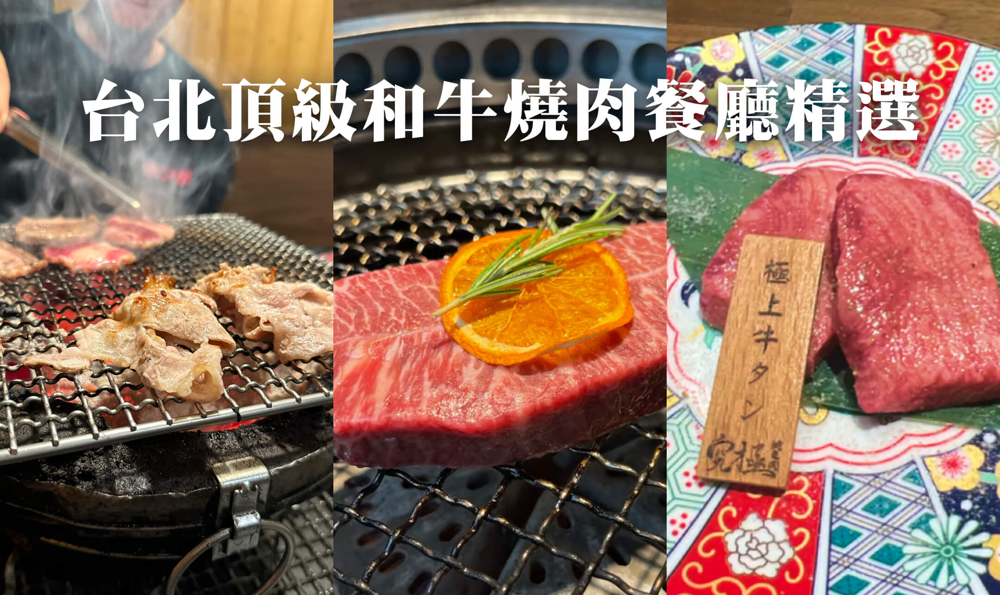

中秋節即將來臨，2024 年的台北燒肉餐廳也早已蓄勢待發，準備了一系列令人垂涎的高級燒肉品項和和牛拼盤。本文為你精選了 5 家提供頂級和牛及代烤服務的燒肉餐廳，讓你在這個特別的中秋節日裡，與親朋好友們共享美味高級的烤肉盛宴！

<!-- truncate -->

### 台北 5 間精選聚餐燒肉餐廳名單：

- [梵 燒肉](#梵-燒肉)
- [TABE YAKINIKU 吃燒肉](#tabe-yakiniku-吃燒肉)
- [燒肉中山 台北信義店](#燒肉中山-台北信義店)
- [上吉燒肉](#上吉燒肉)
- [究極燒肉](#究極燒肉)

---

## 梵 燒肉

_大安區 | 頂級燒肉 | 桌邊代烤 | 和牛菲力 | 精緻燒烤_

梵燒肉是一家位於台北市大安區的高檔燒肉餐廳，專注於提供優質的日本和牛料理。餐廳位於敦化南路的豪宅一二樓，環境現代時尚，設計靈感來自於日本知名燒肉店よろにく，並由兩位主廚 Terry 和 Ice 負責經營。

梵燒肉提供多種套餐選擇，包括「極」料理套餐和「遊肉、一部始終」雙人牛排套餐，讓客人能品嚐到不同部位的和牛。除了套餐，還有單點料理可供選擇，涵蓋牛肉、豬肉、海鮮及蔬菜等。入店後客人都會獲得一條熱毛巾，並可享用各式燒肉醬料。桌邊代烤的服務必不可少，但服務生對紅酒的風味似乎不夠熟悉，服務上還有提升空間。

餐廳內部亦設有包廂，適合各種聚會和慶祝活動，高級的肉品食材以及日本職人的講究，梵燒肉絕對是中秋節烤肉必納入的口袋名單之一！

<iframe width="382" height="726" frameborder="0" src="https://fooday.app/zh-TW/embed/reviews/NksaMbS9wH64gppZtjefD6?maxwidth=384&maxheight=726"></iframe>

```
* 餐廳地址：台北市大安區敦化南路1段235號2F
* 餐廳電話：02-2771-0597
* 營業時間：每日 17:00 - 23:00
* 注意事項：需要預訂 · 提供 Wi-Fi · 有兒童高腳椅
```

---

## TABE YAKINIKU 吃燒肉

_中山區 | 鹿兒島和牛 | 和牛炒飯 | 原汁肉味_

這家燒肉店提供高品質的 A5 日本和牛，肉質厚實且油花分布均勻，搭配白飯與啤酒，口感極佳。特別推薦盛和套餐，讓顧客品嚐到多種部位的美味。店內氛圍溫馨舒適，專注於高級和牛的純粹味道，沒有過多的花俏裝飾，讓人能專心享受美食。

老闆親切且樂於助人，會根據顧客的需求搭配肉品，服務態度友好，讓人感到賓至如歸的感覺，非常適合中秋節與親友一起來享用高級和牛。

<iframe width="382" height="726" frameborder="0" src="https://fooday.app/zh-TW/embed/reviews/N5Fqf3zutCVzUHkMxoyKkf?maxwidth=384&maxheight=726"></iframe>

```
* 餐廳地址：台北市中山區林森北路119巷20號
* 餐廳電話：02-2511-0809
* 營業時間：週一到週六 18:00 – 23:00，週日公休
* 注意事項：可以線上訂位 · 只收現金
```

---

## 燒肉中山 台北信義店

_信義商圈 | 夜景餐廳 | 約會聚餐 | 全程代烤_

燒肉中山餐廳位於信義區 ATT 的高樓內，環境優雅新穎且氛圍非常適合約會，桌距寬敞，用餐時絕對會感到非常舒適。窗外景觀雖然沒辦法直接看到台北 101 ，但晚上燈火通明的信義商圈街景也是增添了不少用餐情調。

燒肉中山的肉品質都相當優良，套餐內容豐富，從 2 人到 6 人的套餐選項都有，尤其和牛的口感令人印象深刻。雖然有些配菜如豆腐鍋表現普通，但整體食物水準還是很高，令人滿意。

當然高級的燒肉店，就是要有服務生全程代烤啦！而且代烤服務生非常專業，會根據客人的需求調整肉的熟度，讓用餐過程非常愉快，服務品質高，全程都可以感受到餐廳服務人員貼心的關懷～不管是情侶約會，還是朋友節慶聚餐，都非常推薦來燒肉中山感受他迷人的優雅氛圍跟舒適的用餐體驗喔！

就連 IG 擁有 5 萬粉絲的知名美食部落客 **[尼克到處吃美食](https://fooday.app/zh-TW/users/8jBwGPBBvSbcqBloKBxdujmalOH2)** 也強力推薦位於信義區的燒肉中山，快來看看他的超詳盡燒肉美食攻略吧！

<iframe width="382" height="726" frameborder="0" src="https://fooday.app/zh-TW/embed/reviews/cqvjwyV5B3ZXJAmDgaBm6d?maxwidth=384&maxheight=726"></iframe>

```
* 餐廳地址：台北市信義區松壽路12號10樓
* 餐廳電話：02-7743-2020
* 營業時間：
  週一 ~ 週五 17:30 – 凌晨 0:00
  週六 ~ 週日 13:30 - 16:00 | 17:30 - 凌晨 0:00
* 注意事項：可電話與線上訂位
```

---

## 上吉燒肉

_大安區 | 延吉街美食 | 代客烤肉 | 和牛拼盤_

位於台北東區巷弄內的上吉燒肉，無論是慶生、慶祝中秋、還是平常同事下班想找個地方聚餐都非常適合！

餐點方面，推薦「盛和」拼盤，可以嘗試多種和牛部位。日本和澳洲和牛的六個部位，每個部位兩片。單點的肋眼牛排尤其出色，外酥內嫩，油花豐富。

餐廳的服務更是讚譽有加，肉品全程會由店員代烤，店員烤肉的技術精湛，而且會根據顧客喜好調整熟度。除了桌邊代烤的貼心服務外，店家甚至會為了慶生準備四寸蛋糕，還會記錄顧客喜好以供下次服務參考。服務這麼優良到位的餐廳，還不快加入燒烤聚餐名單裡！

<iframe width="382" height="726" frameborder="0" src="https://fooday.app/zh-TW/embed/reviews/gHmZ2ouSondDNSCStCS5eG?maxwidth=384&maxheight=726"></iframe>

```
* 餐廳地址：台北市大安區延吉街131巷41號
* 餐廳電話：02-8772-5765
* 營業時間：
  每日 11:00 – 14:00 | 17:00 – 23:00
  週五 11:30 - 14:00 | 17:00 – 23:00
* 注意事項：可電話及網路訂位
```

---

## 究極燒肉

_中山區 | 頂級燒肉 | 海膽干貝海苔 | 代烤服務_

這家餐廳從入口處就可以感受到日式極簡的典雅與高級感，有庭園松樹的造景以及小碎石一路延伸到餐廳門口的木拉門，入場儀式感滿分。內用空間更是氛圍優雅，裝潢具有濃濃的日式風格，適合喜愛高檔用餐的朋友，讓人感到高級放鬆舒適。

價格雖偏高，但提供的都是高品質的日式燒肉，特別推薦海膽干貝海苔燒和厚切牛舌，口感鮮嫩且富有層次，絕對讓你印象深刻。

且餐廳也提供代烤服務，讓你能夠輕鬆享用美食，服務人員友善且專業，增添了用餐的愉悅感。

在中秋節想要享受有人服務的高級日式燒烤，就一定不要錯過位於台北中山的究極燒肉！

<iframe width="382" height="726" frameborder="0" src="https://fooday.app/zh-TW/embed/reviews/9fYcjzn5wcugL8daYWpCct?maxwidth=384&maxheight=726"></iframe>

```
* 餐廳地址：台北市中山區雙城街28巷2號
* 餐廳電話：02-2596-0076
* 營業時間：每日 17:00 - 凌晨 0:00
* 注意事項：可以電話及網路訂位，建議提前預訂
```

---

#### 你知道貢獻用餐評論也能賺取獎勵嗎？

立即下載 Fooday app ，找餐廳不再踩雷，最真實的用餐評論都在這裡。

現在只要完成 Fooday app 內的新手任務，就能獲得免費體驗相機，成為 Fooday 美食家。留下評論跟建立店家就可以獲得獎勵，實現邊吃邊賺的吃貨人生！

[](https://fooday.app/)

想追蹤更多的美食快報，歡迎訂閱我們的[Fooday 電子報](https://blog-zh.fooday.app/)
