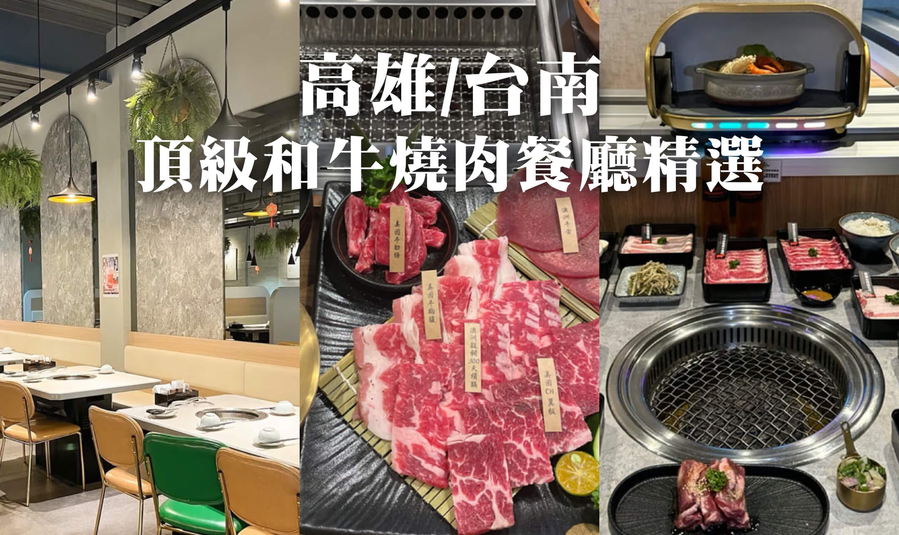

各位南台灣的肉食控們，中秋節就要到啦，想必大家已經摩拳擦掌準備大啖燒肉了吧？ 我們精選了台南及高雄 7 家精選頂級和牛燒肉餐廳，從頂級和牛到專業的桌邊代烤服務，這些餐廳絕對能滿足愛吃肉的你。快揪你的親朋好友一起來吃高級燒肉！

<!-- truncate -->

### 高雄及台南 7 間精選聚餐燒肉餐廳名單：

- [好想燒肉](#好想燒肉) _（高雄）_
- [激肉-迴轉燒肉專門店](#激肉-迴轉燒肉專門店) _（高雄）_
- [迷霧和牛燒肉](#迷霧和牛燒肉) _（高雄）_
- [碳佐麻里](#碳佐麻里) _（高雄、台南）_
- [燒肉擔當](#燒肉擔當) _（台南）_
- [IKIGAI 燒肉專門店](#IKIGAI-燒肉專門店) _（台南）_
- [焼肉ショジョ Yakiniku SHOJO](#焼肉ショジョ-Yakiniku-SHOJO) _（台南）_

---

## 好想燒肉

_高雄鼓山區 | 貨櫃屋 | 日本清酒 | 日本 A5 和牛_

好想燒肉是一家位於高雄市鼓山區的日式燒肉餐廳，高雄美術館店設計採用工業風格，白色貨櫃屋的外觀非常吸睛。店家主打各種高檔的肉品，如日本 A5 和牛跟黃金松阪豬，且所有肉品均為現點現切，確保每個人可以吃到最新鮮的肉。此外，餐廳還有專業的唎酒師駐店，提供多款日本清酒，喜歡喝日本酒的美食家別錯過了！

整體來說，好想燒肉以其優質的食材和精緻的用餐體驗，油煙味也不會太重，是高雄非常受歡迎的燒肉選擇，特別適合中秋節聚餐和約會，快來看看更多推薦的肉品餐點吧！

<iframe width="382" height="726" frameborder="0" src="https://fooday.app/zh-TW/embed/reviews/25dBEUwnFnhbFXaeXRFMhs?maxwidth=384&maxheight=726"></iframe>

- 店家活動：當日壽星打 9 折，當月壽星送肉品兌換券一張。

**好想燒肉 - 高雄美術館總店**

- 餐廳電話：07-5550369
- 餐廳地址：高雄市鼓山區美術館路 27 號
- 營業時間：每日 11:30 - 凌晨 0:00
- 網路訂位：https://is.gd/FSXV3U

**好想燒肉 - 楠梓形象店**

- 餐廳電話：07-3625222
- 餐廳地址：高雄市楠梓區大學二十六街 105 號
- 營業時間：每日 11:30 - 凌晨 0:00
- 網路訂位： https://is.gd/Dwrpmf

---

## 激肉-迴轉燒肉專門店

_高雄鹽埕區 | 迴轉燒肉 | 火烤兩吃 | 真愛碼頭美食_

迴轉壽司人人都知道，但迴轉燒肉你有體驗過嗎？高雄市鹽埕區就有一家迴轉燒肉專門店，2024 年 5 月才新開幕。距離捷運鹽埕埔站只需要步行約 9 分鐘。餐廳內部環境精緻，僅有六張桌子，適合小型聚餐，並設有可愛的送餐小車，用餐時可透過平板點餐，是個非常新鮮有創意的燒肉用餐方式。

激肉-迴轉燒肉專門店提供多樣化的燒肉選擇，包括安格斯牛肉、韓式松阪豬及特選雞肉三重奏等，甚至還有浮誇的松葉蟹火鍋，火烤兩吃完全沒問題。每桌最低消費為 1800 元，適合家庭或朋友聚餐，對於中秋節要聚餐烤肉的朋友來說，激肉-迴轉燒肉專門店是必推的烤肉選擇！

<iframe width="382" height="726" frameborder="0" src="https://fooday.app/zh-TW/embed/reviews/kKsY5CyojWeWGJa2HhA9Bi?maxwidth=384&maxheight=726"></iframe>

- 餐廳地址：高雄市鹽埕區五福四路 4 號
- 餐廳電話：07-521-0057
- 營業時間：週一到週五 17:30 – 01:00，週六日 11:30 – 01:00
- 注意事項：需要預訂 [線上訂位按此](https://inline.app/booking/-Nt0Usz9W_SEf-gKt6t5:inline-live-3/-Nt0UtOPp7_SSDJztqBM?fbclid=IwY2xjawFONQNleHRuA2FlbQIxMAABHcaDNgt44UQxFLtE8cjRy9BkRaNhrlMcvF6Mj01MvRdGj5rRq_x1Rms87Q_aem_9D_jaD5a0KCeIebvd50UEQ&language=zh-tw)

---

## 迷霧和牛燒肉

_高雄左營區 | 寵物友善 | 無煙燒烤 | 宵夜首選_

大口吃肉配酒超滿足！迷霧和牛燒肉是一家位於高雄左營捷運站附近的精緻燒肉餐廳，非常適合與朋友或家人聚餐。主打和牛頂級食材，但價格卻平易近人，從雙人餐 1580 到 3280 都有，以非常實惠的價格就可以嚐到高級的和牛燒肉。營業到半夜兩點的燒肉餐廳，更是夜貓族的宵夜首選。

其中迷霧和牛燒肉最大的特色是寵物可以跟人一起坐！這家店不僅是寵物友善餐廳，寵物可以上座位，甚至還備有寵物享用的食材呦，超級貼心的店家服務，讓毛小孩跟主人可以一起大啖肉肉！

<iframe width="382" height="726" frameborder="0" src="https://fooday.app/zh-TW/embed/reviews/YU2522fzWUQxWTok4dWAWh?maxwidth=384&maxheight=726"></iframe>

- 餐廳地址：高雄市左營區明誠二路 380 號 2 樓
- 餐廳電話：07-558-0907
- 營業時間：
  - 週一 ~ 週五 17:30 – 凌晨 02:00
  - 週六 ~ 週日 11:30 – 15:30 | 17:30 – 凌晨 02:00
- 注意事項：可線上訂位 [線上訂位按此](https://inline.app/booking/-NKNGb4EdeL66qm1amFK:inline-live-3/-NKNGbKBiyBbKC2X2z8q?language=zh-tw)

---

## 碳佐麻里

_台南 | 高雄 | 精緻燒肉 | 聚餐推薦 | 無用餐時間限制_

碳佐麻里是南部必吃的燒肉界扛壩子！一家起源於台南的精緻高級燒肉餐廳，成立於 2002 年，最初名為「炭火工房燒肉居酒屋」。2004 年更名為碳佐麻里，並迅速在台南開設多間分店，2012 年擴展至高雄，並持續增設其他品牌如麻辣鍋和沙龍餐廳，碳佐麻里目標打造地表最大精品燒肉園區，每家分店都佔地非常廣大，且各家店面裝潢氛圍都優雅別具特色。

有別於坊間其他燒肉吃到飽，碳佐麻里是走超精緻路線，不僅肉品高級，石鍋蒜蝦飯等其他熟食更是老饕推薦。石鍋蒜蝦飯裡的蒜頭、蔥花、胡椒粉加上去殼蝦仁和白飯拌炒這香氣真的讓人很難忘，真的真的非常無敵！

餐廳不設用餐時間限制，客人可以非常悠閒地享受用餐，無論是慶生、朋友聚餐、中秋節烤肉、過年過節、情侶約會，都絕對是首選的高級燒肉餐廳。

<iframe width="382" height="726" frameborder="0" src="https://fooday.app/zh-TW/embed/reviews/TYq3z2gxqPGWf4Nc3oHPSj?maxwidth=384&maxheight=726"></iframe>

<iframe width="382" height="726" frameborder="0" src="https://fooday.app/zh-TW/embed/reviews/BxjFNstyTCd9aMjD23aUo4?maxwidth=384&maxheight=726"></iframe>

**台南中華店**

- 餐廳地址：台南市永康區中華路 796 號
- 餐廳電話：06-203-5599
- 營業時間：
  - 週一 ~ 週五 11:30 - 凌晨 0:00
  - 週六 ~ 週日 11:00 - 凌晨 0:00

**台南府前店**

- 餐廳地址：台南市安平區府前路二段 630 號
- 餐廳電話：06-298-3377
- 營業時間：
  - 週一 ~ 週五 11:30 - 凌晨 0:00
  - 週六 ~ 週日 11:00 - 凌晨 0:00

**高雄美術館店**

- 餐廳地址：高雄市鼓山區美術東四路 562 號
- 餐廳電話：07-552-6555
- 營業時間：
  - 週一 ~ 週五 11:30 - 凌晨 0:00
  - 週六 ~ 週日 11:00 - 凌晨 0:00

**高雄時代店**

- 餐廳地址：高雄市前鎮區時代南一路 85 號
- 餐廳電話：07-537-1333
- 營業時間：
  - 週一 ~ 週五 11:30 - 凌晨 0:00
  - 週六 ~ 週日 11:00 - 凌晨 0:00

可電話及網路訂位 [線上訂位請按此](https://inline.app/booking/-L9d0sic_fSKDuTjlB65/-Mt0lRZ0eh4v082lv9Eh?language=zh-tw)

---

## 燒肉擔當

_台南中西區 | 日本澳洲和牛 | 專人代烤 | 料理職人駐店 | 高級燒肉_

燒肉擔當的消費模式以單點為主，有搭配好的套餐一人 2380，如果有選擇障礙的可以嘗試選套餐，因為有料理職人駐店，會先了解個人需求和用餐喜好，安排出餐或幫你搭配組合，還有專業桌邊代烤服務，也因此價格不算便宜。入口處看起來很小，但其實內部用餐空間相當寬敞，適合各類型聚會，也是中秋節聚餐及逢年過節聚餐必選的燒肉餐廳。

燒肉擔當菜單上可以點到日本與澳洲和牛與美牛的多種部位，再由廚師「因肉使刀」、依不同部位牛肉特性，以精準刀工分切出：角塊、厚切、牛五花、姿切與薄切等五種厚度，透過不同切法和不同醬料演繹牛肉最佳口感與風味，體現「刀工即廚藝」的精神。以高級燒肉來說是相當推薦的餐廳！來看看其他 Fooday 美食家如何評價燒肉擔當的吧：

<iframe width="382" height="726" frameborder="0" src="https://fooday.app/zh-TW/embed/reviews/i3Ww9QSzi8tViBQY7XJEen?maxwidth=384&maxheight=726"></iframe>

- 餐廳地址：台南市中西區金華路三段 172 號
- 餐廳電話：06-222-2243
- 營業時間：每日 17:00 - 凌晨 0:00
- 注意事項：建議預先訂位，[請按此選擇分店訂位](https://inline.app/booking/-L93VSXuz8o86ahWDRg0:inline-live-karuizawa?language=zh-tw)

---

## IKIGAI 燒肉專門店

_台南東區 | 南紡夢時代 | 一人烤肉 | 大食怪拼盤_

從台北天母發跡的 IKIGAI 燒肉專門店，首家台南分店正式進駐南紡夢時代！餐廳環境簡約時尚，有日式風格搭配霓虹燈 logo，營造新鮮舒服的現代感，適合享受燒肉的氛圍，中秋節聚餐或是家人朋友聚餐都很適合。且店內設有單人座位，讓一個人也能輕鬆享受燒肉。

IKIGAI 燒肉專門店的肉品以原汁原味為主，無需特別醬料，搭配蒜片與蔥鹽增添風味，喜愛原味肉的饕客絕對會愛上。主要供應日本鹿兒島 A5 和牛、美國牛胸腹大盛、西班牙豚松阪等多種肉品。胃口大的饕客可以點大食怪拼盤，也有海陸雙拼等選擇，非常豐富的餐點組合。

且每桌都有獨創的「領夯員」時間漏斗，讓不太會掌握燒肉時間的新手也能輕鬆上手學會烤肉。歡迎大家來體驗「一起尬意」的燒肉樂趣！

<iframe width="382" height="726" frameborder="0" src="https://fooday.app/zh-TW/embed/reviews/JajWvKtqBgRv9rqVYn5N3g?maxwidth=384&maxheight=726"></iframe>

- 餐廳地址：台南市東區中華東路一段 366 號
- 餐廳電話：06-235-0029
- 營業時間：每日 11:00 - 22:00
- 官方網站：[IKIGAI 燒肉專門店](https://www.facebook.com/IKIGAIyakiniku?mibextid=LQQJ4d)
- 注意事項：可電話及網路訂位，[線上訂位請按此](https://inline.app/booking/-Nva-v3Rly1u6xuk6wQV:inline-live-3/-O2TfCfICbMnW7msNJhg)

---

## 焼肉ショジョ Yakiniku SHOJO

_台南安平區 | 日式居酒屋 | 包廂 | 炭火烤肉_

店內氛圍打造成日式燒肉居酒屋的氛圍，熱鬧的喧嘩聲夾雜著此起彼落的敲杯聲，經典燒肉招牌菜色搭配正統日式調味，不拐彎抹角，以純粹的味道直球對決，讓每一位前來用餐的客人，都能放鬆不拘束自在的大口吃肉大口喝酒。燒肉的品質相當不錯，特別是牛舌和霜降豬肉，搭配調味後味道更佳。各種肉類都有水準，適合喜愛肉食的客人。

「SHOJO」安平店，座位區有包廂區和戶外大桌的位置、很適合一群人聚餐的地方，建議想吃的話一定要早點訂才不會臨時想吃吃不到。且店家採用炭火烤肉，點好餐才會上烤網，桌上會附上蔥花、洋蔥、蒜泥跟燒肉將，亦有免費的雞湯喝到飽。

_\*餐廳可提供部分代烤，人潮多幾乎都會是自己烤_

<iframe width="382" height="726" frameborder="0" src="https://fooday.app/zh-TW/embed/reviews/XaGA2V8tiVbqGegJkXWh8T?maxwidth=384&maxheight=726"></iframe>

- 餐廳地址：台南市安平區怡平路 1 號
- 餐廳電話：06-298-9006
- 營業時間：
  - 週一 ~ 週五 17:30 - 23:30
  - 週六 ~ 週日 11:30 - 15:00 | 17:30 - 23:30
- 注意事項：可電話及網路訂位，[線上訂位請按此](https://inline.app/booking/-MfbQawjmsWQuDOSbbw1:inline-live-2/-MfbQb3Smo00c_WKHaB1?language=zh-tw)

---

#### 你知道貢獻用餐評論也能賺取獎勵嗎？

立即下載 Fooday app ，找餐廳不再踩雷，最真實的用餐評論都在這裡。

現在只要完成 Fooday app 內的新手任務，就能獲得免費體驗相機，成為 Fooday 美食家。留下評論跟建立店家就可以獲得獎勵，實現邊吃邊賺的吃貨人生！

想追蹤更多的美食快報，歡迎訂閱我們的[Fooday 電子報](https://blog-zh.fooday.app/)
