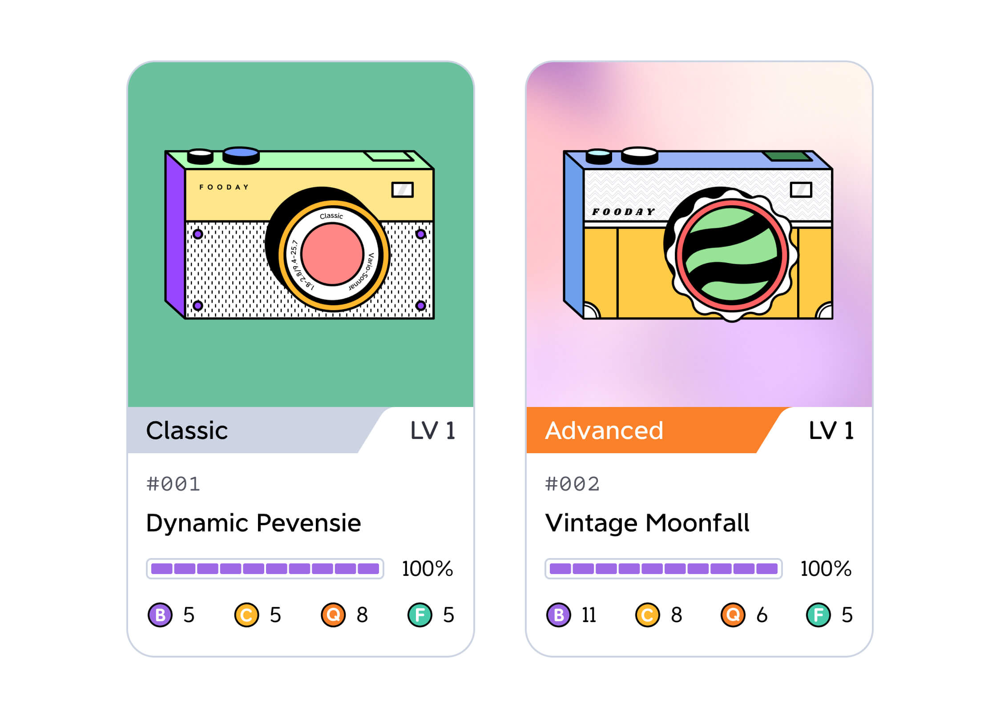

The Fooca Camera is a unique NFT exclusive to Fooday, designed to enhance the Foodie experience within the community while simultaneously driving the platform's growth.

But what is the purpose of the Fooca Camera? The Fooca Camera serves as the entry ticket to Fooday's culinary community, essential for foodies looking to earn rewards while indulging in the world of food. 

:::info
In simple terms, without a Fooca Camera, foodies won't be able to kickstart their journey to earning rewards.
:::

The Fooca Camera NFT is not just your typical NFT; it comes with levels, battery, and four distinct attributes: compute, quality, battery, and foospirit. 

Each attribute affects the performance efficiency of the Fooca Camera, and the number of Fooca Cameras a foodie possesses determines their account's energy value on the platform.

#### A Guarantee for the Culinary Community

Furthermore, the Fooca Camera also acts as collateral for the Fooday platform. In cases where a foodie repeatedly posts malicious reviews or violates community guidelines, Fooday may confiscate their cameras as a penalty, ensuring the peace and fairness of the community.

***

## Rarities of Fooca Camera

Having a Fooca Camera allows you to begin sharing your dining experiences while earning rewards. The rarity of the Fooca Camera significantly impacts the rewards you receive and your efficiency in contributing.

Currently, Fooca Cameras come in two rarities: **Classic** and **Advanced**.



Key Differences:

***

### Initial Attribute Points

> What is attribute points？[See full introduction](/attributes)

#### Classic Fooca Camera

Initial attribute points for the Classic Fooca Camera are all set at 5. However, the extra initial random allocation provides 5 points, which are distributed among the four attributes. Each attribute has a maximum limit for point allocation.

```
The total initial attribute points for the Classic Fooca Camera should sum up to 25.
```

#### Advanced Fooca Camera

Initial attribute points for the Advanced Fooca Camera are all set at 5. However, the extra initial random allocation provides 10 points, which are distributed among the four attributes. Each attribute also has a maximum limit for point allocation.

```
The total initial attribute points for the Advanced Fooca Camera should sum up to 30.
```

|  |  | Battery  | Computing  | Quality  | Foospirit  |
|:---:|:---:|:---:|:---:|:---:|:---:|
| Classic Camera | Initial base points |  5  |  5  |  5  |  5  |
|   | Initial random allocation range  |  0~5  |  0~5  |  0~3  |  0~5  |
| Advanced Camera | Initial base points |  5  |  5  |  5  |  5  |
|   | Initial random allocation range  |  0~6  |  0~6  |  0~4  |  0~6  |

Example:

* Classic Camera A: Battery 7 | Computing 5 | Quality 8 | Foospirit 5
* Classic Camera B: Battery 5 | Computing 5 | Quality 5 | Foospirit 10
* Advanced Camera C: Battery 11 | Computing 8 | Quality 6 | Foospirit 5
* Advanced Camera D: Battery 7 | Computing 6 | Quality 9 | Foospirit 8

***

### Attribute Point Limits

For every level-up of Fooca cameras, you gain 2 attribute points.

Users can distribute these points according to their desired strategic direction. However, there is a difference in the maximum allowable attribute points that can be allocated between classic and advanced cameras.

```
Classic Fooca Camera: Each attribute has a point limit of 30.

Advanced Fooca Camera: Each attribute has a point limit of 50.
```

***

### Probability of Obtaining Rare Fooca Box When Minting

Using an Advanced Fooca Camera for crafting significantly increases the chance of obtaining a Rare Fooca Box.

For a comprehensive guide on crafting Fooca Cameras, refer to the [Minting System of Fooca](/minting).

***

### Foodie Energy Bonus

> What is Foodie energy？[See full introduction](/foodie-energy)

Owning an Advanced Fooca Camera provides a direct bonus to your Foodie Energy. Each Advanced Fooca Camera increases your maximum Foodie Energy by +1. The bonus is cumulative, meaning that having X Advanced Fooca Cameras adds X to your maximum Foodie Energy.

Classic Fooca Cameras do not provide an additional Foodie Energy bonus.

 

Example: 

If you have 3 cameras, including 2 Advanced Fooca Cameras, your maximum Foodie Energy would be 

```
10 (Base Energy) + 2 (Advanced Camera Bonus) = 12.
```

***

### Genesis Fooca Camera

You can only get a Genesis Fooca Camera from a Genesis Fooca Box.

The Genesis Fooca Box is not your ordinary loot box. It represents the very first generation of Fooca Camera releases and is a symbol of prestige within the Fooday community. These boxes are exclusively available to users who participated in our beta testing phase, making them a rare and cherished item.

#### What's Inside the Genesis Fooca Box?

Each Genesis Fooca Box contains a randomly generated Fooca Camera, but with a twist. These cameras bear the coveted Genesis logo, signifying their unique origin and significance. They are a testament to your early support and commitment to Fooday.

#### Using Genesis Fooca Cameras

Genesis Fooca Cameras function just like any other Fooca Camera, allowing you to contribute to Fooday by sharing your experiences and earning rewards. The key difference lies in their exclusivity and the honor of owning one. _In the future, there are plans to provide exclusive benefits and bonuses for Genesis Camera owners. Stay tuned for more details!_

***

### Fooca ID

The Fooca ID is used to distinguish each Fooca Camera / Fooca Box, representing a unique identifier for each Fooca, ensuring there are no duplicate Fooca ID.

Fooca Cameras numbered from #1 to #499 are test cameras used during the trial period and has been burnt and destroyed upon the official launch.

The first batch of Fooca Camera are minted with the ID starting from #500 after the official release. With each Fooca Box minted, the number increments by 1, ordered chronologically by minted time. Both regular Fooca Cameras and Genesis Fooca Cameras follow the same numbering system. The Fooca Box's number corresponds to the Fooca Camera obtained when it is opened.

For example, the Fooca Camera obtained from opening the #500 Fooca Box will also have the camera ID #500.

> The Fooca Camera ID is not equivalent to the NFT token ID assigned to the camera upon minting. Currently, Fooca Cameras and Fooca Boxes do not support on-chain transaction.

***

Choose the Fooca Camera that suits your strategy and embark on your Fooday journey!