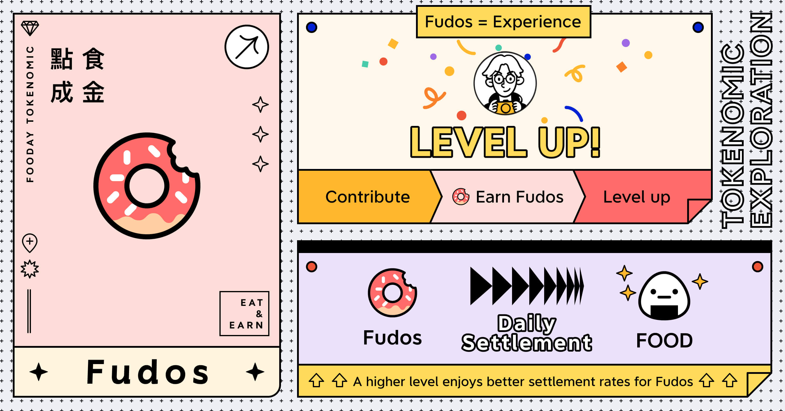

In Fooday, foodies with Fooca Cameras can earn Fudos by contributing, and their levels will also increase.

> Advantage of Higher foodie Levels: The higher the foodie's level, the better the exchange rate of Fudos to FOOD.

Fudos serve as experience points on the Fooday platform. Foodies with Fooca Cameras can earn a certain amount of Fudos by completing tasks, creating spot locations, sharing culinary experiences, and reporting incorrect information.

## Fudos to FOOD Multiplier



The Fudos earned by a foodie on a given day will automatically convert to FOOD after 24 hours on the next day at 00:00 UTC, without any manual action needed.

```
In the absence of any bonuses, the conversion rate of Fudos to FOOD is 1:1
```
 

Example: 

On March 1st, if John accumulates 100 Fudos throughout the day, the system will convert his accumulated Fudos to 100 FOOD on March 3rd at 00:00 UTC.

However, the conversion rate is affected by the foodie's level. The settled FOOD multiplier formula is:

```
Multiplier = 1 + (Foodie level - 1)/100
```

For instance, at the current **Foodie level of 6**, the conversion rate will be multiplied by **1.05**, meaning that John can get **105 FOOD**.

## Foodie Level Achievement

Achievements can be obtained by leveling up your Foodie account through contributions. When a Foodie reaches a specified level, they will automatically receive an achievement and a title. Learn more at [Achievement & Badge System](/achievement-and-badge-system).