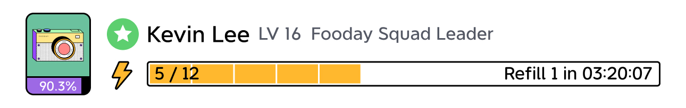

:::info
Only with a Fooca Camera can you possess Energy, which is required for community contributions.
:::

**The more Fooca Cameras you have, the more Energy your foodie account possesses**, allowing for more contributions within a day.

Here's the relationship between the number of cameras and Max Energy:

| Fooca camera  | Max Energy  | 
|:---:|:---:|
| 1 Camera | 6 Energy |
| 3 Cameras | 10 Energy  | 
| 9 Cameras | 18 Energy  | 
| 15 Cameras | 30 Energu  | 

 

**Regardless of your Energy amount, it will refill within a day.** 

For instance, owning 1 camera grants a total Energy of 6, and it takes 4 hours to replenish 1 Energy. Owning 3 cameras yields a total Energy of 10, and it takes 2.4 hours to replenish 1 Energy, and so forth.

>Note: Energy accumulates in your Foodie account, not on individual Fooca Cameras.