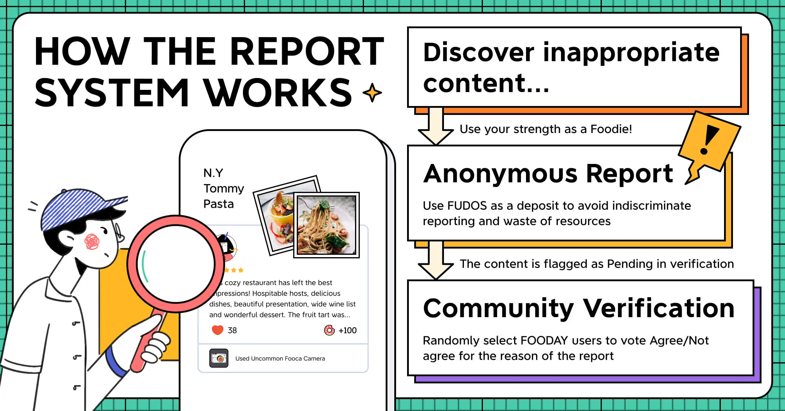

# Report & Voting

Fooday is thrilled to announce the implementation of its enhanced reporting system. After careful iterations, we have made significant adjustments to our validation process to enhance review accuracy and reliability.

## How Does the New Report System Work?

The report system on Fooday serves as a crucial mechanism to maintain the platform’s integrity, enabling users to report inaccurate information. Users can make **challenges** (a.k.a reports) in two primary situations: spot and reviews.

**Wrong Spot Info**

When a user creates a new spot on the Fooday map, the associated spot becomes immediately visible on the map. The creator of the spot is rewarded with Fudo, and other users gain the ability to post reviews on that spot.

However, to ensure the accuracy and reliability of information, a "Newly Created" label is affixed to such spots for the initial 7 days. This label assists other users in verifying the correctness of the spot's details. During this 7-day period, other users are unable to modify existing restaurant information but can contribute by adding information that are not yet listed. The creator of the spot retains the ability to supplement or modify the spot's information as needed. After the aforementioned 7-day period, the "Newly Created" label will be automatically removed. At any given time, users have the option to report a spot for any reason.

**Inappropriate Reviews**

Similarly, when users leave reviews on Fooday, they have the opportunity to report any reviews they believe contain inaccurate or misleading information.

Users can leave reviews without undergoing a verification process and earn Fudos immediately upon posting. If a review is reported by another user, it will undergo further evaluation to ensure reliability and helpfulness.

### Anonymity

Challenging (Reporting) is anonymous. The reported individual and all participating random users in the verification vote won't know your identity. This ensures fairness and prevents account influence.

------

## Voting Verification Process

After a challenge (report) is submitted, Fooday’s voting system is activated. This system randomly selects multiple users to partake in the voting verification process. 

Once a spot or review is reported and enters the voting verification phase, the information in question cannot be modified until the entire verification process has been finalized. Additionally, other users are precluded from submitting further challenges (reports) for the same spot or review. 

The selected users will carefully review the reported spot information or review and cast their votes of "Agree" or "Disagree" based on their judgment.

### How does the system select verification voters?

The system selects appropriate users for voting based on the region and language of the reported content.

If spot information is reported, the system will filter users from the same country as the spot for verification voting. If a review is reported, the system will filter users from the same country as the author for verification voting.

When a piece of content is reported, the system randomly selects 30 Fooday users from the target country to participate in the voting process. The voting period opens for 24 hours starting from the report time. Selected users receive notifications and can participate by clicking on the notification.

The selected users don't need to have a Fooca Camera to participate in verification voting. Even without a camera, you can accumulate verification points and turn them into rewards.

------

## How is a report (challenge) considered approved?

In the event that a report is rejected and the reported spot or review is deemed to be accurate and reliable, the one who reported will be fined with a deduction of FUDOS.

**Within 24 hours from the time of the report, the voting rate must reach 20%, and the "Agree" ratio must be 2/3 for the report to be approved.** 

Example:
> If you, John, report a review, the system selects 30 users for the vote. If within 24 hours, at least 6 users participate in the vote, and out of those, equal or more than 4 users agree, then the report is approved.

### What if the number of voters doesn't meet the requirement?

If within 24 hours from the report time the voting participation rate of the selected 30 users from the reported country is below 20%, the voting period will be extended by 24 hours, and another 30 users will be selected for voting. During this extended 24-hour period, the participation rate must reach 20% of the original users.

Example:
> If there are fewer than 6 users participating in the vote in the first 24 hours, the system will select 30 more users for the poll. Within the following 24 hours, 6 out of 60 users should participate in the voting to make the challenge valid.

If the required participation rate is not reached by the end of the extended period, the process of extending the voting time and increasing the number of participants will be repeated until the participation rate reaches 20% of the original user amount.

------

## What happens if I am challenged and it succeeds/fails?

### If the voting report against you passes

1. You will lose the equivalent Fudos value of the review/store in question (excluding Battery Power debuff), plus an additional 15% penalty based on the original value.
2. The reported review/spot will be taken down.

### If the voting report against you fails

1. You will not lose any Fudos.
2. Your store/review will be retained.
3. The report against you will be revoked.

Example:
> You left a review at Store B, which was originally valued at 40 Fudos. However, due to your camera's battery being below 70%, the review's final reward was 28 Fudos.
> 
> Later, Jane reported your review at Store B:
> 
* If Jane's report against you is successful, you will lose the original 40 Fudos value of the review (even though you only received 28 Fudos initially). Additionally, you will be penalized by an extra 15% deduction of the original value (40 Fudos), resulting in a total loss of 46 Fudos.
* If Jane's report against you fails, you won't face any penalties.

------

## What happens if my challenge passes/fails?

### If the vote on the report passed

1. You will receive the Fudos equivalent to the original value of that review/store (excluding Battery Power debuff), plus any additional Fooca Camera attribute multipliers you used for this report.
2. The reported review/spot will be taken down.

### If the vote on the report is failed
1. You will be penalized by deducting 15% of the original value of the review/store (excluding Battery Power debuff), resulting in a loss of Fudos.
2. The report will be revoked.

Example:
> John left a review at Store A, which was originally valued at 40 Fudos. Later, you reported John's review at Store A:
>
* If your report is passed, you will receive the equivalent of the original 40 Fudos value of the review, along with any additional Fooca Camera attribute multipliers you used for this report.
* If your report fails, you will be penalized by losing 15% of the original value (40 Fudos), resulting in a loss of 6 Fudos.

------

## Benefits of the Fooday Verification System

**Increased Transparency & Impartiality**

Fooday’s enhanced reporting system promotes transparency by involving users in the verification and validation process. The anonymous reporting ensures an impartial voting process, free from the influence of a reporter’s followers, reputation, or current voting rates.

**Community Engagement & Trust**

Users actively contribute to the platform’s reliability by participating in the reporting and voting processes. This fosters a sense of shared responsibility and trust among Fooday users, creating a community-driven environment where accurate information is valued.

**Efficient Spot Creation & Timely Updates**

Spots created on Fooday immediately appear on the map, streamlining the spot creation process and allowing users to quickly share new dining destinations. This ensures real-time updates on exciting culinary experiences, without the need for extensive verification processes.

**Recognition for Accuracy & Quality**

Fooday rewards users who create accurate spots with FUDOS, incentivizing the production of high-quality content. This recognition encourages users to provide reliable information, contributing to the overall trustworthiness of the platform.

**Trustworthy Decision-Making**

Fooday’s enhanced reporting system ensures that decisions are made based on a collective voting process. The randomized voting mechanism eliminates bias and manipulation, reflecting a fair and objective judgment of the reported content. This commitment to trustworthy decision-making establishes Fooday as a reliable source of accurate and unbiased restaurant information.