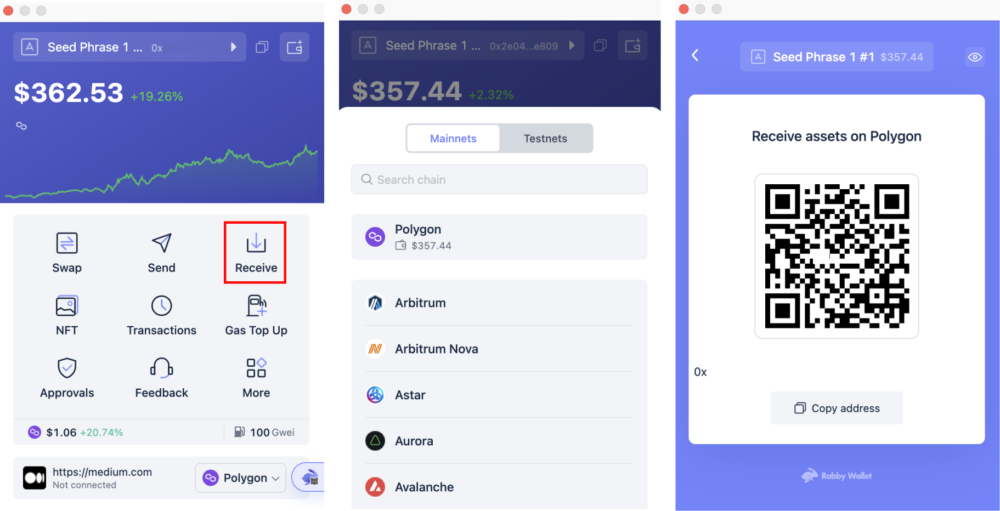

## How to fund your Fooday account?
To purchase a Fooca Camera in the marketplace, you can either buy FUSD within the Fooday app or transfer USDC to your Fooday wallet.

Let’s walk through how to deposit funds on Fooday if you’re not familiar with blockchain and online transactions.

***

### Method 1: In-App Purchase of FUSD on Fooday
If you’re new to blockchain and transactions, buying FUSD within the Fooday app is the quickest way to go.

It’s quite simple. Start by tapping the rightmost option in the menu atra the bottom. Find “Purchase FUSD,” choose the amount you want to buy, and FUSD will automatically be stored in your Fooday wallet, similar to how in-app purchases work in other mobile games.

### Method 2: Transferring USDC to Your Fooday Wallet

1. Currently, Fooday only supports the Polygon chain.  

* USDC contract address：[`0x3c499c542cEF5E3811e1192ce70d8cC03d5c3359`](<https://polygonscan.com/address/0x3c499c542cEF5E3811e1192ce70d8cC03d5c3359>)  
* USDC.e contract address：[`0x2791bca1f2de4661ed88a30c99a7a9449aa84174`](<https://polygonscan.com/address/0x2791bca1f2de4661ed88a30c99a7a9449aa84174>)

 

The second method involves transferring USDC from your crypto wallet to your Fooday wallet. We’ll use the example of the [Rabby](<https://rabby.io/>) wallet, but you can use other wallets or exchanges like Binance as well.

 

#### Steps
1. Again, tap the rightmost option in the menu at the bottom and select “FUSD” under Wallet. On the following page, click “Deposit” (currently supporting the Polygon chain only; the system will fill it in automatically).

2. Next, press the “Deposit” button at the bottom, and you will be redirected to your FUSD transfer address as shown in the image.

3. Copy the address and return to your Rabby wallet. Click “SEND,” select the Polygon chain, and paste the Fooday wallet address you copied earlier. Enter the amount of USDC you want to deposit (FUSD:USDC = 1:1), and hit “Send.”

4. Your FUSD will appear in your Fooday wallet! However, please note that there may be a waiting period after depositing funds before you can use them. You can check the status by clicking on “FUSD.” Once it shows as confirmed, you can start using it!

5. Use FUSD to purchase a camera in the marketplace and kickstart your journey of eating while earning!

:::note
Be sure to select the Polygon chain; currently, Fooday only supports Polygon
:::

***

### Deposit FOOD into Your Fooday Wallet
In addition to USDC, you can also deposit FOOD into your Fooday wallet!

FOOD is the token issued by Fooday, and users can earn FOOD by contributing through actions like commenting and creating spots within Fooday.

FOOD can be used within Fooday to mint new cameras, recharge cameras, and upgrade cameras. FOOD also has liquidity and can be traded on the blockchain or deposited into your Fooday wallet. (Reference article: Detailed Explanation of the Fooday Token Economy)

If you want to instantly Mint a new camera or quickly upgrade your camera, you can also choose to purchase FOOD directly on Polygon and transfer it to your Fooday wallet. The deposit process is the same as depositing FUSD.

* Buy FOOD：[https://reurl.cc/r6WaeZ](<https://reurl.cc/r6WaeZ>)

 

## How do I withdraw from Fooday?
In Fooday, foodies can earn FOOD through contributions and FUSD by selling Fooca cameras. 

Next, Fooday will guide you on how to withdraw and convert it into USDC. If you’re not sure how to withdraw from Fooday, continue reading for a quick step-by-step guide.

:::note
Fooday withdrawals are currently supported only on the Polygon chain, and there will be a Gas Fee when converting FOOD/FUSD to USDC.  
(For detailed Gas Fee information, you can refer to the bottom of this article.)
:::

### Withdraw as 4 simple steps:
1. Go to your Fooday wallet, select FOOD / FUSD, and click “Withdraw.”

2. Paste your web3 wallet address in the “Withdraw to” field.

3. Enter the amount you want to withdraw and click “Withdraw.”

4. Afterward, head over to LlamaSwap to exchange FOOD for USDC.

Once you’ve converted FOOD/FUSD to USDC, you can then go to the MAX exchange to convert it into your local currency!

***

### Detailed Withdrawal Steps:
1. Click on the rightmost option in the menu below and select the currency you wish to withdraw (FOOD / FUSD) from your Fooday wallet, then click “Withdraw.”

2. In the “To” field, enter your wallet address.

> If you don’t already have a web3 wallet, be sure to register one before proceeding! Fooday recommends [Rabby](<https://rabby.io/>) Wallet, or other commonly used cryptocurrency wallets like Metamask will also work.

As an example using Rabby Wallet, once registered, click on the top address, then click the right-facing arrow to view your complete wallet address. You can also import the address by scanning the QR code located on the right side of the “Withdraw to” field.

3. Enter the amount you want to withdraw. (The minimum withdrawal amount for FOOD is 1000, and for FUSD, it’s 2.)

4. After confirming the withdrawal details, click “Confirm” and patiently wait for the withdrawal request to be processed.

5. After confirming, please check your wallet balance. The withdrawn FOOD/FUSD should now be in your wallet.

>Make sure to add the FOOD token to your wallet to view the balance correctly.   

**FOOD Contract Address:** `0x78b1aa5c9b37c52695c93448ad0c64560edb9c4d`
* FOOD coingecko:[https://www.coingecko.com/en/coins/fooday](<https://www.coingecko.com/en/coins/fooday>)

6. Next, go to [LlamaSwap](<https://reurl.cc/r6WaeZ>) and exchange your FOOD for USDC. After entering the desired amount for exchange, remember to select a conversion path on the right. (When withdrawing FUSD, the system will automatically convert it to USDC.)

:::note
This action requires paying a Gas Fee — a small amount of matic. Refer to the detailed explanation at the bottom for more information.
:::

7. Once you’ve exchanged FOOD/FUSD for USDC and confirmed that it has been received in your wallet, congratulations, you’ve successfully withdrawn your funds.

> **USDC Contract Address:** 0x3c499c542cEF5E3811e1192ce70d8cC03d5c3359

***

### Withdrawal Notices for Fooday
* Currently, withdrawals are only supported on the Polygon chain. Please make sure to select the correct network and paste the correct wallet address.

* Currently, the fee for each withdrawal is 100 FOOD for FOOD withdrawals and 1 FUSD for FUSD withdrawals.

* The maximum daily withdrawal limit for FOOD / FUSD is $1000 USD.

* Please do not withdraw directly to crowdfunding or ICO addresses as we will not process future token distribution to these addresses.

***

### On-Chain Gas Fee
Transactions on the blockchain incur a Gas Fee, which is the native cryptocurrency of that blockchain. **For Polygon, the native cryptocurrency is Matic.**

After withdrawing FOOD / FUSD and before converting your wallet’s FOOD / FUSD into USDC, you will need to pay the Gas Fee on the Polygon chain.

This means you need to have some Matic available.

#### Transferring Matic to your web3 wallet
📌 If you do not have Matic:

Please refer to the deposit tutorial article. The process to withdraw USDC from Binance Exchange to Fooday is the same, but you need to change the address to your web3 wallet (Rabby) for your Fooday wallet.

Once you have Matic in your wallet, you can smoothly convert FOOD / FUSD into USDC!

> The Gas Fee on the Polygon chain is quite reasonable, typically only around $0.01 per transaction if you’re not in peak periods. Fooday recommends that you don’t need to exchange too much; 5 Matic should last you a long time.
