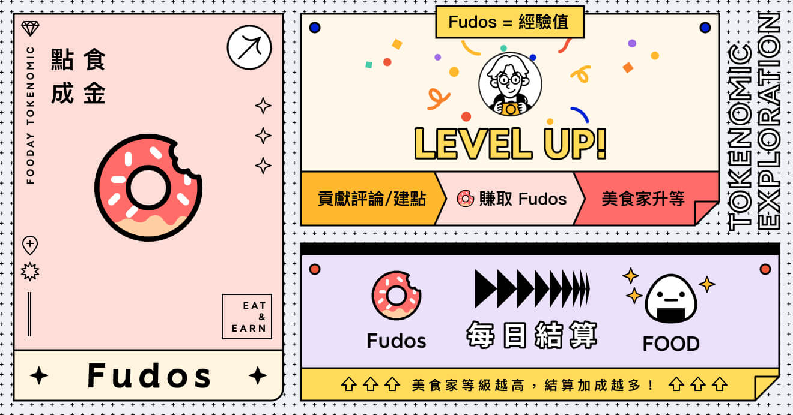
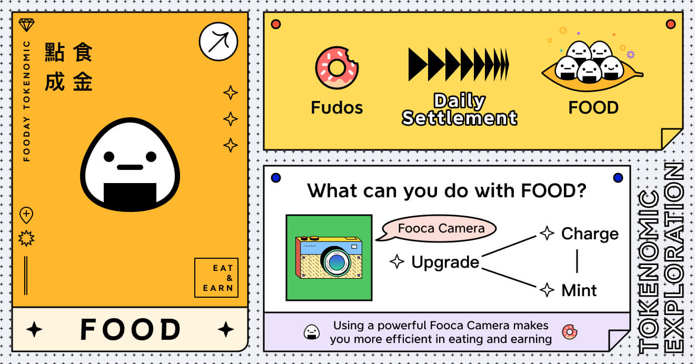
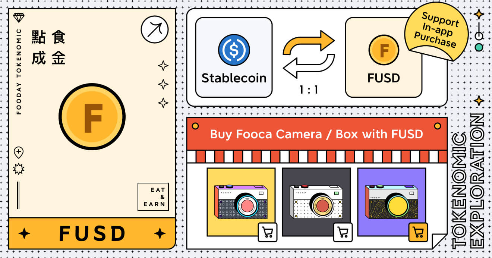

Fooday is not just a food community; its economic token system is at its core. Currently, Fooday has two essential tokens and an experience point system: Fudos, FOOD, and FUSD. These three play different roles on Fooday and have differences in their usage.

***

## Fudos

**Earning Experience Points through Contributions**

Fudos are the experience points on the Fooday platform. Foodies with Fooca cameras can earn a certain amount of Fudos by completing missions, creating spots, reviewing food, and reporting incorrect information, among other methods. 

The system will automatically calculate and convert the earned Fudos into FOOD. Please refer to the [Fodus to FOOD Multiplier](/foodie-level#fudos-to-food-multiplier) section on the [Foodie Level](/foodie-level) page.

In short, by accumulating Fudos through interactions and contributions, a Foodie's level will increase. The Foodie's level affects the conversion rate of Fudos to FOOD, with higher levels enjoying better exchange rates.

> How to earn Fudos in the Fooday app: Please refer to [Tokenomics](/tokenomics)

***

## FOOD

**Food Platform Token**

In Fooday, FOOD has real-world value and serves as a versatile token. Firstly, Foodies can use FOOD for upgrading, charging, and minting Fooca cameras, enhancing their gaming experience on the platform.

Furthermore, Foodies can withdraw the earned FOOD to the blockchain and convert it into other cryptocurrencies, providing users with greater flexibility and various value realization possibilities. 

* FOOD real-time price on CoinGecko: [https://www.coingecko.com/en/coins/fooday](https://www.coingecko.com/en/coins/fooday)
* Buy FOOD: [LlamaSwap](https://reurl.cc/r6WaeZ)
* FOOD contract address: `0x78b1aa5c9b37c52695c93448ad0c64560edb9c4d`

> How to earn FOOD in the Fooday app: Please refer to [Tokenomics](/tokenomics)

:::info
It's important to note that the price of FOOD is determined by the market, so there may be fluctuations in its value.
:::

One important point to note is that FOOD cannot be used to directly purchase Fooca cameras; you need to use a specific economic currency - [FUSD](#fusd).

### Bonus FOOD

**Non-transferable Food Platform Token**

In addition to FOOD, the Fooday platform occasionally distributes **"Bonus FOOD"** during specific events and missions. Unlike FOOD, **Bonus FOOD cannot be withdrawn to the blockchain** and can only be used within the Fooday app for consumption scenarios.

Users with Bonus FOOD will have it consumed first in scenarios requiring FOOD within the app. Once the Bonus FOOD is exhausted, the regular FOOD will be used.

***

## FUSD

**Currency Available for In-App Purchase**

FUSD is a type of economic currency that can be directly purchased within the Fooday App. Foodies can use FUSD to buy special items like Fooca cameras, chests, accessories, etc., but it cannot be used for charging or upgrading Fooca cameras.

Similarly to FOOD, Foodies can also freely withdraw FUSD to the blockchain. It's worth mentioning that after withdrawing FUSD, it will be converted back into stablecoins, meaning its value will not be affected by fluctuations.

In addition to in-app purchases, if you have USDC/USDC.e on the blockchain, you can choose to transfer them to Fooday, and the platform will automatically convert them into FUSD at a 1:1 ratio, allowing users to quickly start enjoying the food experience.

***

How do I withdraw from Fooday? [Deposit and Withdrawal](/deposit-and-withdraw)