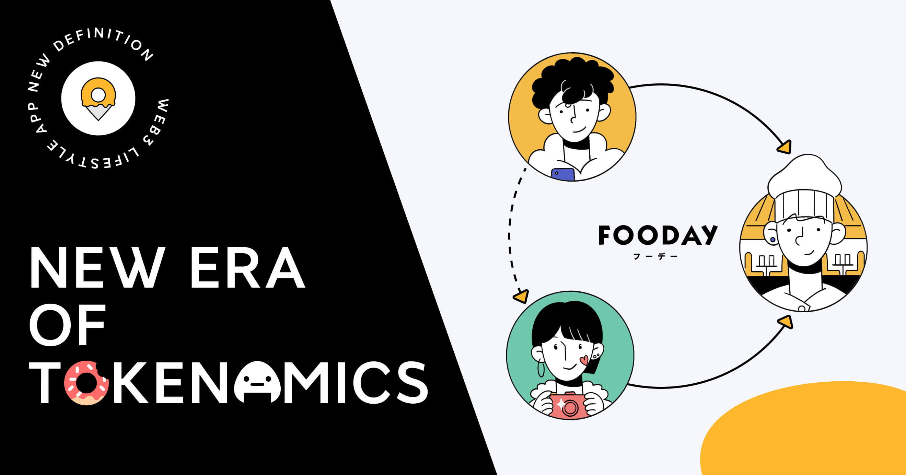
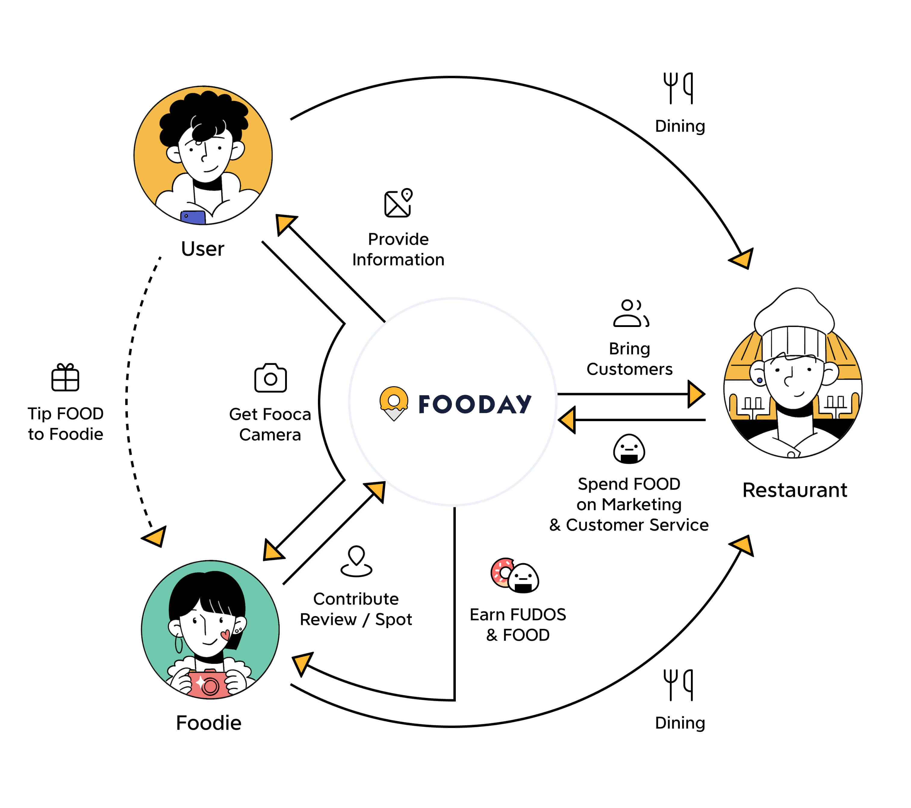

Fooday is a revolutionary restaurant review platform that leverages the latest in web3 technology to provide accurate and reliable information about dining experiences. At the heart of the platform’s success is its innovative tokenomics system, which incentivizes Foodies to share their experiences and create a trustworthy and accurate source of information for food lovers everywhere.

Talk about tokenomics, most are about Ponzi. We don’t agree. With the proper design, tokenomics is the best tool to distribute value in a fair way within the ecosystem. Fooday’s tokenomics system is designed to reward contributors to the platform and provide an incentive for them to share their experiences and engage with the community. By leveraging the latest in web3 technology, Fooday is able to create a more robust and active community that is incentivized to share accurate and reliable information about dining experiences. The use of Food Coin as a form of payment and participation further enhances the user experience, while the distribution of Food Coin ensures the long-term sustainability and growth of the Fooday platform.

***

## Explore Fooday's Tokenomics

Fooday’s tokenomics system is designed to incentivize Foodies to leave accurate and detailed reviews while promoting positive behavior within the community. Here’s how it works:

### Acquisition of a Fooca Camera

Before a Foodie can start earning rewards on Fooday, they must first acquire a Fooca Camera, which is a unique and personalized representation of their personality and engagement within the community. This serves as collateral to ensure good behavior, and any Foodie found to be in violation of the platform’s guidelines may have their Fooca Camera impacted, which could result in the loss of rewards or restrictions on their ability to use the platform. Fooca Camera is a type of NFT used exclusively within the Fooday ecosystem.

### Earning Fudos

Once a Foodie has acquired a Fooca Camera, they can start earning Fudos for their contributions to the platform, such as leaving reviews, adding new restaurants, or engaging with other Foodies. Fudos represent a credit point of a Foodie and the more Fudos a Foodie earns, the higher their level within the platform and the higher the bonus they receive when earning Food Coins. Fudos is not transferrable because you can’t buy the credit, you need to earn it, which further incentivizes Foodies to actively engage with the platform and contribute to the community.

### Receiving Food Coins

To receive Food Coins, foodies must accumulate Fudos during a set period, with the amount of Food Coins received determined by the number of Fudos accumulated. More Fudos result in a higher payout of Food Coins, which Foodies can use to level up or repair their Fooca Camera, mint new Fooca Camera, or acquire new equipment, incentivizing active engagement with the platform and community participation. The use of Food Coins within the system provides added incentives and a sense of ownership in the ecosystem.

***

## Token Utility

Food Coin are the backbone of the Fooday ecosystem, providing a means of value transfer within the platform. These tokens have a wide range of utilities, making them an essential component of the Fooday experience. Here are some of the ways in which Food Coins are used within the platform:

### For Foodies

* Leveling up and repairing Fooca Camera: Foodies can use Food Coins to level up their Fooca Camera or repair them if they are damaged.
* Minting new Fooca Camera: Food Coins can also be used to mint new Fooca Camera, allowing Foodies to showcase their expertise and engagement within the community. Except the Genesis Fooca Camera, this is the only way to create new Fooca Camera in the ecosystem. We’ll cover more in the next article about Fooca Camera.
* Acquiring new equipment: Food Coins can be used to acquire new equipment within the platform, enhancing the overall user experience.

### For Merchants

* Marketing campaigns: Food Coins can be used for merchant marketing campaigns within the Fooday ecosystem, contributing to the growth and development of their businesses.
* Customer service: Merchants can use Food Coins to respond to customer reviews on the platform, offering enhanced customer service and building stronger relationships with their customers. Additionally, merchants can use Food Coins to offer exclusive deals or discounts, incentivizing engagement and building loyalty within the community. By using Food Coins to provide exceptional customer service, merchants can create a more engaged and satisfied customer base, contributing to the long-term success of the Fooday ecosystem.
* Operating the spot: Merchants can use Food Coins to operate their spot on the Fooday platform, enhancing their visibility and contributing to the growth of the ecosystem.

The ultimate goal of Fooday is to create a closed-loop ecosystem. Foodies can spend Food Coins in restaurants, and merchants can use these tokens to attract more customers, thus creating a mutually beneficial relationship between the two groups.

***

In conclusion, Fooday’s innovative tokenomics system provides a fair and incentivized ecosystem that benefits both Foodies and Merchants. By promoting positive behavior within the community and enabling the power of tokenomics to incentivize engagement, Fooday creates a trustworthy and accurate source of information for food lovers everywhere. The use of Food Coins within the platform enhances the user experience and ensures the long-term sustainability and growth of the Fooday ecosystem. With its unique approach to value distribution and community engagement, Fooday is poised to revolutionize the restaurant review industry and set a new standard for fairness and transparency.