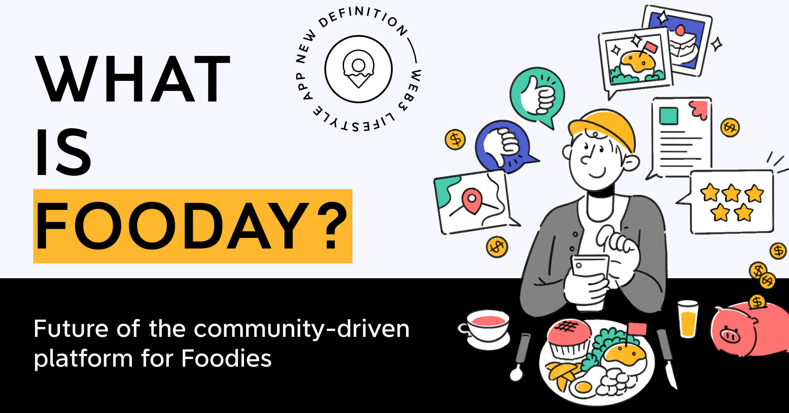

# Foodayとは何ですか？ 

Foodayへようこそ：レビューエコシステムを変える革新的なレストランレビュープラットフォーム！

Foodayとは何ですか？
Foodayは、食事を共有するためのプラットフォームで、単なるグルメマップではありません。ここでは、ユーザーは食事体験を共有したり、店舗の場所を作成したりするだけでなく、さらに多くのレストランを見つけたり、様々な美食を楽しんだりすることができます。

Foodayを通じて、ユーザーはレストランの品質、サービス、雰囲気、コスパなどさまざまな側面について公正な評価とコメントを提供し、Foodayマップに好きなレストラン情報を作成して他のユーザーがそれをお気に入りに追加し、追跡し、実際に訪問できます。

Foodayが最も正確で公正な美食地図となる理由は何でしょうか？Foodayは、最新のweb3技術を活用し、独自のトークンエコノミーとコミュニティ検証を採用しています。これにより、評価の正確性と信頼性が向上しました。さらに、GPS位置情報技術を利用することで、Foodayはユーザーが実際にレストランに行って食事をすることを確認し、消費者と店舗に追加の信頼保証を提供しています。

# 現代のレビュー生態系の問題と課題

現在のレストランレビュープラットフォームには、以下のような問題があります。これらの問題は、消費者が失望する可能性を高めるだけでなく、多くの場合、店舗に否定的な影響を与える可能性があります。その中でもっとも批判されている問題は次の通りです：

**1. 不正確なレビューやボットによる口コミ操作：**
多くのレストランレビュープラットフォームで見られる不正なレビューは、多くの消費者がレストランを探す際の課題となっています。一部のレストランは、有料のボットや「5つ星の評価を残して料理を交換する」といった活動から高い評価を得ており、これにより消費者は実際の味やサービスを参考にしにくくなっています。

**2. 利益関係：**
一部のレストランレビュープラットフォームは、広告の利益関係やその他の要因により、特定のレストランや事業者に偏った情報を提供することがあります。その結果、消費者はレストランの公正な評価を得るのが難しくなります。

**3. 信頼の不足：**
現在のレストランレビューの生態系では、虚偽のレビューや偏見のある発言が少なくないため、多くのユーザーがレビュープラットフォームの情報にますます信頼を置かなくなっています。これにより、プラットフォームの本来の価値が失われています。

**4. 情報の時代遅れ：**
レストランの価格、料理、および提供されるサービスは通常急速に変化しますが、従来のレビュープラットフォームは適時に反映することができず、消費者が期待する料理や価格と一致しない経験をすることがよくあります。

**5. レビューを書く動機の不足：**
現在のレビュー生態系では、多くのプラットフォームが消費者に十分なインセンティブを提供しておらず、結果として消費者が詳細で正確なレビューを残す動機が不足しています。これにより、美食レビュープラットフォームの本来の目的が失われ、レストラン情報が不足してしまい、消費者は最終的に限られた情報しか参考にできなくなります。

# 私たちが提供する解決策

Foodayは、現存するレストランレビュープラットフォームが直面する問題を解決することに取り組んでいます。これには、NFTを統合し、食の評判を向上させ、独自のFoodieアカウントをカスタマイズすることが含まれます。また、NFTを入場制限として使用することで、悪意のある行動が発生しないよう保証することができます。

以下は、Foodayが消費者に提供する、現在のレビューの問題に対する解決策です：

**トークンエコノミクス：**
Foodayは独自のトークンエコノミクスシステムを持ち、ユーザーがプラットフォームへの貢献に報酬を与えます。また、FoocaカメラNFTを所有しているユーザーのみが報酬を受け取ることができます。Foocaカメラを持つユーザーは、美食を楽しむ日常の中で引き続き「Eat & Earn」を実行できます。

**コミュニティ検証システム：**
Foodayプラットフォームは、コミュニティ検証システムを採用しています。これにより、すべてのレビューが真実で偏見のないものであることが保証されます。Foodieは信頼性の高い情報を提供し、すべてのユーザーに大きな利益をもたらします。

>コミュニティ検証システムとは、ユーザーが情報が真実であるかどうかを相互に確認する方法の一つです。このシステムにより、ユーザーはお互いのレビューや情報を閲覧し、それらが真実で信頼性があることを確認することができます。まるで身近な友人に特定のことが正しいかどうかを確認してもらうような感覚で、このシステムは情報の信頼性を確保するために相互の確認に依存しています。

* **リアルタイム情報の提供：：**
Foodayは、動的で柔軟な存在であり、Foodieがレストランの状態や情報を迅速かつ簡単に共有できるようにし、プラットフォーム上のコンテンツが常に最新かつ正確であることを確保します。

* **コミュニティ駆動：**
FoodayはFoodie向けに設計されており、FoodayはFoodieによって共同で構築されています。我々はFoodayが温かい美食愛好家のコミュニティプラットフォームになることを望んでいます。ユーザーは美食に情熱を持ち、経験を共有し、他の人々が美食を発見するのを手助けします。ポジティブで支持的な環境を共同で作り上げ、Foodieはプラットフォーム内で自由に交流し、コミュニティに参加できます。

* **Fooca 相機：**
FoodayのFoocaカメラはNFTであり、さまざまな用途があります。ユーザーはレベルを上げるために貢献し、自分自身の個性や専門知識を表示するユニークなシンボルとして使用できます。さらに、Foocaは擬似品としても機能し、Foodieが悪意のある行動を行わないようにし、プラットフォームの完全性を維持します：プラットフォームガイドラインに違反したFoodieはペナルティを受けます。その影響はFoocaカメラの機能に及び、場合によってはプラットフォームからの没収となります。

上記の解決策を通じて、Foodayはこれまでのレビュープラットフォームの中で最も信頼できる情報源を提供できると信じています。これにより、Foodiesがスムーズな食体験を探求し、同じ志を持つ人々と交流する手助けができます。

**Foodayの最も魅力的な特徴は、従来の偽レビューの問題を解決すると同時に、Foodiesに報酬を提供することです。**

Web3テクノロジーを活用することで、ボットによる口コミ操作に惑わされる必要がなくなり、また、レストランがFoodayを通じて味とサービスの公正な評価を受けることを期待しています。また、カメラを持っていないユーザーでも、さまざまなレストランを探索し、似たような趣向を持つFoodieをフォローすることで、レストランを選ぶ際の心配がなくなります。

Foodayコミュニティに参加することで、驚くべき新しい食体験を見つけることができることを期待しています。Foodayと一緒に新しい美食の波を創造する準備はできていますか？
