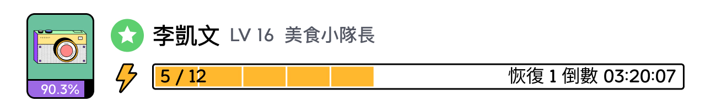

エネルギー（Energy）は、グルメ愛好家が貢献する際に欠かせない要素の一つです。各貢献には異なる量のエネルギーが消費されます。Foodayアプリのホームページ下部には、現在のエネルギー値が表示される黄色のエネルギーバーがあります。

:::info
Foocaカメラを所有している場合のみエネルギーを持つことができ、エネルギーがあることでコミュニティに貢献することができます。
:::

***

## Fooca カメラのボーナス

### カメラの数によるボーナス

**Foocaカメラを多く所有するほど、美食家アカウントの総エネルギーが増加し**、一日に行える貢献が増え、それに伴い得られる報酬も多くなります。

以下はカメラの数と総エネルギーの関係です：

| カメラの総数  | 総エネルギー  | 
|:---:|:---:|
| 1台 | 6 エネルギー |
| 3台 | 10 エネルギー  | 
| 9台 | 18 エネルギー | 
| 15台 | 30 エネルギー | 

### アドバンストカメラのボーナス

アドバンストカメラを1台所有している場合、美食家のエネルギー（Energy）の最大値が直接+1されます。X台のアドバンストカメラを持っている場合、その数だけエネルギーが加算されます。このボーナスは、カメラの数によるエネルギーの最大値のボーナスと競合しません。

クラシックカメラには追加のエネルギーボーナスはありません。
 

#### 例:

小林が3台のカメラを所有しており、そのうち2台がアドバンストFoocaカメラである場合、小林の最大エネルギーは

```
10（3台のカメラによるエネルギーボーナス） + 2（2台のアドバンストカメラによるボーナス）= 12
```

***

## エネルギーの消費

ほとんどの貢献にはエネルギーが消費されます。異なる貢献には異なる基本エネルギー消費が必要です。以下の表をご参照ください：

| 貢献  | 消費エネルギー   | 消費電力     | *獲得可能な最大Fudos  |
|:---:        | :---:        |:---:       | :---:       |
| Review      | 4 エネルギー  | 10% 電力  | 45 Fudos    |
| Create Spot | 3 エネルギー  | 5% 電力   | 15 Fudos   |
| Update Spot | 1 エネルギー  | 2% 電力   | 3 Fudos    |
| Report      | 1 エネルギー  | 2% 電力   | **元のレビュー/店舗の価値に相当するFudos     |

***

## エネルギーの回復

消費されたエネルギーは時間経過でしか回復しません。**所有しているエネルギー量に関係なく、一日にすべてのエネルギーが回復します。**

#### 例；

* 1台のカメラを所有している場合、総エネルギーは6で、1エネルギーの回復時間は4時間です。
* 3台のカメラを所有している場合、総エネルギーは10で、1エネルギーの回復時間は2.4時間です。


:::注意：
注意：エネルギーはグルメ愛好家アカウントに蓄積され、Foocaカメラには蓄積されません。Foodayアカウントからログアウトするとエネルギーはゼロになり、次回ログイン時にエネルギーはゼロから回復します。
:::