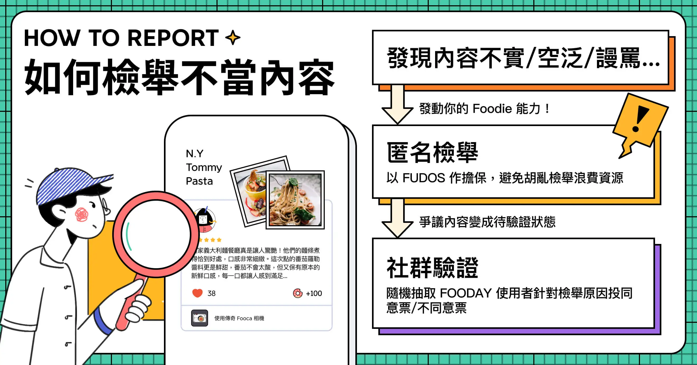
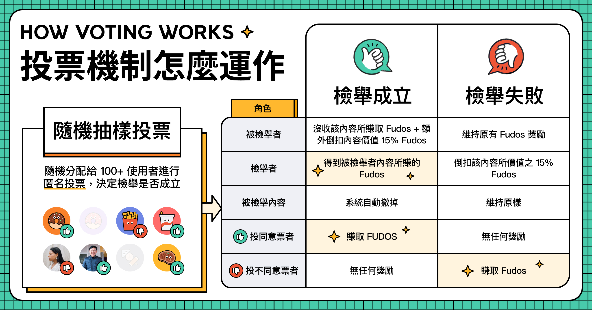

# 通報と検証投票

Foodayのレビューおよびレストラン情報の正確性と信頼性を向上させるため、コミュニティ主導の通報検証プロセスを導入しました。本記事では、通報および投票システムの完全な運用方法について説明します。

## 通報システムの運用方法

Foodayの通報システムは「プラットフォームの公正性と完全性を維持する」ことを目的としています。この新しい通報メカニズムにより、ユーザーは不正確な情報を通報し、リアルタイムで審査を行うことができます。現在、主な通報シナリオには、レストラン情報の誤りや無効なレビューが含まれます。

**Wrong Spot Info**

When a user creates a new spot on the Fooday map, the associated spot becomes immediately visible on the map. The creator of the spot is rewarded with Fudo, and other users gain the ability to post reviews on that spot.

However, to ensure the accuracy and reliability of information, a "Newly Created" label is affixed to such spots for the initial 7 days. This label assists other users in verifying the correctness of the spot's details. During this 7-day period, other users are unable to modify existing restaurant information but can contribute by adding information that are not yet listed. The creator of the spot retains the ability to supplement or modify the spot's information as needed. After the aforementioned 7-day period, the "Newly Created" label will be automatically removed. At any given time, users have the option to report a spot for any reason.

**不適切/不正確なレビューの通報**

同様に、ユーザーは不正確または誤解を招く情報を含むレビューを通報することもできます。レビューは投稿後すぐにレストランページに表示され、Fudosが獲得されますが、他のユーザーがそのレビューを通報した場合、そのレビューは投票プロセスに進み、信頼性と有用性を確保するために評価されます。

### 完全匿名

通報は匿名で行われ、通報された人および検証投票に参加するランダムに選ばれたグルメ愛好家たちは、あなたの身元を知ることはありません。これにより、公平性とアカウントの影響力が確保されます。

------

## 通報投票ルール

通報が提出されると、Foodayの投票システムが起動し、ランダムに選ばれた複数のユーザーが投票に参加します。通報された情報が投票検証プロセスに入ると、その情報やレビューは検証が完了するまで編集できず、他のユーザーも重複して通報することはできません。選ばれたユーザーは通報されたレストラン情報やレビューを慎重に審査し、「賛成」または「反対」の投票を行います。

### システムはどのように投票検証者を選ぶのか？

システムは通報内容の地域や言語に基づいて適切なユーザーを選びます。

レストラン情報が通報された場合、システムはその店舗がある国のユーザーを選出して投票検証を行います。レビューが通報された場合、システムはレビューの投稿者と同じ国のユーザーを選出して投票検証を行います。

情報が通報されると、システムはランダムに30人のFoodayユーザーを選び、投票を依頼します。投票は通報された時点から24時間開放され、選ばれたユーザーには通知が届きます。通知をクリックすることで投票に参加できます。

:::info
Foocaカメラを持っていないユーザーでも、ランダムに選ばれて検証投票に参加できます。つまり、一般ユーザーでもコミュニティに参加して報酬を得ることができます！
:::

------

## 通報が成立する条件

**通報後24時間以内に、投票率が総投票者数の30％以上、かつ「同意」票が2/3以上で通報が成立します。** 

例：
> 小林があるレビューを通報し、システムが30人のユーザーを選んで投票を依頼した場合、24時間以内に9人以上が投票し、そのうち6票以上が「同意」であれば通報が成立します。

### 投票者数が足りない場合はどうなるの？

通報後24時間以内に30人中9人以上の投票がなければ、投票期間をさらに24時間延長し、追加で倍の人数を選んで投票を依頼します。この延長された24時間内に、元の投票者数の30％に達する必要があります。

例：
> 	システムが30人のユーザーを選んで投票を依頼し、24時間後に投票率が30％未満であれば、さらに30人のユーザーを選び、合計60人に投票を依頼します。最終的に9人以上が投票すれば目標達成です。

もしそれでも達成できなければ、再び投票期間を延長し、新しいユーザーを追加していきます。これを投票率が30％に達するまで繰り返します。

------

## 通報が成立/不成立した場合はどうなりますか？

### 通報が成立した場合

1.	通報されたレビューや店舗の価値に応じたFudosが失われ（カメラのバッテリー消耗を除く）、さらに元の価値の30％が罰則として追加で減点されます。
2.	該当するレビューや店舗情報が削除されます。

### 通報が不成立だった場合

1.	Fudosの減点はありません。
2.	レビューや店舗情報はそのまま残ります。
3.	通報は取り消されます。

例:
> 店舗Bにレビューを書いて、そのレビューの元の価値が40 Fudosだったが、カメラのバッテリーが70％未満だったため、最終的な報酬は28 Fudosだったとします。

> その後、小林がそのレビューを通報しました：
> 
* 小林の通報が成立した場合、レビューの元の価値である40 Fudosを失い（報酬が28 Fudosであっても）、さらに40 Fudosの30％である12 Fudosが追加で減点され、合計で52 Fudosが減点されます。
* 小林の通報が不成立だった場合、何も減点されません。

------

## 私が提出した通報が成立 / 不成立の場合、どうなるの？

### 通報が成立した場合

1.	当該レビューや店舗情報の価値に相当するFudosを獲得できます（カメラのバッテリー消耗は考慮されません）。
2.	該当のレビューや店舗情報が削除されます。

### 通報が不成立の場合

1.	当該レビューや店舗情報の価値の30％が減点されます。
2.	通報は取り消されます。

例:
> 小林が店舗Aに40 Fudosの価値があるレビューを投稿しました。

あなたがそのレビューを通報した場合：

* あなたの通報が成立した場合、元のレビューの価値である40 Fudosと、通報時のカメラボーナスが追加で付与されます。
* あなたの通報が不成立だった場合、元のレビューの価値である40 Fudosの30％が減点され、12 Fudosが失われます。

------

## Foodayの通報システムの目的

**透明性と公正性の向上**
Foodayの強化された通報システムは、ユーザーが検証プロセスに参加することでプラットフォームの透明性を高めます。匿名の通報は公正な投票プロセスを保証し、通報者のフォロワーや評価、現在の投票率に影響されない結果をもたらします。

**コミュニティの参加と信頼**

ユーザーは通報と投票プロセスに積極的に参加することで、プラットフォームの信頼性に貢献します。これにより、共同責任感やユーザー間の信頼が醸成され、正確な情報を重視するコミュニティ駆動の環境が創造されます。

**効率的なスポット作成とタイムリーな更新**

Foodayに作成されたレストランは、即座に地図上に表示されます。私たちはスポット作成プロセスを簡素化し、ユーザーが新しいレストランや食体験を迅速に共有できるようにしました。複雑な検証プロセスを必要とせず、食体験のリアルタイム更新と最新情報の流通を確保します。

**正確性とレビュー品質**
Foodayは、正確な情報を提供するユーザーにFudosを報酬として提供し、高品質なレビューコンテンツを維持します。これにより、プラットフォーム全体の信頼性が向上します。

**信頼性のある意思決定**

Foodayの強化された通報システムは、集団投票プロセスに基づいた意思決定を保証します。ランダムに選ばれた投票メカニズムは、偏見や人為的な操作を排除し、通報内容の公正で客観的な判断を反映します。これにより、Foodayは信頼できる、正確で公正なレストラン情報のソースとなります。