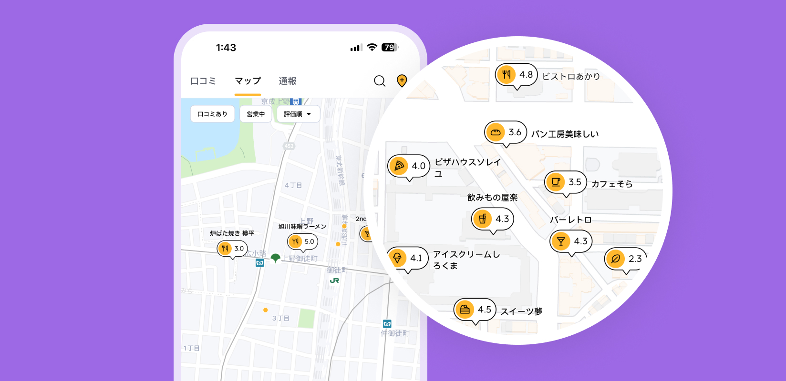
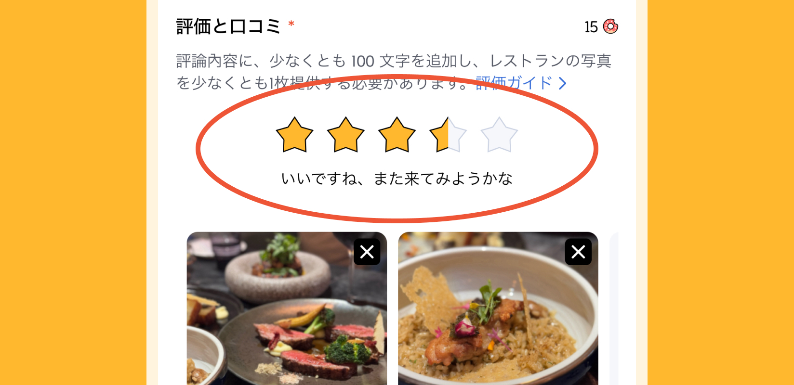
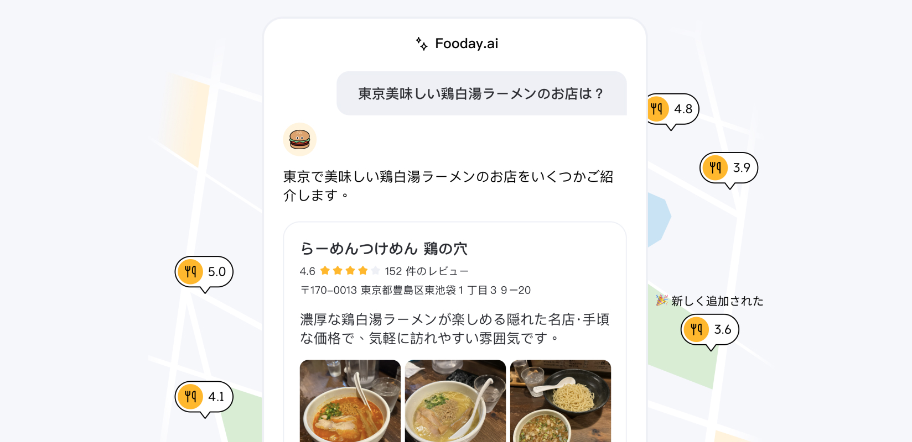
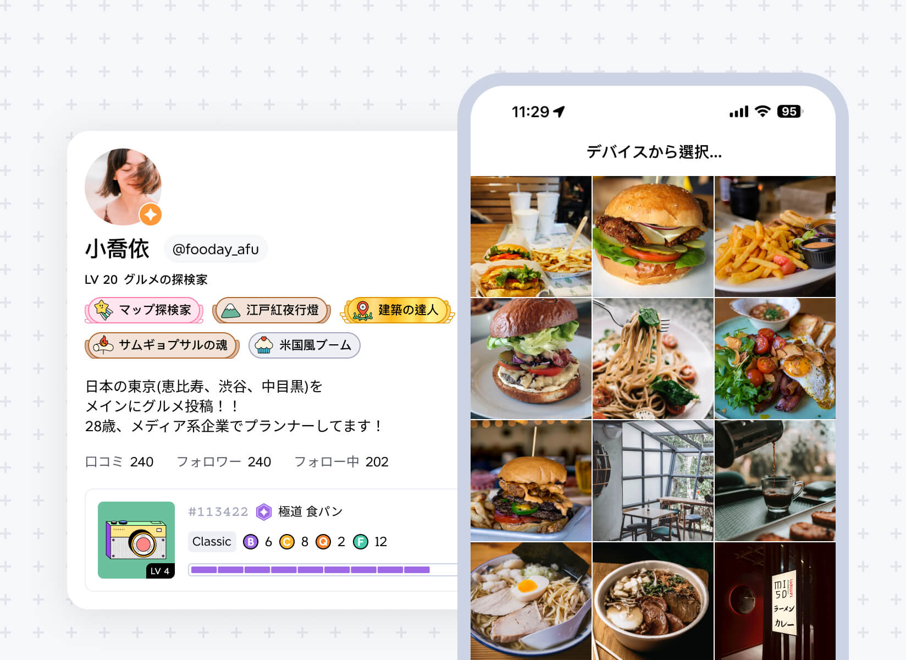
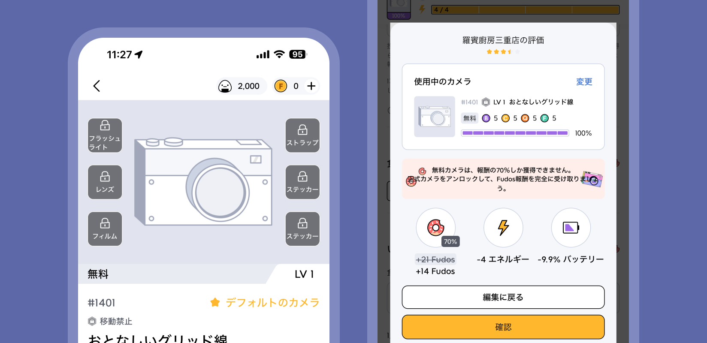
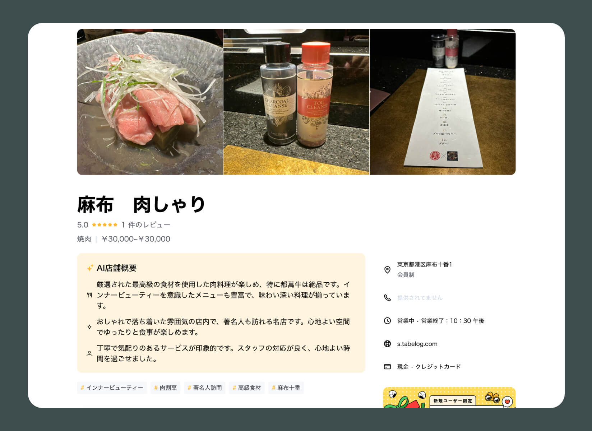
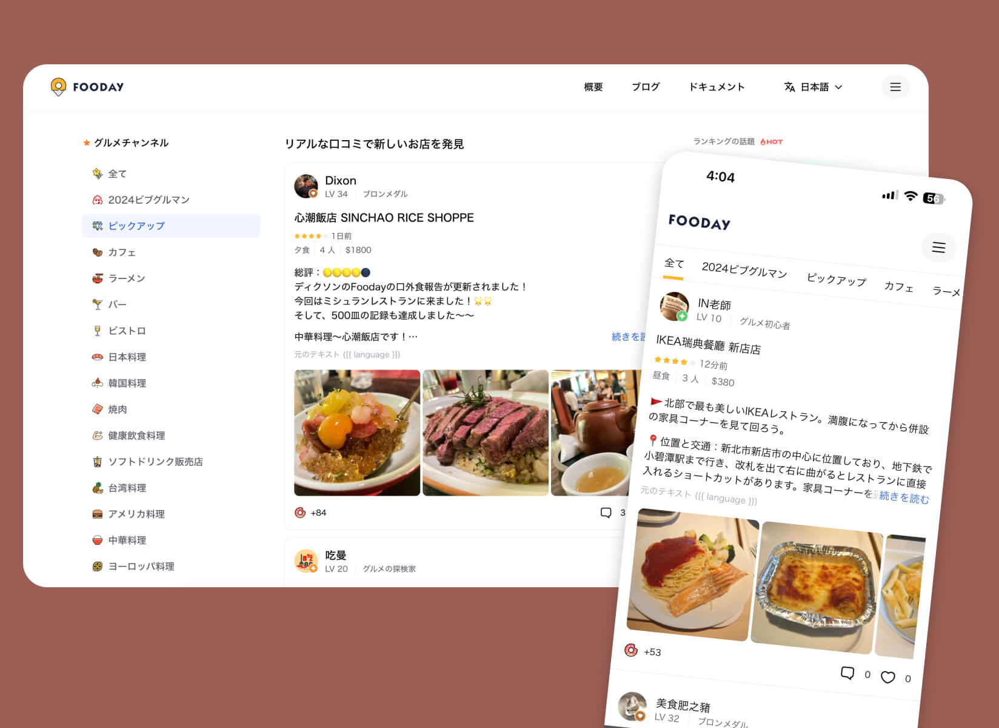

## App Release Notes

### V1.58.0 (2024-08-30)

#### 🎉 New Features

- New Beginner Task System: Complete simple community tasks in the app, like liking posts or following other foodies, and earn rewards.

---

### V1.55.5 (2024-08-25)

#### 🐛 Bug Fix

- Fixed an issue that prevented photo uploads from mobile devices.

---

### V1.55.0 (2024-08-10)

#### 🎉 New Features

- Added Restaurant Category Icons: Each restaurant category now has its own icon, making it easier to view on the map.

---

### V1.54.0 (2024-08-05)

#### 🎉 New Features

- Added Half-Star Ratings: By popular demand, you can now rate restaurants using half-star increments for more precise feedback.

---

### V1.52.0 (2024-07-15)

#### 🎉 New Features

- AI Restaurant Summaries: Now, when you view a restaurant, you’ll see a summary generated from all the reviews, covering food, service, and ambiance. This helps users quickly spot must-try dishes and the pros and cons of each restaurant.

---

### V1.49.0 (2024-07-10)

#### 🎉 New Features

- Fooday AI Launch: Fooday AI is now live! You can use AI to search for restaurants, like “recommendations for gastropubs in Zhongshan” or “ramen with chicken broth in Taipei.” It integrates authentic reviews from around the world and the latest restaurant information from the Fooday platform, providing food lovers with dining guides and helpful tips to make better dining choices.

---

### V1.47.0 (2024-07-01)

#### 🎉 New Features

- Certified Foodie Feature: Once you meet the criteria and pass the review process, you can become a Certified Foodie (gold badge). Certified users can upload photos from their gallery within 30 days.

---

### V1.41.0 (2024-06-18)

#### 🎉 New Features

- Free Experience Camera: The Free Experience Camera is now live! Complete simple community tasks to get one for free. Users with the experience camera can fully participate in Fooday, including adding locations and writing reviews. This allows interested users to try it out before deciding whether to purchase the full version.

---

## Web Release Notes

### V1.11.0 (2024-09-03)

#### 🎉 New Features

- AI Food Topics: Popular searches and answers from Fooday AI are now available on the official website! Check out what restaurants foodies near you are looking for.

---

### V1.6.0 (2024-08-10)

#### 🎉 New Features

AI Restaurant Summaries: Each location now includes an AI-generated summary, combining all reviews to provide detailed insights on service, ambiance, and food. This helps users quickly determine if a restaurant fits their preferences.

---

### V1.4.0 (2024-08-02)

#### 🎉 New Features

- New Food Exploration Page: The Fooday website now features a new Food Exploration page, where you can easily browse categories of interest and read genuine, thoughtful reviews from Fooday foodies.

---
