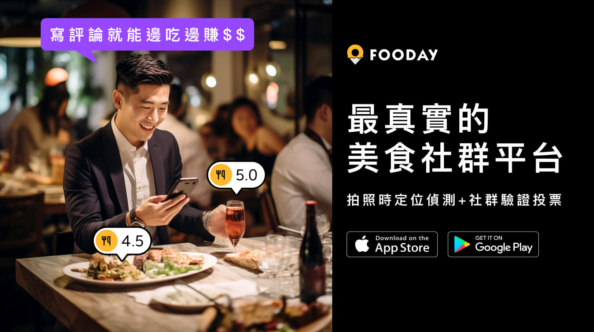

import { InstagramEmbed } from 'react-social-media-embed';


2024 年底跨年即將到來，想好跨年聚餐要去哪裡吃了嗎？今天為大家精選出北中南 8 間日式、中式、美式及火鍋等跨年餐廳，讓你能夠跟家人朋友在 2024 跨年一起歡慶，迎接 2024 斬新的一年！

<!-- truncate -->

### 全台 8 間跨年聚餐餐廳首選：

* [海底撈火鍋 微風南山店](#海底撈火鍋-微風南山店)
* [Old Seat Restaurant Cafe 川酒.咖啡](#old-seat-restaurant-cafe-川酒咖啡)
* [八百屋](#八百屋)
* [町燒酒食](#町燒酒食)
* [The Chips 美式餐廳](#the-chips-美式餐廳)
* [羊鮮森-溫體涮羊肉精緻火鍋](#羊鮮森-溫體涮羊肉精緻火鍋)
* [賦于咖啡 FuYu Cafe](#賦于咖啡-fuyu-cafe)
* [Manniu 慢牛 創意牛肉料理](#manniu-慢牛-創意牛肉料理)

***

## 海底撈火鍋 微風南山店

_微風南山 | 101煙火 | 火鍋 | 現場撈麵表演_

台北市信義區的人氣夯店「海底撈」已經在微風南山重新開幕囉！座落在跨年 101 煙火的一級戰區，海底撈火鍋微風南山店除了可以讓你邊享用熱騰騰的火鍋，享受頂級的桌邊服務以及撈麵表演，更可以超近距離觀賞 101 跨年煙火，是每個饕客的必訪餐廳，建議如果你有要打算到海底撈一睹跨年煙火風采，建議當天白天直接到現場抽號碼牌，搶先卡好位，才可有機會在跨年夜吃到火鍋喔！

<InstagramEmbed url="https://www.instagram.com/p/BvmLCnQAmFf/" width={382} />

```
* 餐廳地址：台北市信義區松智路17號B2 (微風南山大樓)
* 餐廳電話：02-8780-1866
* 營業時間：週一 ~ 週日 11:00 ~ 隔日凌晨 04:00
* 注意事項：跨年人潮眾多，建議提早到現場抽號碼牌候位
```

***

## Old Seat Restaurant Cafe 川酒.咖啡

_中餐川菜料理 | 咖啡廳 | 餐酒館 | 寵物友善_

隱藏在隱密小巷弄中的神奇川菜館，乍看外表還以為是咖啡店，裡面是復古裝潢和道地的川菜。所有想得到的川菜口味，如麻辣、鹹、油都應有盡有，且菜色食材都新鮮，口味偏重，因此白飯可以一碗接著一碗配起來！餐點不僅不僅限川菜，也有些其他菜路，是個非常好吃的創意川味餐酒館。如果想要在跨年夜來點不同風味的聚餐，Old Seat Restaurant Cafe 川酒.咖啡是一個很不錯的選擇喔！

<iframe width="382" height="726" frameborder="0" src="https://fooday.app/zh-TW/embed/reviews/gypoX3FE9Bb84KS2S5pQSK?maxwidth=384&maxheight=726"></iframe>

```
* 餐廳地址：台北市大安區忠孝東路四段101巷29號1樓
* 餐廳電話：02-2731-0459
* 營業時間：週日 ~ 週四 12:00 ~ 23:30，週五 ~ 週六 12:00 ~ 24:00
* 注意事項：可刷卡，可線上訂位
```

***

## 八百屋

_日式居酒屋 | 啤酒 | 關東煮 | 烤物 | 炸物_

這家日式居酒屋在中山巷子享有超高人氣！近年來都是上班族下班聚會必去的小酌地點。很多日本人都會來此處用餐，店員也多半會講日文，是個很有日本風味的居酒屋。店內裝潢為現代日本風，簡約而溫馨，營造出舒適的用餐氛圍，非常適合三五好友小酌聚聚，一起跨年迎接 2024 新年！菜單種類繁多，提供多樣化的日式料理，包括烤物、炸物、煮物以及各式啤酒。跨年夜想要跟朋友一起談天說地、品嚐日式料理的話，八百屋是個非常不錯的選擇喔！

<iframe width="382" height="726" frameborder="0" src="https://fooday.app/zh-TW/embed/reviews/daC5u3ycrrRLGTw7Tefg9U?maxwidth=384&maxheight=726"></iframe>

```
* 餐廳地址：台北市中山區中山北路二段27巷11號
* 餐廳電話：02-2567-4775
* 營業時間：週一 ~ 週日 18:00 ~ 凌晨 01:00
* 注意事項：可刷卡，可電話訂位
```

***

## 町燒酒食

_日式燒肉 | 居酒屋 | 燒酒_

座落在板橋的日式燒肉居酒屋，店裡的餐桌位置擺放很寬鬆，用餐氛圍比一般的燒肉店舒服很多。店家會為每桌提供熱暖暖的雞湯，跟烤肉一起享用非常美味暖胃，如果喜歡清爽一點的口味可以試試胡麻鰻魚沙拉跟牛小排。若喜歡日本燒肉的用餐環境的朋友，非常適合來吃看看町燒酒食的燒肉、小酌兩杯喔！

店家剛好最近有推出骰子樂，可以跟店家一起玩骰子比大小，贏了的話可以獲得驚喜隱藏人氣小品！

<InstagramEmbed url="https://www.instagram.com/p/C0i7UNhr9Tm/" width={382} />

```
* 餐廳地址：新北市板橋區館前西路46巷3–1號
* 餐廳電話：02-8951-1066
* 營業時間：週一 ~ 週日 17:30 ~ 24:30
* 注意事項：可刷卡，可線上訂位
```

***

## The Chips 美式餐廳

_美式餐廳 | 牛排 | 生日聚餐 | 朋友聚餐 | 炸物拼盤_

喜歡美式餐廳的朋友有福囉！The Chips 美式餐廳提供可以看球賽的電視轉播，且店內裝潢非常美式，，必備的美式炸物滿足你舌尖上的感動，炭火醬汁炸雞翅和雞柳尤其推薦，雞柳是用魚薯條那種濕粉炸法，裡面還是很多汁。每人有200元低消，但其實多人一起享用的話，點個幾道餐點就超過囉，因此不用太擔心。

<InstagramEmbed url="https://www.instagram.com/p/Cy5nhUOP7gH/" width={382} />

```
* 餐廳地址：新北市板橋區縣民大道二段7號2樓
* 餐廳電話：02-8969-2222
* 營業時間：週一 ~ 週日 11:00 ~ 22:00
* 注意事項：可刷卡，線上訂位，如客滿時用餐限時 90 分鐘
```

***

## 羊鮮森-溫體涮羊肉精緻火鍋

_火鍋 | 溫體羊肉湯 | 煮粥服務_

不同於一般的羊肉爐，羊鮮森-溫體涮羊肉精緻火鍋的店內空間寬敞舒適並有獨立包厢，很適合與朋友聚餐或是公司聚餐， 餐點新鮮用料實在並有涮肉服務。價位雖然比較高，但無論海陸或是蔬菜、火鍋料都表現不凡，有符合這價位的水準！湯頭很鮮，喝了會回甘，在冷冷的跨年夜更是暖心又暖胃。喜歡吃羊肉的朋友們，這家絕對是不容錯過的跨年美食首選。

<InstagramEmbed url="https://www.instagram.com/p/Cz4rK3DBEeo/" width={382} />

```
* 餐廳地址：台中市西區中興里美村路一段273號
* 餐廳電話：04-2302-6889
* 營業時間：週一 ~ 週日 12:00 ~ 22:00
* 注意事項：可刷卡，可線上訂位
```

***

## 賦于咖啡 FuYu Cafe

_咖啡店 | 早午餐 | 適合工作 | 馬爾濟斯 | 免費 Wifi_

賦于咖啡 FuYu Cafe 主打豐富的早午餐拼盤、學生友善的價格、再加上店員友善溫柔的態度，會讓人心動到想一再來訪！最主要是餐點不僅很有特色，也非常之美味，營養攝入很均衡。最喜歡可頌的早午餐拼盤，可頌本人外酥內軟，豬肉丸也很好吃。青醬雞腿排超有特色。推薦在跨年或隔日的白天睡到自然醒，來 賦于咖啡 FuYu Cafe 享受悠閒的早午餐！

<iframe width="382" height="726" frameborder="0" src="https://fooday.app/zh-TW/embed/reviews/ETteAeRqHoEX9VXvBrHpyD?maxwidth=384&maxheight=726"></iframe>

```
* 餐廳地址：台南市東區長榮路三段76號
* 餐廳電話：06-236-1189
* 營業時間：週二 ~ 週日 09:00 ~ 17:00，週一公休
* 注意事項：可刷卡，免費 Wifi，內用每人低消一杯咖啡
```

***

## Manniu 慢牛 創意牛肉料理

_多國料理 | 牛肉料理 | 創意料理 | 高雄巨蛋美食_

高雄巨蛋附近很有名的多國料理餐廳， 一進門就可以看到櫃檯掛了好幾個代表各國時間的時鐘，很有異國融合的意境， 點餐時店員也會很細心的介紹餐點，主廚是馬來西亞人，所以很多料理都是台灣很少見的，非常特別！ 另外，雖然店家主打牛肉，但不吃牛的人可以請更換成豬肉，因此不吃牛的人不怕沒東西吃。在不收服務費的情況下，卻服務的非常周到，是個跨年聚餐非常適合的美食好去處喔！

<InstagramEmbed url="https://www.instagram.com/p/C0gutR0v92n/" width={382} />

```
* 餐廳地址：高雄市左營區至真路252號
* 餐廳電話：07-346-1899
* 營業時間：週一 ~ 週日 11:30 ~ 14:30，17:00 ~ 20:30
* 注意事項：座位不多，建議訂位
```

***

#### 你知道貢獻用餐評論也能賺進大把金嗎？

立即下載 Fooday app ，成為美食家，只要留下評論跟建立店家就可以獲得獎勵，實現邊吃邊賺的吃貨人生！

[](https://fooday.app/)

想追蹤更多的美食快報，歡迎訂閱我們的[Fooday 電子報](https://blog-zh.fooday.app/)