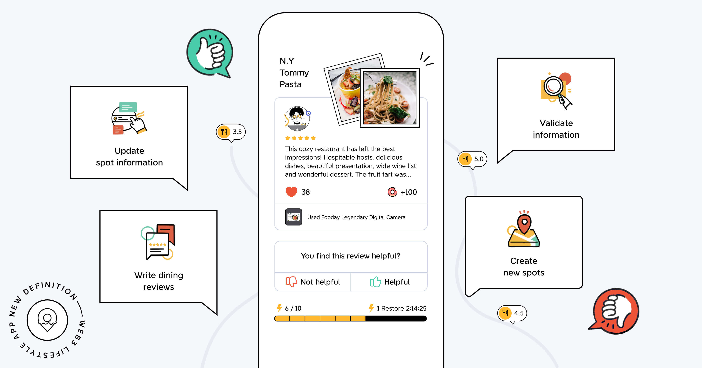

# Foodayとは？ 

Foodayへようこそ：飲食店のレビュー文化を一新する、画期的な口コミプラットフォーム！

Foodayとは？
単なるグルメレビューマップではありません。Foodayは、コミュニティが創り出す共有プラットフォーム。ここでは、グルメ好きの皆さんが実際の飲食体験を共有したり、新しいお店を登録したりできるだけでなく、素敵なレストランとの出会いや、新しい美味しい体験を見つけることができます。

Foodayでは、料理の品質やサービス、雰囲気、コスパなど、多角的な視点からお店を評価。公平なレビューと評価を投稿できるだけでなく、お気に入りの店や新しく発見したレストラン情報をFoodayのマップ上で共有することで、他のユーザーがそのお店をブックマークしたり、フォローしたり、実際に訪れたりするきっかけを作ることができます。

Foodayが最も信頼できるグルメマップである理由は、最新のweb3技術を活用し、独自のトークンエコノミーとコミュニティ検証システムにより、レビューの正確性と信頼性を確保しているからです。さらに、GPS位置情報技術を用いることで、ユーザーが実際にレストランを訪れたことを確認。これにより、消費者と飲食店の双方に、より確かな信頼性を提供しています。（詳しくは：Foodayが提供するソリューションをご覧ください）

# 現在のレビュー環境が抱える課題

現在多くの飲食店レビュープラットフォームでは、以下のような問題点が発生しています。問題は消費者の失敗体験を増やすだけでなく、飲食店にも大きな悪影響を及ぼしており、特に以下の問題が頻繁に指摘されています：

**1. 虚偽のレビューやボットによる口コミ操作：**
多くのレビュープラットフォームで見られる最も深刻な問題の一つで、消費者が店選びに困る大きな要因となっています。一部の店舗の高評価は、有料ボットによるものだったり、「五つ星レビューと引き換えに料理をプレゼント」といったキャンペーンによるものだったりするため、実際の味やサービスの参考にならないケースが多発しています。

**2. 利害関係による偏り：**
一部のレビュープラットフォームでは、広告収入などの利害関係により、特定の店舗や企業に有利な情報表示をすることがあります。そのため、消費者が公平な評価を得ることが難しくなっています。

**3. 信頼性の欠如：**
虚偽のレビューや偏った意見が少なくないため、多くのユーザーがプラットフォーム上の情報を信頼できなくなってきています。これにより、レビュープラットフォーム本来の価値が失われつつあります。

**4. 時差がある情報：**
レストランのメニューや価格、提供サービスは頻繁に変更されますが、従来のレビュープラットフォームではそれらの変更をタイムリーに反映できないことが多く、消費者の期待と実際の体験との間にギャップが生じやすくなっています。

**5. レビュー投稿の動機付けの不足：**
現在のレビュー環境では、多くのプラットフォームが十分なインセンティブを提供していないため、消費者が詳細で正確なレビューを投稿する動機が乏しい状況です。これは、グルメレビュープラットフォームの本来の目的を損なうだけでなく、店舗情報の不足を招き、消費者は限られた情報のみを参考にせざるを得ない状況に陥っています。

# Foodayが提供するソリューション

Foodayは、NFTの導入によるFoodayアカウントのカスタマイズや、食に関する評価の向上など、既存のレビュープラットフォームが抱える課題の改善に取り組んでいます。NFTによる参加条件の設定により、悪意のある行為を防止する保証としても機能します。

以下がFoodayが消費者に提供する、現在のレビュー課題への具体的なソリューションです：

**トークンエコノミクス（Tokenomics）：**
Foodayは独自のトークン経済システムを採用し、プラットフォームへの貢献に応じてユーザーに報酬を提供します。この報酬は、Foocaカメラ NFTを所持しているユーザーのみが獲得可能です。Foocaカメラ所有者は、普段の食事を楽しみながら継続的にEat & Earnができます。

**コミュニティ検証システム：**
Foodayプラットフォームは、コミュニティ検証システムを採用しています。これにより、すべてのレビューの信頼性と中立性を確保します。グルメマニアたちは信頼性の高い正確な情報を提供し、それがすべてのユーザーの利益となります。

>コミュニティ検証システムとは？
簡単に言えば、情報の真偽をユーザー同士で確認し合う仕組みです。ユーザーはお互いのレビューや情報を閲覧し、その真実性と信頼性を確認できます。身近な友人に確認を取るような感覚で、相互確認により情報の信頼性を担保します。

* **リアルタイムな最新情報：**
Foodayプラットフォームは、グルメマニアたちが素早く簡単にレストランの状況や情報を共有できる柔軟な仕組みを持ち、常に最新かつ正確な情報提供を実現します。

* **コミュニティ主導のプラットフォーム：**
Foodayはグルメマニアのために設計され、同時にグルメマニアたちによって共に作り上げられています。私たちは、Foodayを食への情熱を持ち、体験の共有を楽しみ、美食の発見を手助けしたいと考える人々の、温かいコミュニティプラットフォームにしたいと考えています。ポジティブでサポーティブな環境の中で、グルメマニアたちが自由に交流し、コミュニティに参加できる場を目指しています。

* **Foocaカメラ：**
FoodayのFoocaカメラは、多目的なNFTです。貢献度に応じてレベルアップし、グルメマニアたちの個性と専門性を示すユニークな証となります。また、Foocaカメラは保証金としても機能し、悪意のある行為を防止しプラットフォームの健全性を維持します：プラットフォームのガイドラインに違反した場合、Foocaカメラの機能制限から没収まで、段階的な処罰が設けられています。

上記の解決策を通じて、Foodayはこれまでのレビュープラットフォームの中で最も信頼できる情報源を提供できると信じています。これにより、Foodiesがスムーズな食体験を探求し、同じ志を持つ仲間と交流する手助けができます。

**Foodayの特徴：従来の口コミサイトの課題を解決し、グルメマニアの投稿に報酬を。**

Web3テクノロジー（トークンエコノミー、NFT、GPS認証）を活用し、ステルスマーケティングや投稿の水増しに惑わされることなく、飲食店は料理とサービスについて公平な評価を得られます。
写真投稿が苦手な方でも、お気に入りの店舗を保存したり、好みの合うグルメマニアをフォローしたりと、Foodayを存分に楽しめます。もう、失敗のない店選びが可能に。

Foodayコミュニティに参加して、新しい食との出会いを見つけませんか？素晴らしいグルメ体験があなたを待っています。さあ、Foodayと一緒に新しいグルメの波を起こしましょう！
