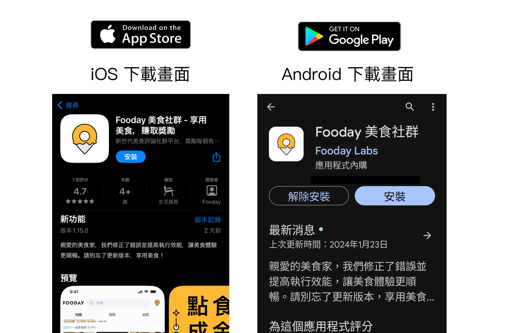
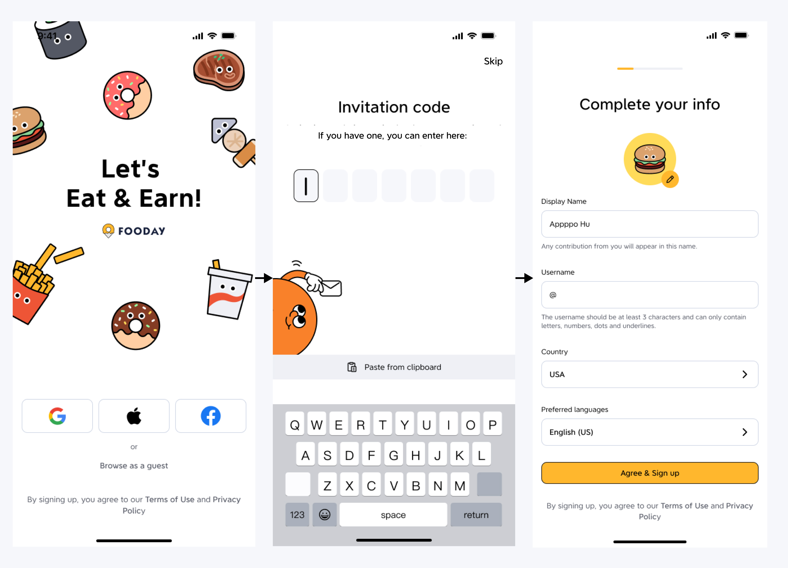

# Foodayで簡単4ステップで始めよう

## 1. Download the Fooday App

App Store または Google Play からFoodayアプリをスマートフォンやタブレットにダウンロードしてください。

* iOSユーザーはこちらからダウンロード： [Download](https://itunes.apple.com/app/id6456410353)
* Androidユーザーはこちらからダウンロード： [Download](https://play.google.com/store/apps/details?id=org.foodaylabs.fooday)

***

## 2. Foodayアカウントを登録する

1. Foodayアプリをダウンロードした後、お好みのログイン方法を選んでアカウントを登録してください。

    > 現在、iOSはGoogle、Apple、Facebookログインに対応しており、AndroidはGoogleとFacebookログインに対応しています。

2. 7桁の招待コードを入力してアカウントを有効化してください（必須ではありませんので、招待コードがない場合はスキップできます）。

3. 基本的な個人情報を設定してください（後でプロフィールから変更可能です）。

:::info
ログインプロセスの最後のステップで、「通知✅」と「位置情報✅」の許可を忘れずに！写真撮影時に現在の位置を取得するため、位置情報を有効にすることが貢献と報酬獲得のために必要です。
:::

***

## 3. FUSDを入手してFoocaカメラを購入

EAT & EARNを始めるには、まずFUSDを取得し、Foocaカメラを購入する必要があります。

現在、Fooday内でFUSDを取得する方法は2つあります：

	1.	Foodayアプリ内で直接FUSDを購入する。
	2.	ポリゴンネットワークからUSDCをFoodayウォレットに転送し、自動的にFUSDに変換する（Rabbyウォレットや取引所を利用）。」

### 方法1: Foodayアプリ内でFUSDを購入

ブロックチェーンやオンチェーントランザクションに詳しくない場合は、Foodayアプリ内で直接FUSDを購入するのが最も簡単です。手順は非常に簡単です。メニューの一番右のオプションをクリックし、「FUSDを購入」を選択して、購入したい金額を選ぶだけです。FUSDは他のモバイルゲームのアプリ内購入と同様に、自動的にFoodayウォレットに入金されます。

### 方法2：USDCをFoodayウォレットに送金する

次の方法は、ブロックチェーンウォレットからFoodayウォレットにUSDCを送金することです。以下では、Rabbyウォレットを使用した手順を説明しますが、他のウォレットや取引所も利用可能です。

> 現在、FoodayはPolygonネットワークのみに対応しており、自動的に選択されます

* USDC Cコントラクトアドレス: `0x3c499c542cEF5E3811e1192ce70d8cC03d5c3359`  

#### 手順解説：

1. Foodayを開いたら、メニューの一番右のオプションをクリックし、ウォレットセクション内の「FUSD」を選びます。次のページで「入金」をタップします。
2. 続いて、下部にある「入金」ボタンを押すと、FUSDの入金先アドレスが表示されます。
3. そのアドレスをコピーし、Rabbyウォレットに戻ります。「送金」をクリックし、Polygonネットワークを選択後、Foodayからコピーしたウォレットアドレスを貼り付けます。入金したい USDC（またはFOOD）の金額を入力して送金します。（FUSD : USDC = 1 : 1）

4. これでFUSDがFoodayウォレットに表示されます！ただし、入金後に使用可能になるまで多少の待ち時間が発生することがあります。 
5. 承認されたら、マーケットプレイスでFUSDを使ってFoocaカメラを購入し、EAT & EARNを始められます！

:::注意
必ずPolygonネットワークを選択してください—現時点でFoodayはPolygonのみに対応しています。上記の手順はRabbyウォレットを使用した入金方法ですが、他のウォレットも使用可能です。
:::

***

## 4. Foocaカメラを購入する

FUSDを手に入れたら、カメラマーケットプレイスでFoocaカメラを購入して、投稿を始められます！

手順ガイド：

1. Foodayアプリを開き、「その他」（右下隅にある三本線のアイコン）に進みます。

2. 「フーカ市場」ボタンをクリックして、Foocaマーケットプレイスに入ります。

3. Foocaマーケット内には、現在販売中の全てのFoocaカメラとFoocaボックスが表示されます。カメラとボックスの価格はFUSDで表示されています。

4. Foocaボックスの購入も選べます。これを開くとFoocaカメラが手に入ります。カメラボックスには高性能なカメラが入っている可能性があり、魅力的な投資先になっています！

***

Foocaカメラを手に入れたら、公式のFoodieとしての旅が始まります！

次は、素早く投稿を始めて報酬を稼ぐ方法をご案内します。ぜひ続けてお読みください。: [Contributions](/start-contribute)