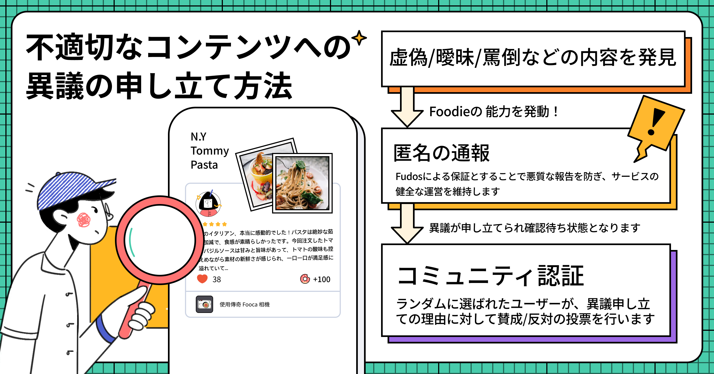
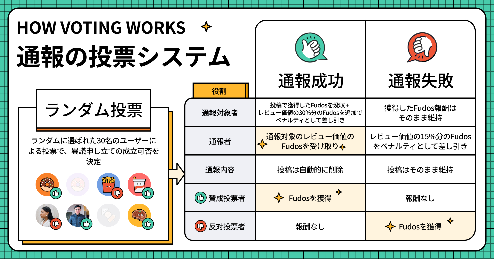

# 通報と検証投票

Foodayプラットフォームにおける口コミと店舗情報の正確性と信頼性を向上させるため、コミュニティベースの通報・審査プロセスを導入しました。ここでは、通報と投票システムの詳細な仕組みについてご説明します。

## 通報システムの仕組み

Foodayの通報システムは「プラットフォームの公正性と完全性を維持する」ことを目的としています。この新しい通報の仕組みでは、ユーザーが不正確な情報を通報し、リアルタイムで審査することができます。現在、主な通報対象は以下の2つです：

**誤った店舗情報の通報**

ユーザーがFoodayマップ上に新しい店舗を登録すると、その店舗は即座にマップ上に表示され、登録者はすぐにFudosを獲得できます。また、他のユーザーもその店舗に対して即座に口コミを投稿することができます。

ただし、正確性と信頼性を確保するため、新規登録から7日間は「新規登録」というマークが表示されます。このマークは、閲覧者が店舗情報の正確性を確認する際の目安となります。この期間中、他のユーザーは既存の店舗情報を更新することはできませんが、未記入の情報を追加することは可能です。また店舗の登録者は、この間いつでも情報の追加や変更ができます。7日後、「新規登録」マークは自動的に消えます。なお、他のユーザーはいつでも店舗情報を通報することができます。

**不適切/不正確なレビューの通報**

同様に、ユーザーは不正確または誤解を招く情報を含むと思われる口コミを通報することができます。口コミは投稿後すぐに店舗ページに表示され、投稿者はFudosを獲得できますが、他のユーザーから通報があった場合、その口コミは投票プロセスに入り、信頼性と有用性を確認するための評価が行われます。

### 完全な匿名性

通報は匿名で行われ、通報された人および投票に参加するランダムに選ばれたグルメマニアは、通報者の身元を知ることはできません。これにより、公平性とアカウントの影響力が保たれます。

------

## 通報投票のルール

通報が提出されると、Foodayの投票システムが起動し、複数のユーザーがランダムに選出され投票に参加します。通報された店舗情報や口コミは、投票による審査プロセスが完了するまで編集することができません。また、同じ内容について重複して通報することもできません。ランダムに選ばれたユーザーは、通報された店舗情報や口コミを慎重に確認し、自身の判断で「賛成」または「反対」の票を投じます。

### 投票者の選出方法

システムは通報された内容の地域や言語に基づいて、適切なユーザーを投票者として選出します。

・店舗情報が通報された場合：その店舗と同じ国のユーザーから投票者を選出
・口コミが通報された場合：投稿者と同じ国のユーザーから投票者を選出

通報された情報に対して、システムはランダムに30名のFoodayユーザーを投票者として選出します。投票所は通報された時点から24時間開放され、選出されたユーザーは通知を受け取り、それをクリックすることで投票に参加できます。

:::info
Foocaカメラを持っていないユーザーでも、ランダムに選ばれて検証投票に参加できます。つまり、一般ユーザーでもコミュニティに参加して報酬を得ることができます！
:::

------

## 通報が成立する条件

**通報後24時間以内に、投票率が総投票者数の30％以上に達し、かつ「賛成」の割合が2/3を超えた場合に通報が成立します。** 

例：
> 太郎さんが口コミを通報し、システムが30名の投票者を選出した場合、24時間以内に9名以上が投票し、そのうち6票以上が「賛成」であれば通報が成立します。

### 投票率が基準に達しない場合

通報から24時間以内に、選出された30名の投票率が30%に達しない場合、投票時間が24時間延長され、さらに2倍のユーザーが追加で選出されます。この延長された24時間内に、当初の総投票者数の30%の投票率に達する必要があります。

例：
> 	システムが30名を選出し、24時間後に投票率が30%に達していない場合、さらに30名が追加で選出されます。この60名の中から9名（当初の数の30%）が投票すれば基準を満たします。

時間が経過しても基準に達しない場合、投票率が当初の総投票者数の30%に達するまで、時間延長とユーザー追加が繰り返されます。

------

## 通報が成立/不成立した場合

### 通報が成立した場合

1.	該当の口コミ/店舗情報で獲得したFudos（カメラの電力消費は除く）が没収され、さらに元の価値の30%が追加で差し引かれます
2.	該当の口コミ/店舗情報は削除されます

### 通報が不成立だった場合

1.	Fudosは没収されません
2.	口コミ/店舗情報は保持されます
3.	通報は取り消されます

例:
> 店舗Bに口コミを投稿し、その口コミの元の価値は40 Fudosでしたが、カメラの電力が70%未満だったため、実際に獲得したのは28 Fudosでした。

> その後、花子さんがあなたの口コミを通報した場合：
> 
* 通報が成立すると、元の価値40 Fudos（実際の獲得額は28 Fudosであっても）が没収され、さらに40 Fudosの30%である12 Fudosが追加で差し引かれ、合計52 Fudosが減少します。
* 通報が不成立の場合、ペナルティはありません。

------

## 通報者側の結果

### 通報が成立した場合

1.	通報された口コミ/店舗情報の元の価値分のFudos（カメラの電力消費は除く）を獲得できます
2.	該当の口コミ/店舗情報は削除されます

### 通報が不成立の場合

1.	通報された口コミ/店舗情報の元の獲得報酬の30%が差し引かれます
2.	通報は取り消されます

例:
> 次郎さんが店舗Aに投稿した口コミの価値が40 Fudosだった場合：

あなたがそのレビューを通報した場合：

* 通報が成立すると、元の価値40 Fudosに加えて、通報時に使用したカメラによるボーナスを獲得できます
* 通報が不成立の場合、元の価値40 Fudosの30%である12 Fudosが差し引かれます

------

## Foodayの通報システムの目的

**透明性と公正性の向上**
Foodayの強化された通報システムでは、ユーザーが検証プロセスに参加することで、プラットフォームの透明性を高めています。匿名での通報により、通報者のフォロワー数や評価、現在の投票状況に影響されない公正な投票プロセスを確保しています。

**コミュニティの参加と信頼**

ユーザーは通報と投票プロセスに積極的に参加することで、プラットフォームの信頼性向上に継続的に貢献しています。これにより、共同責任の意識とユーザー間の信頼が育まれ、正確な情報を重視するコミュニティ主導の環境が創出されています。

**効率的な店舗登録とタイムリーな更新**

Foodayでは、登録された店舗が即座に地図上に表示されます。店舗登録のプロセスを簡素化することで、ユーザーが新しい店舗やグルメ体験を迅速に共有できるようになりました。複雑な検証プロセスを必要とせず、グルメ体験のリアルタイムな更新と最新情報の共有を実現しています。

**正確性と口コミの質**
Foodayは、正確な情報を提供するユーザーにFudosという形で報酬を付与し、質の高い口コミコンテンツを維持することで、プラットフォーム全体の信頼性を高めています。

**信頼できる判断**

Foodayの強化された通報システムは、集団投票プロセスに基づく判断を保証します。ランダムに選出された投票の仕組みにより、偏見や人為的な操作を排除し、通報内容を公正かつ客観的に判断します。これにより、Foodayは信頼性が高く、正確で公平な店舗情報を提供するプラットフォームとなっています。