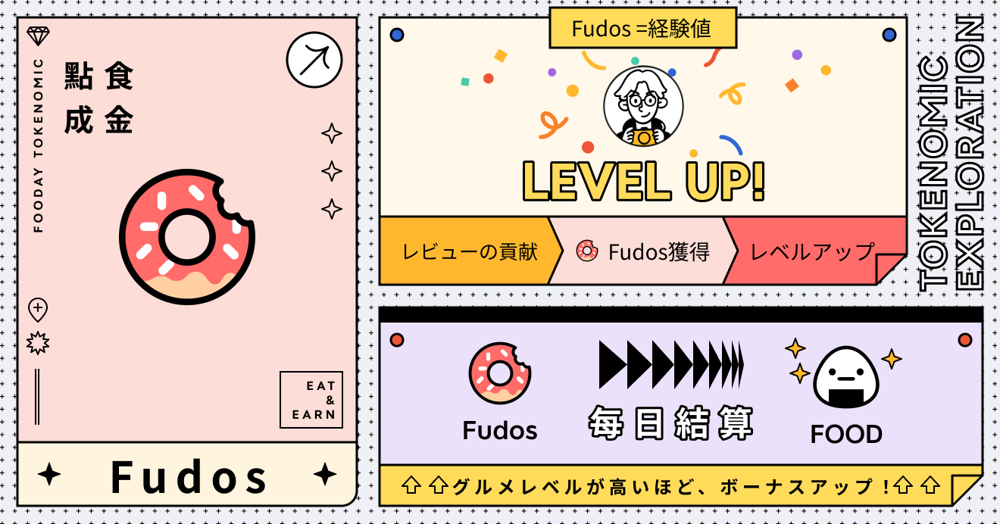
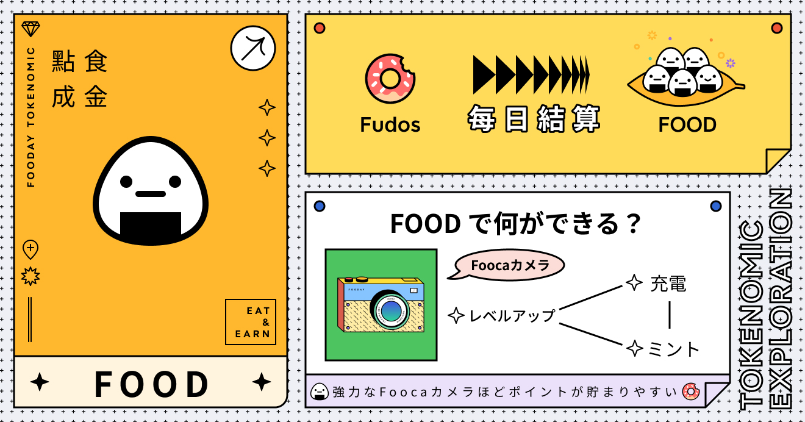
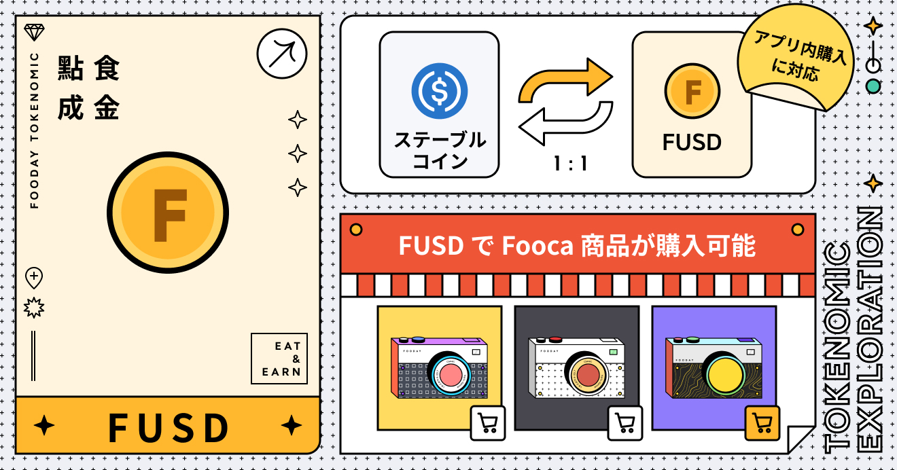

Foodayは単なるグルメコミュニティではありません。トークンエコノミーシステムがその中核となっています。現在、Foodayには2種類の重要なトークンと1種類のポイントがあります：Fudos、FOODとFUSDがあります。これらはFooday内で各役割を持ち、使用方法も異なります。

***

## Fudos

**貢献によって得られる経験値**

FudosはFoodayプラットフォーム上の経験値です。Foocaカメラを所持しているグルメマニアは、ミッションの達成、店舗情報の登録、グルメ体験の共有、誤情報の報告などを通じて、一定量のFudosを獲得できます。

システムが自動的に計算し、獲得したFudosをFOODに変換します。精算ルールと時期については [FudosのFOODへの変換](/foodie-level#fudos-to-food-multiplier) をご参照ください。

簡単に言えば、交流や貢献を通じてFudosを貯めることで、グルメレベルが上がっていきます。そして、グルメレベルはFudosからFOODへの変換率に影響し、レベルが高いほどより良い換算率を得られます。

***

## FOOD

**グルメプラットフォームでの貨幣**

FoodayにおいてFOODは実質的な価値を持つ多目的トークンです。まず、グルメユーザーはFOODを使ってレベルアップ、充電、そしてFoocaカメラのミント(製造)を行うことができ、プラットフォーム上でのゲーム体験を向上させることができます。

さらに、グルメユーザーは獲得したFOODをブロックチェーン上に引き出し、他の暗号資産に交換することができます。これにより、ユーザーにより大きな柔軟性と様々な価値実現の可能性を提供しています。

* FOODのCoinGecko上の現在価格：[https://www.coingecko.com/en/coins/fooday]
* FOODコントラクトアドレス：`0x78b1aa5c9b37c52695c93448ad0c64560edb9c4d`
* ブロックチェーンでのFOOD購入：[https://reurl.cc/r6WaeZ](<https://reurl.cc/r6WaeZ>)

:::info
ただしFOODの価格は市場で決定されるため、価格の上下変動が発生する可能性があることにご注意ください。
:::

また、FOODではFoocaカメラを直接購入することはできず、特定の仮想通貨であるFUSDが必要となります。

***

## FUSD

**譲渡不可のプラットフォームトークン**

FUSDはFoodayアプリ内で直接購入できる仮想通貨の一種です。ユーザーはFUSDを使って、Foocaカメラやカメラボックス、アクセサリーなどの特別なアイテムを購入できますが、Foocaカメラの充電やアップグレードには使用できません。

FOODと同様に、グルメユーザーはFUSDを自由にブロックチェーン上に引き出すことができます。注目すべき点として、FUSDを引き出した後はステーブルコインに変換されるため、価値が相場変動の影響を受けることはありません。

アプリ内購入の他にも、ブロックチェーン上にUSDC/USDC.eをお持ちの場合は、それらをFoodayに送金することができ、プラットフォームが自動的に1:1の比率でFUSDに変換します。これによりユーザーは素早くグルメ体験を始めることができます。

***

Foodayからの引き出し方法 [Deposit and Withdrawal](/deposit-and-withdrawal)