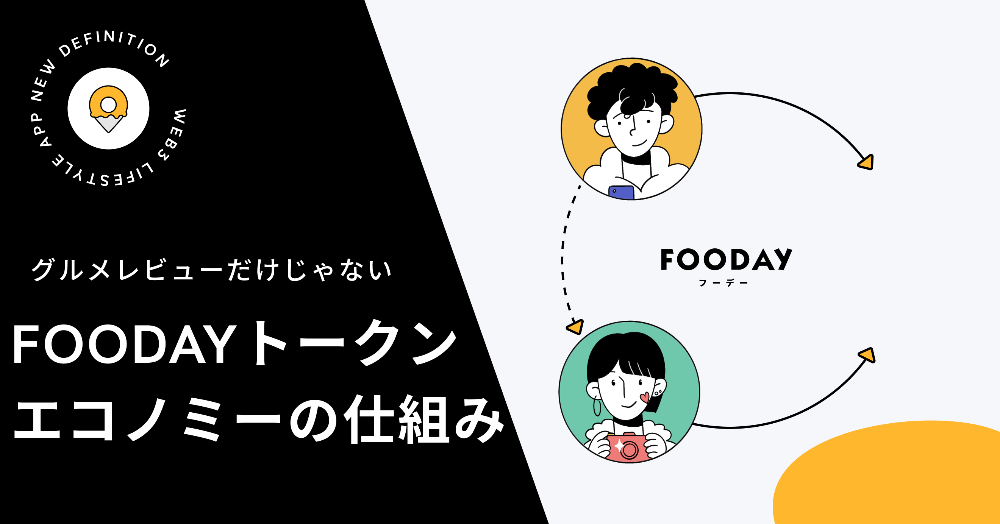
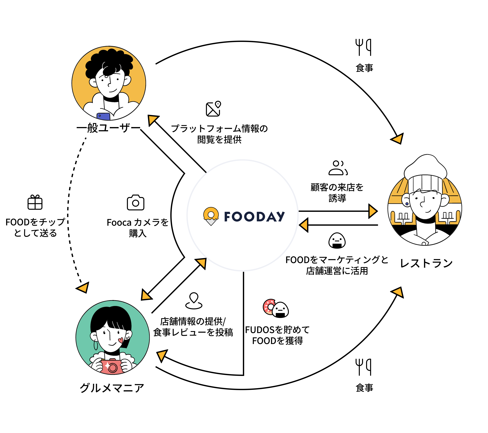

Foodayは単なるグルメレビューマップではありません。これまでにない革新的なプラットフォームとなります。最新のWeb3技術を活用し、消費者に信頼性の高い食事体験を提供します。そして、プラットフォームの核となる革新的なトークンエコノミーシステムを通じて、食事体験の共有を促進し、世界中のグルメマニアのための信頼できる情報コミュニティを作り上げます。

「トークンエコノミー」という言葉を聞くと、多くの人はねずみ講を連想しがちですが、私たちはその見方に同意しません。実際、適切に活用すれば、トークンエコノミーはエコシステム内で価値を公平に分配する最適なツールとなります。
Foodayでは、FOODトークンを決済やコミュニティ参加に活用することでユーザー体験を向上させ、その配布設計によってプラットフォームの持続可能性と発展を確保しています。

***

## Foodayのトークンエコノミーを探る

Foodayのトークンエコノミーシステムは、コミュニティの貢献者に報酬を与え、ユーザーの飲食体験の共有やコミュニティ活動への参加を促進し、より強力で活発なコミュニティを構築することを目指しています。
具体的な仕組みは以下の通りです：

### Foocaカメラの取得

プラットフォームで報酬を得るには、まずFoocaカメラを取得する必要があります。FoocaカメラはFooday専用のNFTで、ユーザーのコミュニティ参加度や個性を表すだけでなく、プラットフォームの重要な担保としても機能します。不正行為を防止し、プラットフォームの健全性を維持するため、ガイドライン違反が発見された場合は、Foocaカメラの機能制限から没収まで、段階的な処罰が設けられています。

###  Fudosの獲得

Foocaカメラを取得すると、レビューの投稿、レストラン情報の追加、他のユーザーとの交流などの活動を通じてFudosを獲得できます。Fudosは譲渡不可能な特性を持ち、ユーザーのプラットフォーム参加とコミュニティへの貢献を促進します。
Fudosはユーザーの信用スコアも表しています。獲得したFudosが多いほど、プラットフォーム上のレベルが上がり、FOOD Coinのボーナス報酬も増加します。

### FOODの獲得

FOOD Coinを獲得するには、一定期間内に十分なFudosを累積する必要があります。定期的な決済日にFudosは自動的にFOODに変換され、変換量はユーザーレベルに応じて決定されます。Fudosを多く累積するほどレベルが上がり、レベルが高いほどFOODへの変換効率が上がります。
FOODはシステム内で追加的なインセンティブとプラットフォーム参加意識を提供します。FOODの使用方法としては、レベルアップ、Foocaカメラのミント、またはステーブルコインへの換金などが可能です（詳細は「トークンの用途」をご参照ください）。

***

## トークンの用途

FOODはFoodayエコシステムの基盤であり、プラットフォーム内の価値移転ツールです。以下がFOODの主な使用方法です：

### グルメマニア向け

* Foocaカメラのアップグレード・修理：FOODを使用してカメラのレベルアップや、使用後の修理を行い、生産効率を維持
* 新しいFoocaカメラの作成：FOODを使って新しいカメラを作成でき、グルメマニアはコミュニティでの料理の専門性や活動の熱心さをアピールできます。なお、最初の限定カメラを除き、新しいカメラを入手する方法は「ミント」だけとなります。Foocaカメラについては次の記事で詳しく解説します。
* カメラの新機能追加：FOODを使ってカメラに新機能を追加でき、カメラの性能と全体的な使い勝手を向上させることができます。

### 飲食店向け

* 広告マーケティング活動：飲食店はFoodayプラットフォーム上でFOODを使用し、露出度の向上やコンバージョン率の改善、Foodayとのコラボレーション企画への参加など、マーケティング活動を展開することで、ビジネスの成長と発展を促進することができます。
* カスタマーサービス：飲食店はFOODを使用してプラットフォーム上の顧客レビューへの返信を行い、より良い顧客サービスを提供し、顧客との関係を強化することができます。また、FOODを使用して限定特典や割引を提供することで、顧客の参加を促進し、コミュニティのロイヤルティを高めることができます。
* 店舗情報の運営：店舗はFOODを使ってFoodayのプラットフォーム上の店舗情報を管理でき、お店の視認性を高めることで、Foodayエコシステムの長期的な成功に貢献できます。

Foodayの最終目標は、公平で循環型のエコシステムを作ることです：将来的にグルメマニアは店舗でFOODを使って支払いができ、店舗側はFOODを活用してより多くの顧客を呼び込むことで、双方にとって利益があり、持続可能な良好な関係を築くことができます。

***

私たちは、Foodayの革新的なトークンエコノミーが、公平でやりがいのあるエコシステムを提供し、消費者と店舗の双方にメリットをもたらすと確信しています。独自の価値配分とコミュニティ参加の仕組みを通じて、Foodayはレストランレビュー業界に革新をもたらし、公平性と透明性の新しい基準を確立します。