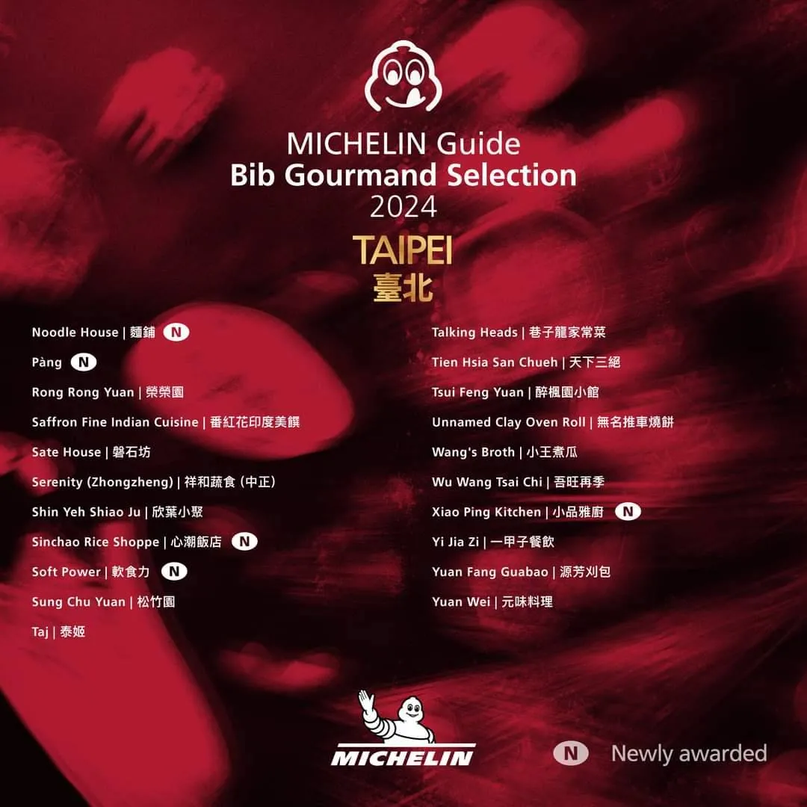
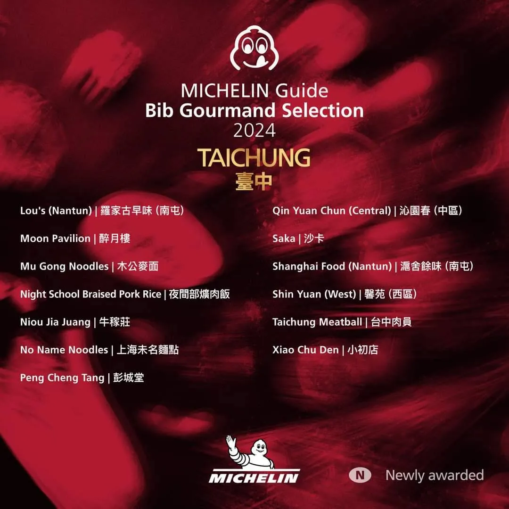

台灣米其林指南 2024 年度最新必比登推介名單揭曉囉！**共計 126 間店家入選**。

這份名單涵蓋了台北、台中、台南和高雄四個城市，其中台北 43 家、台中 27 家、台南 31 家、高雄 25 家。值得注意的是,今年新增 16 家入選店家，超過半數都是台灣道地的平民美食與小吃。


《臺灣米其林指南 2024》必比登推介今年的名單中,不乏知名店家如心潮飯店、黃記魯肉飯、葉桑生炒鴨肉焿、秀明豬心冬粉及良佳豬腳等。

儘管相較去年 139 家的入選數量略有下降，但新入榜的 16 家餐廳中，台北 6 家、台中 2 家、台南 3 家、高雄 5 家，顯示全台各地美食文化的蓬勃發展。

<!-- truncate -->

> _**延伸閱讀：什麼是必比登推介？**_
>
> _「必比登推介」旨在表彰那些能以合理價格提供高品質美食的餐廳。評選標準主要考量 1000 元新台幣以下即可享用的三道菜餐點。這些入選店家涵蓋了 20 多種不同的料理風格，為消費者提供多元化的用餐選擇。_

## 2024「必比登推介」新上榜名單

### 台北（新上榜 6 家）▼

- **[黃記魯肉飯](#黃記魯肉飯)**：經典老店，招牌滷肉飯深受喜愛。
- **麵舖**：以芋頭米粉聞名，口味獨特。
- **Pàng**：提供墨西哥料理，融合台灣食材。
- **心潮飯店**：創新台菜，以炒飯為主打。
- **[軟食力](#軟食力)**：特色粉漿蛋餅，口味選擇多樣。
- **[小品雅廚](#小品雅廚)**：宵夜熱選，提供多到台式家常菜。

### 台中（新上榜 2 家）▼

- **繡球**：主打川味和江浙風味的麵食。
- **裡小樓**：位於逢甲新村巷弄裡的台灣特色私房菜。

### 台南（新上榜 3 家）▼

- **[麥謎實驗室](#麥謎食驗室)**：提供新創麵食，結合全球各地的特色佐料。
- **添厚**：以台式家常菜為主，呈現層次豐富的風味。
- **葉桑生炒鴨肉焿**：招牌鴨肉焿以小鍋炒香，散發蒜香及鴨肉香氣。

### 高雄（新上榜 5 家）▼

- **賣塩順**：以傳統家常台菜聞名，特色菜如老薑炒雞腿，香氣四溢。
- **春蘭割包**：綜合刈包結合了滷肉、酸菜和特製醬汁。
- **秀明豬心冬粉**：專注於冬粉料理，結合新鮮食材，湯頭層次豐富。
- **小燉食室**：提供多款中式燉湯，剝皮辣椒蛤蠣雞湯尤為推薦。
- **良佳豬腳**：以其豬腳飯聞名，豬腳經過中藥材滷製，色澤誘人，肉質軟嫩。

---

## 「必比登推介」全台餐廳完整名單

### 台北入選店家 43 家 ▼

|        **台北入選店家**         |                     |                             |
| :-----------------------------: | :-----------------: | :-------------------------: |
|        阿城鵝肉（中山）         |      昶鴻麵點       |      雞家莊 （⻑春路）      |
|        鍾家原上海⽣煎包         | ⼤橋頭⽼牌筒仔⽶糕  |      鼎泰豐 （信義路）      |
|         都一處 （信義）         |     好朋友涼麵      | 清真中國牛肉麵食館 （大安） |
|      杭州小籠湯包 （大安）      |      小酌之家       |         雄記蔥抓餅          |
| [黃記魯肉飯（新）](#黃記魯肉飯) | HUGH dessert dining |           隱食家            |
|             人和園              |       金賞軒        |     老山東牛肉家常麵店      |
|       小小樹食 （大安路）       |      賣麵炎仔       |            茂園             |
|      雙月食品 （青島東路）      |     麵鋪（新）      |         Pàng（新）          |
|             榮榮園              |   番紅花印度美饌    |           磐石坊            |
|        祥和蔬食 （中正）        |      欣葉小聚       |       新潮飯店（新）        |
|     [軟食力（新）](#軟食力)     |       松竹園        |            泰姬             |
|          巷子龍家常菜           |      天下三絕       |         醉楓園小館          |
|          無名推車燒餅           |      小王煮瓜       |          吾旺再季           |
|   [小品雅廚（新）](#小品雅廚)   |     一甲子餐飲      |          源芳刈包           |
|            元味料理             |                     |                             |




### 台中入選店家 27 家 ▼

| **台中入選店家** |              |                        |
| :--------------: | :----------: | :--------------------: |
|      阿坤麵      |  繡球（新）  |  范記金之園 （中區）   |
|   鳳記鵝肉老店   |    鮮魚鱻    |     富鼎旺（中區）     |
|    富狀元豬腳    |    富貴亭    | 咕嚕咕嚕原住民音樂餐廳 |
|      曙光居      |  可口牛肉麵  |      好菜（西區）      |
|    老士官擀麵    | 裡小樓（新） |   羅家古早味（南屯）   |
|      醉月樓      |   木公麥面   |      夜間部爌肉飯      |
|      牛稼莊      | 上海未名麵點 |         彭城堂         |
|  沁園春（中區）  |     沙卡     |    滬舍餘味（南屯）    |
|   馨苑（西區）   |   台中肉員   |         小初店         |




### 台南入選店家 31 家 ▼

| **台南入選店家**  |                        |                                 |
| :---------------: | :--------------------: | :-----------------------------: |
|     阿星鹹粥      |        阿文米粿        |           阿興虱目魚            |
|     阿美飯店      |        黑琵食堂        | [麥謎食驗室（新）](#麥謎食驗室) |
| 田媽媽 長盈海味屋 |      誠實鍋燒意麵      |         大勇街無名鹹粥          |
| 東香台菜海味料理  |       添厚（新）       |         福泰飯桌第三代          |
|    好農家米糕     |      西羅殿牛肉湯      |            黃家蝦捲             |
|      吃麵吧       |    開元紅燒土魠魚羮    |            落成米糕             |
|    無名羊肉湯     |         博仁堂         |        三好一公道當歸鴨         |
|   尚好吃牛肉湯    |      鮮蒸蝦仁肉圓      |          小公園擔仔麵           |
|      謝掌櫃       |      葉家小卷米粉      |      葉桑生炒鴨肉焿（新）       |
|      一味品       | 八寶彬圓仔惠（國華街） |          永通虱目魚粥           |
|      筑馨居       |                        |                                 |


### 高雄入選店家 25 家 ▼

|   **高雄入選店家**    |                           |                             |
| :-------------------: | :-----------------------: | :-------------------------: |
|      Apis Grill       | 牛老大涮牛肉 （自強二路） | 北港蔡三代筒仔米糕 （鹽埕） |
|        菜粽李         |     昭明海產家庭料理      |         正宗鴨肉飯          |
|    春蘭割包（新）     | [前金肉燥飯](#前金肉燥飯) |  橋仔頭黃家肉燥飯 （橋頭）  |
|       貳哥食堂        |        侯記鴨肉飯         |     秀明豬心冬粉（新）      |
|      湖東牛肉館       |       弘記肉燥飯舖        |         阿香的廚房          |
|   舊市羊肉 （岡山）   |    老爺美食館（鳳山）     |       良家豬腳（新）        |
|       廖記米糕        |       賣塩順（新）        |         米院子油飯          |
| 老新台菜 （九如二路） |      小燉食室（新）       |            泰元             |
|  楊寶寶蒸餃 （楠梓）  |                           |                             |


米其林強調，這份名單是由匿名且獨立的評審員精心挑選而成。他們期望通過必比登推介，不僅能為饕客指引優質且價格合理的美食選擇，更能展現台灣豐富多樣的飲食文化。

---

## 2024 最新「必比登推介」全台餐廳食評

台北必比登餐廳涵蓋台菜、小吃、早午餐等多元風格，既有老字號名店，也有創新餐廳，為饕客提供物有所值的美食選擇。來看看 Fooday 幾家精選的必比登入選餐廳美食評論吧！

### 黃記魯肉飯

_魯肉飯 | 台灣小吃 | 銅板美食 | 小吃店_

黃記魯肉飯是一家經營超過 30 年的老字號餐廳，位於台北市中山區，因其招牌魯肉飯而聞名。

魯肉以肥肉為主，肉質鮮嫩，肥而不膩，深受食客喜愛。店家的好評在美食饕客中口耳相傳，吸引了大量顧客光臨，門口總是絡繹不絕。黃記魯肉飯在今年被列入 2024 年米其林必比登推介名單，更進一步證明了這家老字號餐廳在台灣在地美食界的地位。

<iframe width="382" height="726" frameborder="0" src="https://fooday.app/zh-TW/embed/reviews/N6HVa7QXXi4xnboeQxHHwr?maxwidth=384&maxheight=726"></iframe>

```
* 餐廳地址：台北市中山區中山北路二段183巷28號
* 營業時間：週二 ~ 週日 11:30 - 20:30，週一公休
* 注意事項：只收現金
```

---

### 軟食力

_行天宮 | 早午餐 | 街頭小吃 | 蛋餅_

軟食力（Soft Power）是一家位於台北市行天宮附近的的早餐店，主打的是台式粉漿蛋餅。店家於 2024 年 6 月才剛新入選米其林比登推介名單，可以看得出這家店深厚的「軟實力」。

餐廳環境結合復古與簡約風格，營造出溫馨的氛圍。菜單上有多達 14 種蛋餅口味，並提供飯糰和飲品，價格範圍約 30 至 155 元。餐點均為現點現做，而且來店人潮時常爆滿，需要耐心等待喔！

<iframe width="382" height="726" frameborder="0" src="https://fooday.app/zh-TW/embed/reviews/RpS2agrWrFP4kYPSHqm7Nk?maxwidth=384&maxheight=726"></iframe>

```
* 餐廳地址：台北市中山區民權東路二段135巷30弄21號
* 餐廳電話：02-2502-9543
* 營業時間：週一到週日 07:00 ~ 14:00
* 注意事項：餐點均為現點現做，需耐心等待
```

---

### 小品雅廚

_宵夜 | 清粥小菜 | 台灣小吃 | 夜貓族_

小品雅廚是一家位於台北中山區的餐廳，主要是提供各式清粥小菜，營業時間為每天晚上 6 點至凌晨 5 點，是夜貓族吃宵夜的首選店家之一。

這家餐廳以其家常台式料理而聞名，菜單上有超過 20 種選擇，價格範圍在 40 至 160 元之間，並且大部分菜品均為當日新鮮製作。

如果喜愛鋼筆，那麼台北的文具迷一定知道小品雅集這家鋼筆店，而小品雅廚則是老闆原本的本業。再想想，從清粥小菜起家可以做到有能力出國追夢，那是多麼浪漫的一件事。而本業的餐飲又究竟可以多美味呢？快來看看有哪些推薦餐點吧！

<iframe width="382" height="726" frameborder="0" src="https://fooday.app/zh-TW/embed/reviews/jqQEQXM6d7UJm3BjGafbLr?maxwidth=384&maxheight=726"></iframe>

<iframe width="382" height="726" frameborder="0" src="https://fooday.app/zh-TW/embed/reviews/V7D53adGVnYqYwgnakjjNo?maxwidth=384&maxheight=726"></iframe>

```
* 餐廳地址：台北市中山區中原街130號
* 餐廳電話：02-2592-9924
* 營業時間：週一 ~ 週日 18:00 - 隔日 05:00
* 注意事項：入店需要先領號碼牌等店員帶位
```

---

### 麥謎食驗室

_台南市 | 麵食創意料理 | 餐酒館_

麥謎實驗室（Bue mi .Lab）位於台南市中西區，使用台灣在地食材結合法式及東南亞風味，以實驗及研發精神創作出新穎的麵食，不定時更換菜單，依季節性去變化，展現出豐富的口感與創意。該店由擁有米其林經驗的主廚主理，提供非常獨特的用餐體驗。

店面看進去低調又神秘，藍灰色調簡約色調，軟裝上皮椅和岩板桌面搭配上吊燈，明明是白天卻有一種夜晚約會的氛圍感，非常舒適愜意。

推薦雙人套餐的麵食，口感 Q 彈，令人驚艷，是值得一試的特色料理。

<iframe width="382" height="726" frameborder="0" src="https://fooday.app/zh-TW/embed/reviews/MB5yPCvA8oftgqwE4CpqeT?maxwidth=384&maxheight=726"></iframe>

```
* 餐廳地址：台南市中西區青年路90號1樓
* 餐廳電話：02-2658-0168
* 營業時間：週三 ~ 週一 12:00 - 14:00，17:50 - 20:00，週二公休
* 注意事項：可至 inline 線上訂位
```

---

### 前金肉燥飯

_高雄美食 | 肉燥飯 | 魚皮湯 | 傳統老店_

高雄唯一一家，前金肉燥飯在今年 2024 一口氣就同時榮獲：
🌟 米其林必比登推介
🌟 𝟓𝟎𝟎 碗 𝟑 碗

這家的招牌菜就是肉燥飯，大部分是肥肉，但並非軟爛口感，而是 Q 彈不膩。上面的半熟鴨蛋並不會流得都是，被煎得香香的外層蛋白包覆，讓原先已經很美味的肉燥飯，又昇華到另一個境界。

這家傳承三代的老字牌肉燥飯，長達 𝟔𝟓 年歲月到底醞釀出什麼極致滋味，就快來看看 Fooday 的真實探店美食評論吧：

<iframe width="382" height="726" frameborder="0" src="https://fooday.app/zh-TW/embed/reviews/2yw9k9RTUv3mmns7vrnxxb?maxwidth=384&maxheight=726"></iframe>

```
* 餐廳地址：高雄市前金區大同二路26號
* 餐廳電話：07-272-7263
* 營業時間：週一 ~ 週六 07:15 - 17:30，週六 07:15 ~ 14:00，週日公休
```

Fooday 也會不定食持續更新餐廳名單，歡迎訂閱我們的[Fooday 電子報](https://blog-zh.fooday.app/)，不錯過任何美食情報！

---

#### 你知道貢獻用餐評論也能賺取獎勵嗎？

立即下載 Fooday app ，成為美食家，只要留下評論跟建立店家就可以獲得獎勵，實現邊吃邊賺的吃貨人生！
現在只要註冊時輸入邀請碼，就能獲得免費體驗相機！

[](https://fooday.app/)

想追蹤更多的美食快報，歡迎訂閱我們的[Fooday 電子報](https://blog-zh.fooday.app/)
