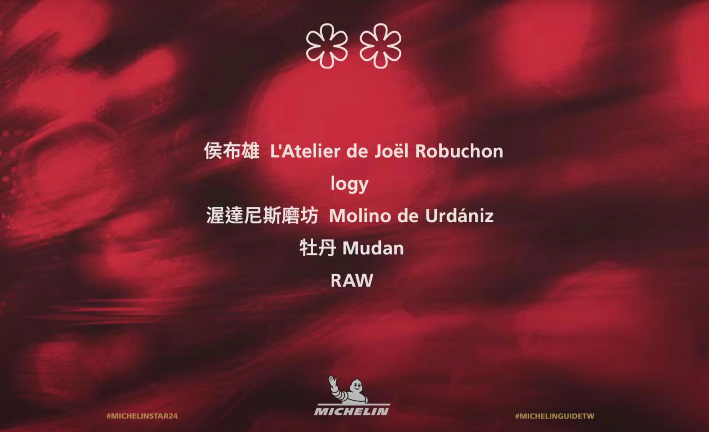
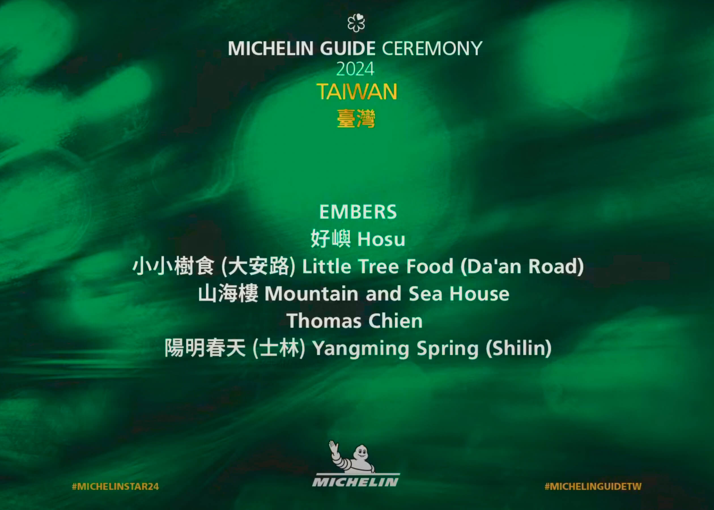

餐飲界的年度盛事《臺灣米其林指南 2024》完整名單出爐啦！**2024 的餐廳入選名單中，台灣米其林指南綠星入選 6 家、一星共入選 41 家，二星 5 家，頤宮、JL Studio 跟態芮則蟬聯三星。**


2024 米其林星級餐廳範圍涵蓋台北、台中、台南及高雄四大美食城市。米其林指南已經舉辦了好幾個世紀，今年也正式邁入臺灣米其林指南的第 7 年。透過這次 2024 年的臺灣米其林指南，台灣的美食文化能夠被世界上更多美食愛好者認識到台灣的精緻美食料理、卓越的主廚以及山河歷史人文傳承。

<!-- truncate -->

君品酒店的「頤宮」再度展現其非凡實力，成功達成**連續七年**蟬聯米其林三星的傲人成就。這一紀錄不僅彰顯了該餐廳在粵菜領域的絕對統治力,更是對其持續創新和品質把控的最佳肯定。不得不說，「頤宮」這張王牌，君品打得可謂是穩贏穩贏的。

去年首次摘得三星桂冠的兩家新秀餐廳 - 台中的「JL Studio」和台北的「態芮(Taïrroir)」，均順利衛冕最高評級。這不僅證明了它們並非曇花一現,更凸顯出台灣餐飲界在融合創新方面的實力。看來,這兩家新星已經準備好在美食界的星光大道上長期霸佔一席之地了。

特別值得關注的是，今年 2024 共有 10 家餐廳首次摘得米其林一星評級。這一數字不僅反映了台灣餐飲界的蓬勃生機，更展現了本地廚師們在創新與品質方面的不懈追求。這 10 顆新星的崛起，為台灣的美食星空增添了更多璀璨光芒，也為饕客們帶來了更多值得期待的選擇，馬上就來看看新晉的米其林餐廳有哪些吧！

## 2024「米其林指南」新晉及蟬聯名單

#### 米其林 ★ 新晉一星（10） ▼

- **[Restaurant A](#restaurant-a)**
  - 台北市大安區忠孝東路三段 282 號 4 樓
- **Circum-**
  - 台北市中山區中山北路二段 39 巷 3 號 B2
- **盈科 Eika**
  - 台北市大同區民樂街 58 號
- **雋 Gen**
  - 高雄市前鎮區復興四路 8 號
- **L'Atelier par Yao**
  - 台中市太平區新福十六街 68 號 2 樓
- **MINIMAL**
  - 台中市西屯區文心路二段 636 號
- **NOBUO**
  - 台北市中正區泰安街 8 號
- **Sens**
  - 台北市松山區民生東路三段 127 巷 12 號
- **WOK by O’BOND**
  - 台北市中山區龍江路 18 號
- **元紀**
  - 台中市西屯區安和東路 5 號

#### 米其林 ★ 蟬聯一星餐廳（31） ▼

- **A cut**
  - 台北市中山區中山北路二段 63 號 B1
- **Ad Astra**
  - 台北市中山區中山北路二段 45 巷 23 號
- **斑泊 Ban Bo**
  - 台北市中山區樂群二路 265 巷 38 號
- **de nuit**
  - 台北市大安區信義路四段 175 號
- **鹽之華 Fleur de Sel**
  - 台中市西屯區市政路 581-1 號
- **Forchetta**
  - 台中市西屯區惠中七街 36 號 2F
- **[富錦樹臺菜香檳（松山）](#富錦樹台菜香檳)**
  - 台北市松山區敦化北路 199 巷 17 號 1 樓
- **[金蓬萊遵古臺菜](#金蓬萊遵古台菜餐廳)**
  - 台北市士林區天母東路 101 號
- **Haili**
  - 高雄市前金區成功一路 264-1 號 2 樓
- **Impromptu by Paul Lee**
  - 台北市中山區中山北路二段 39 巷 3 號
- **INITA**
  - 台北市松山區八德路三段 12 巷 52 弄 1 號
- **謙安和**
  - 台北市大安區安和路一段 127 巷 4 號
- **吉兆割烹壽司**
  - 台北市大安區忠孝東路四段 181 巷 48 號
- **文公館**
  - 台中市西屯區文心路二段 636 號
- **明福台菜海產**
  - 台北市中山區中山北路二段 137 巷 18-1 號
- **米香**
  - 台北市中山區樂群二路 55 號 3 樓
- **山海樓**
  - 台北市中正區仁愛路二段 94 號
- **俺達的肉屋**
  - 台中市西區公益路 192-1 號
- **巴黎廳 1930 X 高山英紀**
  - 台北市中山區民權東路二段 41 號 2 樓
- **欣葉鐘菜**
  - 台北市中山區樂群二路 199 號 1 樓(中城廣場)
- **承 Sho**
  - 高雄市前鎮區中華五路 806 號入口
- **澀 Sur-**
  - 台中市北區育德路 201 號
- **明壽司**
  - 台北市中山區雙城街 25 巷 6 之 3 號
- **鮨隆 Sushi RYU**
  - 台北市中山區新生北路二段 60-5 號
- **壽司芳**
  - 台北市大安區忠孝東路四段 216 巷 19 弄 12 號
- **T+T**
  - 台北市松山區敦化北路 165 巷 11 號 1 樓
- **請客樓**
  - 台北市中正區忠孝東路一段 12 號
- **天香樓**
  - 台北市中山區民權東路二段 41 號
- **雅閣**
  - 台北市松山區敦化北路 158 號
- **彧割烹**
  - 台北市松山區三民路 9-1 號
- **ZEA**
  - 台北市大安區仁愛路四段 300 巷 20 弄 5 號


#### 米其林 ★★ 完整二星餐廳（5） ▼

- **侯布雄**
  - 台北市信義區松仁路 28 號 5 樓
- **logy**
  - 台北市大安區安和路一段 109 巷 6 號 1F
- **渥達尼斯磨坊**
  - 台北市中山區建國北路一段 61 號 GF
- **牡丹**
  - 台北市大安區四維路 52 巷 17 號
- **RAW**
  - 台北市中山區樂群三路 301 號



#### 米其林 ★★★ 完整三星餐廳（3） ▼

- **JL Studio**
  - 台中市南屯區益豐路四段 689 號
- **頤宮中餐廳**
  - 台北市大同區承德路一段 3 號 17 樓
- **態芮 Tairrori**
  - 台北市中山區樂群三路 299 號


---

## 《臺灣米其林指南 2024》一到三星完整名單

#### 2024 米其林一星店家（41） ▼

|            **米其林一星店家**             |                                       |                        |
| :---------------------------------------: | :-----------------------------------: | :--------------------: |
|                   A cut                   |               Ad Astra                |      斑泊 Ban Bo       |
|                  de nuit                  |          鹽之華 Fleur de Sel          |       Forchetta        |
| [富錦樹臺菜香檳（松山）](#富錦樹台菜香檳) | [金蓬萊遵古臺菜](#金蓬萊遵古台菜餐廳) |         Haili          |
|           Impromptu by Paul Lee           |                 INITA                 |         謙安和         |
|               吉兆割烹壽司                |                文公館                 |      明福台菜海產      |
|                  山海樓                   |              俺達的肉屋               | 巴黎廳 1983 X 高山英紀 |
|                 欣葉鐘菜                  |                承 Sho                 |        澀 Sur-         |
|                  明壽司                   |            鮨隆 Sushi RYU             |         壽司芳         |
|                    T+T                    |                請客樓                 |         天香樓         |
|                   雅閣                    |                彧割烹                 |          ZEA           |
|   [Restaurant A（新晉）](#restaurant-a)   |            Circum-（新晉）            |   盈科 Eika（新晉）    |
|              雋 Gen（新晉）               |       L'Atelier par Yao（新晉）       |    MINIMAL（新晉）     |
|               NOBUO（新晉）               |             Sens（新晉）              | WOK by O’BOND（新晉）  |
|               元紀（新晉）                |                                       |                        |

#### 2024 米其林二星店家（5） ▼

| **米其林二星店家** |      |              |
| :----------------: | :--: | :----------: |
|       侯布雄       | logy | 渥達尼斯磨坊 |
|        牡丹        | RAW  |              |

#### 2024 米其林三星店家（3） ▼

| **米其林三星店家** |            |               |
| :----------------: | :--------: | :-----------: |
|     JL Studio      | 頤宮中餐廳 | 態芮 Tairrori |

---

## 《臺灣米其林指南 2024》米其林綠星名單

米其林綠星是一項專注於永續美食的獎項，旨在表彰那些在環保和道德方面表現卓越的餐廳。這些餐廳不僅提供美味的料理，還與當地供應商合作，減少浪費，並推廣可持續的食材使用。

自 2020 年推出以來，全球已有 287 間餐廳獲得此榮譽，彰顯其對環境的承諾和影響力。米其林綠星不僅是品質的標誌，更是一種引導消費者關注永續飲食的方式。

#### 2024 新晉綠星店家（4） ▼

- **好嶼 Hosu**
  - 台北市大安區忠孝東路四段 181 巷 40 弄 14 號
- **山海樓**
  - 台北市中正區仁愛路二段 94 號
- **Thomas Chien**
  - 高雄市前鎮區成功二路 11 號
- **陽明春天（士林）**
  - 台北市士林區菁山路 119-1 號

#### 2024 蟬聯綠星店家（2） ▼

- **EMBERS**
  - 台北市大安區仁愛路四段 122 巷 24 號
- **小小樹食（大安路）**
  - 台北市大安區大安路一段 116 巷 17 號



#### 米其林指南 2024 全台綠星完整名單（6） ▼

| **米其林綠星店家** |                      |                          |
| :----------------: | :------------------: | :----------------------: |
|       EMBERS       |  好嶼 Hosu（新晉）   |    小小樹食（大安路）    |
|   山海樓（新晉）   | Thomas Chien（新晉） | 陽明春天（士林）（新晉） |

---

## 《臺灣米其林指南 2024》米其林伺酒師大獎

米其林侍酒師獎是由米其林指南頒發的獎項，旨在表彰在餐飲業中表現卓越的侍酒師。這個獎項不僅強調侍酒師的專業知識，還考量他們在提升顧客用餐體驗方面的貢獻。

獲獎者通常具備出色的酒品搭配能力和卓越的服務技巧，並在米其林認證的餐廳中工作，為顧客提供優質的酒水建議和服務。

- 2024 米其林伺酒師大獎：元紀 曾雅慧

曾雅慧是台灣知名的侍酒師，曾在捌伍添第餐廳工作。她致力於推廣餐酒搭配，並在業界中擁有良好的聲譽。曾雅慧不僅具備專業的葡萄酒知識，還是一位酒類講師，為消費者提供精緻的用餐體驗。她的專業背景和熱情使她在台北的餐飲界中脫穎而出。

---

## 《臺灣米其林指南 2024》米其林服務大獎

- 2024 米其林伺服務大獎：斑駁 許韻珊

許縕珊是台北斑泊餐廳的經理，擁有超過十年的飯店業經驗。她在斑泊的工作中，強調餐點、環境設計和服務流程的重要性，並注重細節，如香氛和地板的選擇。斑泊餐廳在開業僅八個月後便獲得米其林一星的榮譽，顯示出其在高端餐飲界的潛力和創新。今年 2024 年榮獲米其林服務大獎更是肯定了許韻珊以及他的服務團隊世界級的餐飲服務精神。

---

## 《臺灣米其林指南 2024》米其林年輕主廚大獎

米其林年輕主廚大獎是米其林指南頒發的獎項，旨在表彰年輕且有潛力的廚師，鼓勵他們在餐飲界的創新與發展。此獎項自 2016 年設立以來，已成為年輕廚師的重要榮譽，幫助他們獲得更多曝光與機會。

- 米其林年輕主廚大獎：卉寓 陳莛諭

陳莛諭是台中米其林推薦餐廳卉寓的主廚。他以融合台灣家常料理與西式烹飪技法而聞名，創造出現代化的家庭菜餚。餐廳的季節性菜單包括如糖燻旗魚等創新料理，展現了她對食材的巧妙運用和對味道的深刻理解。陳莛諭的烹飪哲學強調用心和創新，致力於為顧客提供獨特的用餐體驗，今年榮獲 2024 米其林年輕主廚大賞，更是為他的精湛廚藝帶來的美食饗宴錦上添花。

---

## 2024 最新「米其林指南」全台摘星餐廳食評

相信大家已經迫不及待要手刀訂位要準備摘星了，快來瞧瞧 Fooday 上其他美食家的真實評論，看看哪些米其林店家是值得造訪的吧！

### 金蓬萊遵古台菜餐廳

_士林天母 | 排骨酥 | 佛跳牆 | 臺菜料理_

金蓬萊遵古台菜餐廳是一家位於台北士林天母的米其林一星餐廳，成立於 1950 年，最初名為蓬萊食堂，至今已有超過 70 年的歷史。餐廳專注於傳統台灣菜，菜單上有超過 200 道經典菜色，特別推薦的包括排骨酥、嫩煎豬肝、佛跳牆和土魠魚米粉鍋等。

餐廳的環境古色古香，適合家庭聚餐或商務宴請，並設有包廂供多人使用。由於其受歡迎程度，建議提前訂位，尤其是在週末。金蓬萊遵古台菜餐廳的菜品不僅味道正宗，還注重食材的新鮮與品質，深受美食家的喜愛！

Fooday 美食家推薦菜色：排骨酥、香酥鴨、油爆大蝦、佛跳牆

<iframe width="382" height="726" frameborder="0" src="https://fooday.app/zh-TW/embed/reviews/FkUwNrJ8RrPjHdTpxnTmx9?maxwidth=384&maxheight=726"></iframe>

```
* 餐廳地址：台北市士林區天母東路101號
* 餐廳電話：02-2871-1517
* 營業時間：
  週一四五 11:30 – 14:30、17:30 - 21:00
  週六日 11:30 – 14:30、17:30 - 21:30
  週二及週三公休
* 注意事項：可以網路訂位，建議提前預訂
```

---

### 富錦樹台菜香檳

_士林天母 | 排骨酥 | 佛跳牆 | 臺菜料理_

富錦樹台菜香檳是一家獲得米其林一星的台灣餐廳，提供創新的台菜與香檳搭配，致力於將傳統台菜的風味與法式慢食文化相結合。餐廳的環境設計以綠意盎然的植物裝飾和大片落地窗為特色，營造出輕鬆而優雅的用餐氛圍。

餐廳提供多樣化的菜單，餐點的味道整體上仍具水準，但價格漲幅過大使得性價比下降。部分菜色的表現不如預期，價格範圍從 480 元到 2800 元不等。餐廳環境舒適且隱密，適合家庭聚餐。包廂的私密性良好，裝潢簡約卻有品味，營造出愉悅的用餐氛圍。桌邊服務生的表現令人滿意，能夠應對客人的需求，並提供詳細的菜品介紹，展現出專業的服務態度。

Fooday 美食家推薦菜色：芋泥香酥鴨、蜜棗煨肉、干貝竹笙雞湯、油條蒜蓉鮮蚵

<iframe width="382" height="726" frameborder="0" src="https://fooday.app/zh-TW/embed/reviews/Gm9MTL6GVkUCNXX6iGyCYq?maxwidth=384&maxheight=726"></iframe>

```
* 餐廳地址：台北市松山區敦化北路199巷17號1樓
* 餐廳電話：02-8712-8770
* 營業時間：週一 ~ 週五 12:00 – 15:00、17:00 - 22:00，週六 ~ 週日 12:00 - 22:00
* 注意事項：可以網路訂位，建議提前預訂
```

---

### Restaurant A

_台北頂級法式餐廳 | RAW 前主廚 | 生活動力法 | 純白空間_

Restaurant A 是台北最新開幕的頂級法式餐廳，隱身於新光三越 A11 四樓。由米其林二星餐廳 RAW 前主廚黃以倫主理，提出「CONTINUMIC (生活動力法)」的料理哲學，將生活中的人事物融入菜餚,以獨特的視角與饕客溝通。

餐廳由建築師吳聲明操刀設計，150 坪大的空間以白色為主調，加上 4.5 米 的挑高，營造出純淨、通透的用餐氛圍。

> 主廚黃以倫的料理哲學
> 黃以倫曾在瑞典、法國等地工作，並在 RAW 擔任重要職務。離開 RAW 後，他用兩年多的時間旅行、研究咖啡、茶、酒，思索理想餐廳的模樣。他提出「CONTINUMIC」理念，認為料理不僅是做菜，更是一種揉合思維的創作。每道菜都是主廚想法和觀察的表達，也反應周遭事物對他的影響。

餐廳開幕菜單貫徹 CONTINUMIC 理念，主廚訪問參與餐廳打造的 10 位設計工藝家，了解他們的成長歷程和飲食喜好，以具關聯性的經典法式料理做演繹，呈現獨特的「A」版本法式料理。餐具方面，主廚與設計師、工藝家合作，打造一系列美如藝術品的創作器皿，如大理石質地的《漫步香檳》餐具，以及陶藝家打造的純白《Cloud Blossom》主餐具系列等，讓視覺享受從餐具開始。

總之，Restaurant A 以頂級食材、精湛手藝和獨特理念，為台北饕客帶來全新的法式用餐體驗。

<iframe width="382" height="726" frameborder="0" src="https://fooday.app/zh-TW/embed/reviews/Qd6ddgQfptqMuJ3kJukHYz?maxwidth=384&maxheight=726"></iframe>

```
* 餐廳地址：106台北市大安區忠孝東路三段282號四樓（Diamond Towers 二館）
* 餐廳電話：02-2721-8088
* 營業時間：週二 ~ 週六 11:30 – 15:30、18:00 - 22:30，週六週日公休
* 注意事項：餐廳採全預約制，僅提供餐前線上訂位服務
```

---


## 臺灣米其林指南 2024：全球一致的評鑑標準

「米其林指南」是由法國米其林輪胎公司創辦的餐飲評鑑刊物，起初旨在推廣駕車旅遊，後來演變為全球知名的餐廳評選標準。指南透過匿名評審制度，對餐廳進行星級評價，分為一星、二星和三星，並引入米其林指南和必比登推介等標準，成為美食界的重要指標。

#### ► 米其林指南的評鑑標準包括五項核心要素：

1. **食材品質**：使用新鮮且高品質的食材。
2. **味道與烹調技巧**：廚師對味道的掌握及烹調技術的熟練程度。
3. **味道的融合**：不同食材和調味料的協調性。
4. **料理的個性**：菜餚展現的創意和廚師的風格。
5. **餐飲水準的一致性**：在不同時期的用餐體驗保持穩定的品質。

此外，米其林評審員在評鑑過程中保持匿名，並自行支付餐費，以確保評價的客觀性和獨立性喔！可以說是非常具有公平且公正性的超高評鑑標準。

#### ► 「米其林星級」和「必比登推介」的主要區別是什麼？

- **米其林星級**：分為一星、二星和三星，代表餐廳的烹調質量和用餐體驗。一星表示優質，二星表示出色，三星則代表卓越，值得專程造訪。
- **必比登推介**：專注於提供物有所值的大眾化餐飲體驗，餐廳需在一定價格範圍內提供高品質的菜品，比如台北餐廳須在價格 1000 元台幣範圍內，提供三道菜的標準餐點（不含飲料）。這些餐廳通常不會獲得星級，但仍受到米其林評審的認可。

---

## 米其林指南的全新發布機制

根據最新的米其林指南資訊，自 2024 年起，米其林指南將採取全新的發布機制：

1. 每年將在 8 月公布最新的米其林指南名單。
2. 除了每年 8 月公布全新指南外，米其林還將在每年 2 月發布一次「特別版」，介紹一些新進或值得關注的餐廳。
3. 這種一年兩次發布的新機制，可以讓米其林指南更即時地反映餐飲業的最新動態和趨勢。
4. 同時，米其林也將在每年 8 月的全新指南中，公布前一年度的「米其林綠星」得主名單。這些餐廳在永續經營和環保作為上有出色表現。
5. 總體來說，米其林指南的全新發布機制，讓這份權威美食指南能夠更快速、更頻繁地向大眾推薦優質餐廳，也更重視餐廳的社會責任和永續發展。

---

#### 你知道貢獻用餐評論也能賺取獎勵嗎？

立即下載 Fooday app ，成為美食家，只要留下評論跟建立店家就可以獲得獎勵，實現邊吃邊賺的吃貨人生！
現在只要註冊時輸入邀請碼，就能獲得免費體驗相機！

[](https://fooday.app/)

想追蹤更多的美食快報，歡迎訂閱我們的[Fooday 電子報](https://blog-zh.fooday.app/)
