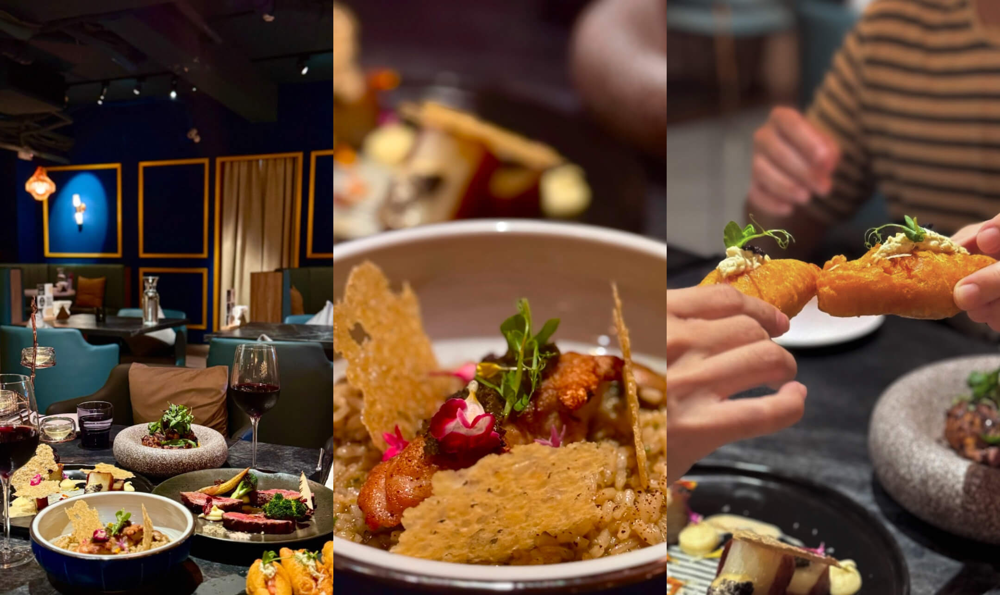

import leone_1 from './img/leone-1.jpeg';
import leone_2 from './img/leone-2.jpg';
import leone_3 from './img/leone-3.jpg';
import leone_4 from './img/leone-4.jpg';
import leone_5 from './img/leone-5.jpg';
import leone_6 from './img/leone-6.jpg';
import leone_7 from './img/leone-7.jpg';
import leone_8 from './img/leone-8.jpg';
import leone_9 from './img/leone-9.jpg';
import leone_10 from './img/leone-10.jpeg';

位於台北中山區的餐酒館，結合台式在地食材與西式風格，可以感覺到廚師在每道餐點上的口味平衡設計及用心，且酒單豐富，有多種特色調酒可供選擇，整體可以說是被低估的台北市餐酒館。

享用的餐點口味上以餐酒館來說都在水準之上。如果你正在尋找慶生或是與朋友聚餐的好去處，Leone Restaurant & Bar 絕對是不會讓你失望的選擇，推薦給想要增加「台北餐酒館口袋名單」的美食家！

  

前菜的碳烤伊比利豬肋條，豬肋條醃漬後再下去燒烤，外表焦香，內裡保持鮮嫩多汁。一上桌就香氣四溢，搭配清爽酸甜的醃漬蔬菜，有效地平衡烤肉的油膩感，作為前菜再適合不過。這道神秘菜色完美執行了開胃菜的角色及責任，受到同行用餐者的一致好評。

  

酥脆馬鈴薯千層佐奶油玉蜀黍醬，上桌時的精美擺盤一度讓人以為是 Fine Dining。主廚將馬鈴薯削成薄片後層層堆疊，瀝乾水分後下去油炸，外酥內軟，每一口都充滿了馬鈴薯的濃郁香氣。搭配的玉蜀黍醬則質地絲滑，入口即是濃厚奶油香氣及玉米的天然甜味，作為佐醬來說，適當地提升整道料理的柔和與質感。

  

 

人氣餐點酥炸蟹肉莎莎，趁熱一口咬下，酥脆的外皮和蟹肉棒內餡完美結合，且途中能感受到莎莎醬中和了油炸的油膩感，整體意外清爽，推薦給喜愛吃炸物的美食家們。

 

  

 
主菜部分則有「特選牛小排佐糖漬紅酒醬」讓人驚喜，恰到好處的五分熟烹調，保留了豐富的肉汁和香氣，肉質軟嫩。搭配的糖漬紅酒醬富有層次，濃郁的紅酒風味與糖漬相輔相成。牛小排沾上醬汁後，可以感受到口中的鹹、酸、甜的平衡。這道牛小排特別適合適合慶生時作為主菜登場，作為餐酒館的排餐來說，無疑優秀且美味，絕對不會讓壽星失望。
 

  

  

 
剝皮辣椒雞燉飯也是這裡的特色之一，廚師選用了風乾剝皮辣椒作為調味亮點，與義大利進口的燉飯米相結合，保留了燉飯米的硬度和咬勁，雞肉則使用新鮮的溫體雞腿肉，再搭配酥炸起司片作為點綴。燉飯入口後可以感受到剝皮辣椒的微辣襯托出雞肉的鮮嫩，是台式食材與義式料理的巧妙融合，有趣且不突兀，是台北餐酒館少見的創意料理。
 

  

甜點此次只享用了提拉米蘇，甜味明顯，不過咖啡香氣及酒味稍嫌欠缺，比較適合真的非常嗜甜的螞蟻人，若平時對甜度容忍度較低，則建議看看店內其他甜點選擇。

  

整體來說，Leone Restaurant & Bar 不僅適合與家人朋友聚會，也是慶生、約會的理想選擇。雖然價格稍高，但對於中山區餐酒館來說屬於合理範圍。同時在餐點上絕對可以得到意想不到的驚喜。內部裝潢以藍調為主，搭配柔和的燈光設計，營造出寧靜而不失浪漫的用餐氛圍，空間寬敞舒適，也有提供包場服務需求。

  

  

 

唯一的小遺憾是店門口的裝潢稍顯老舊，與餐廳內部的現代氛圍略有差距，初期可能想走地中海風格，但感覺菜色慢慢走向多元，或許可以考慮稍作更新，提升整體一致性。不過這絲毫不影響這裡成為台北餐酒館慶生和聚餐的首選之一。

****Leone Restaurant & Bar****

地址：台北市中山區林森北路353巷20號
電話：0225813109

｜內用營業時間｜ 
平日週日-週四//晚上17：00-淩晨00：00 
正餐供餐時間17：00-23: 00 
Bar Food供應時間21:00-23:00 
調酒供應時間17 : 00-23 : 00 

假日週五-週六//晚上17：00-淩晨2：00 
正餐供餐時間17：00-23：00 
Bar Food供應時間22:00-01:30 
調酒供應時間17 : 00-01 : 30 

不定期平日公休，詳情請洽[社群資訊](https://www.facebook.com/leonetaipei)

***
---

#### 你知道貢獻用餐評論也能賺取獎勵嗎？

立即下載 Fooday app ，成為美食家，只要留下評論跟建立店家就可以獲得獎勵，實現邊吃邊賺的吃貨人生！
現在只要註冊時輸入邀請碼，就能獲得免費體驗相機！

想追蹤更多的美食快報，歡迎訂閱我們的[Fooday 電子報](https://blog-zh.fooday.app/)
