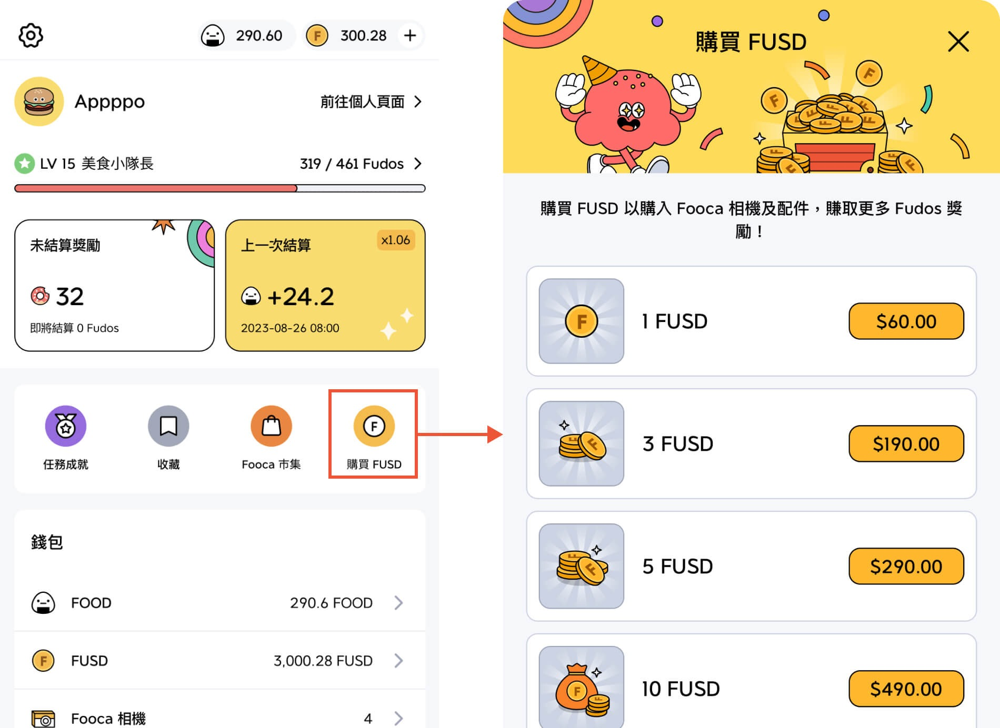

# 簡單 4 步驟開始在 Fooday 邊吃邊賺

## 1. 下載 Fooday App

利用手機或平板裝置，在 App Store 中或者 Google Play 中下載 Fooday App。

* iOS 使用者請至 App Store 下載：[點此下載](https://itunes.apple.com/app/id6456410353)
* Android 使用者請至 Google Play 下載：[點此下載](https://play.google.com/store/apps/details?id=org.foodaylabs.fooday)

***

## 2. 註冊 Fooday 帳號

1. 下載 Fooday App 後，選擇登入方式來註冊帳號

    > iOS 目前支援 Google、Apple 及 Facebook 登入；Android 目前支援 Google 及 Facebook 登入

2. 輸入 7 位數邀請碼開通帳號

    > 邀請碼可至 [Discord](https://discord.gg/6Q3Xa7fRV4) 官方聊天群索取，上面會有其他玩家分享邀請碼，Fooday 官方 [Instagram](https://www.instagram.com/fooday.app) 也會不定期更新限時動態公布邀請碼

3. 設定個人基本資訊（之後都還可以到個人頁面更改）

:::info
在登入流程的最後階段，記得要同意開啟「通知提醒 ✅」跟「定位 ✅」喔！若不開啟定位，拍照時將無法取得你的目前位置，沒有照片就無法繼續貢獻賺取獎勵了。
:::

***

## 3. 取得 FUSD 購買 Fooca 相機

若想要開始邊吃邊賺，首先需要取得 FUSD 並購入 Fooca 相機。

目前在 Fooday 中，取得 FUSD 有兩種方式：
1. 從 Fooday App 內購 FUSD
2. 從 Polygon 鏈將 USDC 轉入 Fooday 錢包，轉入後則會自動轉換為 FUSD（Rabby 錢包、交易所）

### 方法 1 ：Fooday App 內購 FUSD 

如果你不熟悉區塊鏈及鏈上交易，使用 Fooday 內購 FUSD 是最快速的方式。內購方法相當簡單，先點擊下方選單最右邊，並找到「購買 FUSD」，並選擇想要購買的金額，FUSD 就會自動存入 Fooday 錢包囉，與其他手遊的課金方法相同。

### 方法 2 ：將 USDC 打入 Fooday 錢包

第二個方法則是從鏈上錢包打入 USDC 或 USDC.e 至 Fooday 錢包。接下來將以 Rabby 錢包打入為例，當然使用其他錢包、使用 MAX、幣安等交易所也都可以。

> 目前 Fooday 僅支援 Polygon 鏈，系統會自動帶入

* USDC 合約地址：`0x3c499c542cEF5E3811e1192ce70d8cC03d5c3359`  
* USDC.e 合約地址：`0x2791bca1f2de4661ed88a30c99a7a9449aa84174`

#### 步驟教學：
1. 進入 Fooday 後，一樣點擊下方選單最右側，並點選錢包下的「FUSD」，進入頁面後，點選「轉入」。
2. 接著按下最下方的「轉入」按鈕，會跳轉至你的 FUSD 轉入地址如圖。  
3. 接著複製地址，並回到 Rabby 錢包。點選「SEND」後，選擇 Polygon 鏈及將剛剛在 Fooday 複製的錢包地址貼上。最後輸入想要入金的 USDC （或是 FOOD）數量後並送出。（FUSD：USDC = 1：1）

4. 接著 FUSD 就會出現在自己的 Fooday 錢包中囉！不過入金後需要等待一段時間才能使用，使用者可以點選「FUSD」查看狀況，當變成確認後就可以使用了！  
5. 使用 FUSD 到市集購買相機，開始邊吃邊賺！  

:::note
鏈一定要選擇 Polygon，目前 Fooday 僅支援 Polygon。
以上是以 Rabby 錢包入金為例，如果想要從其他錢包入金也沒問題喔！
:::

***

## 4. 購買 Fooca 相機

有了 FUSD 後，就可以到相機市集購買 Fooca 相機，開始貢獻並邊吃邊賺！

#### 步驟教學：

1. 開啟 Fooday app 並前往 "更多" (右下角三個槓槓那一頁)
2. 點擊 "Fooca 市集" 按鈕進入 Fooca 市集
3. 在 Fooca 市集裡，可以找到所有上架販賣中的相機及相機盒。 購買相機及相機盒都是以 FUSD 計架（Fooday 的數位幣）。
4. 你也可以選擇購買相機盒來打開盒子以得到 Fooca 相機，相機盒有一定的機率開出稀有的高階相機，所以也是個不錯的投資！

***

確定你獲得了一台 Fooca 相機之後，就可以開啟你的美食家之旅了！

接著將會教你如何快速開始貢獻賺獎勵。繼續閱讀： [開始貢獻](/start-contribute)