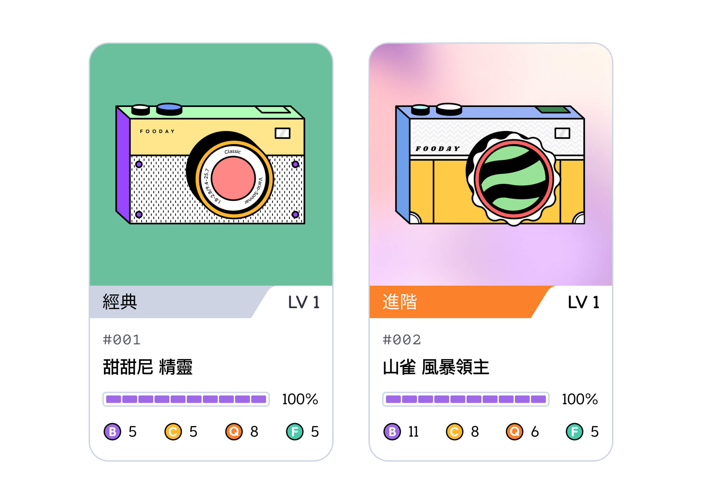

Fooca 相機是 Fooday 專屬 NFT，在社群中增強 Foodie 的體驗，同步推動平台的成長。

而 Fooca 相機有什麼用途？Fooca 相機是 Fooday 的入場票，對於想要在 Fooday 美食社群中邊吃邊賺的美食家來說至關重要。

:::info
簡單來說，如果沒有 Fooca 相機，美食家將無法開始賺取獎勵。
:::

Fooca 相機 NFT 不單純是一般認知中的 NFT。它具有等級、電池續航力和四個獨特的屬性：[運算、品質、電池和福靈](/attributes)。每個屬性都會影響 Fooca 相機的效率表現；而美食家擁有的 Fooca 相機數量，決定了帳號在平台上的[美食家能量值](/foodie-energy)。

#### 美食社群擔保品

同時，Fooca 相機也作為 Fooday 平台的擔保品。若有美食家多次發表惡意評論、違反社群守則，則 Fooday 將沒收其相機作為懲罰，以維持社群的和平及公正性。

***

## 相機稀有度

目前 Fooca 相機已有開放兩種稀有度：

**經典 (Classic)** 和 **進階 (Advanced)**

經典相機為初階相機，比較常見；而進階相機的平均屬性都比較高，也相較稀有。



以下為你介紹不同稀有度相機的賦能差別：

***

### 初始屬性點數

> 什麼是相機屬性點數？[請看這完整介紹](/attributes)

經典相機及進階相機的初始屬性點數就有顯著上的差異，其配點差異如下：

#### 經典 Fooca 相機：

經典相機的初始屬性點數皆為 5 ，初始隨機分配點數為 5 點，這 5 點會隨機骰出並分配在四個屬性裡面，而各屬性又有可分配最多點數的限制。

```
經典相機的初始屬性點數加總應為 25 點。
```

#### 進階 Fooca 相機：

進階相機的初始屬性點數皆為 5 ，初始隨機分配點數則為 10 點，這 10 點會隨機骰出並分配在四個屬性裡面，而各屬性又有可分配最多點數的限制。

```
進階相機的初始屬性點數加總應為 30 點。
```

|  |  | 電池 Battery  | 運算 Computing  | 品質 Quality  | 福靈 Foospirit  |
|:---:|:---:|:---:|:---:|:---:|:---:|
| 經典 Fooca 相機 | 初始點數 |  5  |  5  |  5  |  5  |
|   | 初始隨機分配點數範圍  |  0~5  |  0~5  |  0~3  |  0~5  |
| 進階 Fooca 相機 | 初始點數 |  5  |  5  |  5  |  5  |
|   | 初始隨機分配點數範圍  |  0~6  |  0~6  |  0~4  |  0~6  |

例：

* 經典相機 A 屬性：電池 7 | 運算 5 | 品質 8 | 福靈 5
* 經典相機 B 屬性：電池 5 | 運算 5 | 品質 5 | 福靈 10
* 進階相機 C 屬性：電池 11 | 運算 8 | 品質 6 | 福靈 5
* 進階相機 D 屬性：電池 7 | 運算 6 | 品質 9 | 福靈 8

***

### 各屬性可配上限

隨著每升 1 等 Fooca 相機，都會有增加 2 點屬性點數提供使用者分配，使用者可以依據想要的策略方向來妥善分配點數，但經典相機跟進階相機的個屬性可分配點數的上限不同。

```
經典 Fooca 相機：各屬性點數上限為 30
進階 Fooca 相機：各屬性點數上限為 50
```

進階相機在單一屬性可以加的點數比經典相機多了許多，因此若長遠來看，經營進階相機可以激發的潛能更是非常可觀的！

***

### 鑄造時獲得稀有相機盒機率

用進階相機來鑄造，會大幅提升鑄造出稀有相機盒的機率。

[相機盒鑄造完整介紹](/minting)

***

### 美食家能量加成

> 什麼是美食家能量？[請看這完整介紹](/foodie-energy)

若你有一台進階相機，則你的美食家能量（Energy）最大值會直接 +1 ，若有 X 台進階相機則加 X。此加成與持有相機數量所加的能量最大值不相衝突。

經典相機則不會有額外美食家能量加成。

例：

小明擁有 3 台相機，其中有 2 台為進階 Fooca 相機，那麼小明的最大美食家能量為

```
10（3 台相機能量加成） + 2（進階相機兩台加成）= 12
```

***

### 創世 Fooca 相機

創世 Fooca 相機盒並不是普通的相機盒。它代表了 Fooca 相機首次發布上線的第一代盲盒，是 Fooday 社群內的威望象徵！

#### 創世 Fooca 相機盒內含什麼？

每個創世 Fooca 相機盒都包含一台隨機生成的 Fooca 相機。這些從創世 Fooca 相機盒裡開出相機上帶有獨特的「創世」標誌。這標誌代表早期加入支持 Fooday 的特別象徵。

#### 使用創世 Fooca 相機

創世 Fooca 相機的功能就像任何其他 Fooca 相機一樣，你可以使用創世 Fooca 相機來貢獻並賺取獎勵。關鍵的區別在於它們的獨特性和擁有它們的榮譽。 _未來預計將會有創世相機擁有者專屬的福利跟加成，敬請期待！_

***

### Fooca ID

Fooca ID 被用來區分每一台 Fooca 相機 / 相機盒，代表每台 Fooca 皆獨一無二，不會有重複的 ID。

#1 到 #499 的 Fooca 相機為封測期間的測試相機，正式版上線後隨即銷毀。

**正式版之後第一批鑄造出來的 Fooca 相機編號從 #500 起算**，每鑄造出一台相機盒，編號即會往上加 1，以鑄造/生產時間來升冪排序，且無論一般相機或創世相機皆套用同樣的編號排序方式。Fooca 相機盒的編號跟其開出來的 Fooca 相機相同。

例： #500 的 Fooca 相機盒，開盒後得到的 Fooca 相機編號也為 #500。

> 相機編號不等於該相機上鏈後的 NFT token ID，目前尚不支援 Fooca 相機或相機盒鏈上交易。

***

對於希望使用更強大工具並在 Fooday 上產生重大影響的美食家來說，進階 Fooca 相機是更好的選擇，因進階相機的高平均初始屬性，讓在貢獻過程中可以更快賺取獎勵，且進階相機在鑄造時，也有更高的機率能助造出稀有相機盒。使用進階 Fooca 相機，你的貢獻將脫穎而出，可以更有效地賺取獎勵！