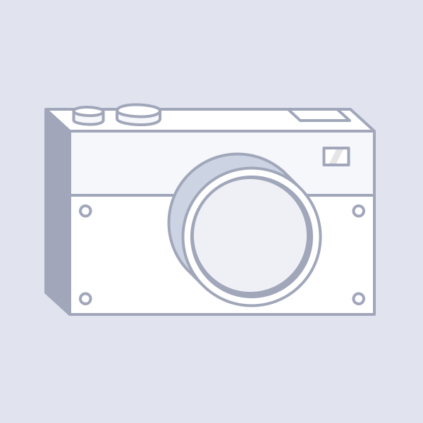

沒有購買 Fooca 相機的使用者，也能透過「免費 Fooca 相機」來參與 Fooday 社群。
擁有免費相機的美食家，與付費購買相機的使用者相同，也能透過建點、評論等貢獻，賺取 Fudos 提升美食家等級。

### 免費 Fooca 相機限制

雖然免費相機能賺取 Fudos 以及 FOOD，也能提升美食家等級之外，需要注意的是：
> **使用者無法提領賺取的 FOOD 獎勵。購買市集上的 Fooca 相機才能解鎖提領 FOOD 的功能。**

舉例來說，若使用者透過免費相機賺取了 1000 FOOD，在到市集購買付費相機前無法出金。
而購買市集中的相機後，使用者的免費相機即消失，並解鎖提領功能，此時則可以提領 1000 FOOD。

***

#### 免費相機與付費相機比較：

| **功能/相機種類**  | **免費相機** | **付費相機** |
|--------------|----------|----------|
| 美食家能量 | 4        | 6        |
| 建點/評論/挑戰 | O        | O        |
| 提升美食家等級  | O        | O        |
| 升級相機     | X        | O        |
| 提領 FOOD  | X        | O        |

### 免費 Fooca 相機的取得方式

通過官方不定時活動可以取得，請密切關注 Fooday 的社群消息！

