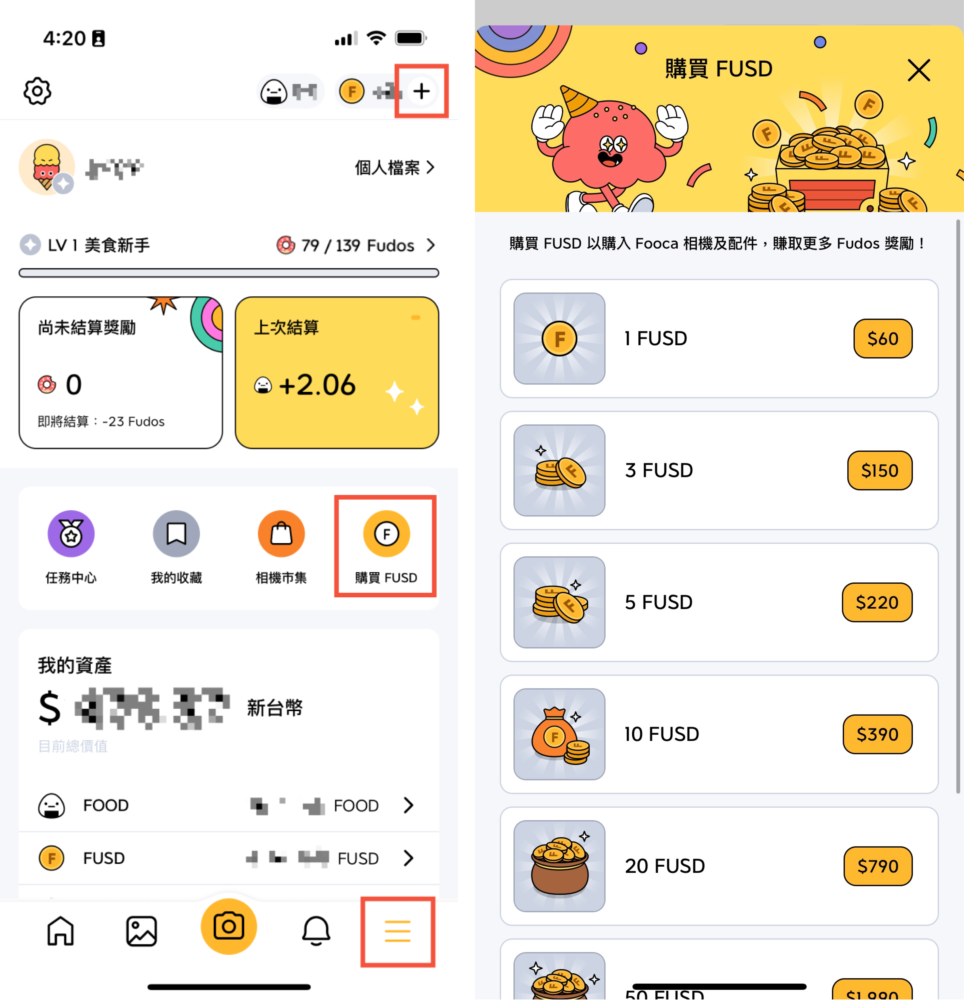

## Fooday 入金該怎麼操作？
如果想要在市集中購買 Fooca 相機，你需要先獲得 FUSD。接下來 Fooday 會仔細教你如何內購，或是轉入 USDC 到 Fooday App 中。

Fooca 相機在市集中以 FUSD 定價，想要獲取 FUSD 有兩種方法：

1. Fooday App 內購買 FUSD（Apple 會多收 30% 手續費）
2. 從 Polygon 鏈將 USDC 轉入 Fooday 錢包，USDC在轉入Fooday後會自動轉換為 FUSD（推薦！不會貶值）

### 方法 1 ：Fooday App 內購 FUSD
如果你對於區塊鏈不太熟悉，也不想花太多時間研究，透過APP內購買是最簡單快速的方式，先點擊下方選單最右邊，並找到「購買 FUSD」或點選上方「＋」後，選擇想要購買的金額，FUSD 就會自動存入 Fooday 錢包囉！與一般手遊的課金方式相同。

### 方法 2：將 USDC 轉入 Fooday 錢包
你也可以將USDC由鏈上錢包或是交易所轉至Fooday錢包，在轉入 Fooday 錢包後，系統會自動將 USDC 轉為 FUSD。
你可以選擇從台灣交易所購買 USDC 後轉入，或是可以從你目前有的 Web3 錢包轉帳。（如Rabby、小狐狸等都是常見 web3 錢包）

#### 1.台灣交易所購買USDC轉入Fooday (以下以MAX交易所為例)
若沒有購買過USDC，你可以使用台幣在台灣交易所購買 USDC 後轉入 Fooday 錢包
（此操作需使用台灣交易所，若你尚未擁有台灣交易所，請一定要先註冊一個再開始操作喔！）

下面步驟以MAX交易所為例：

1. 存入台幣至交易所：將台幣轉進交易所指定帳戶，詳細請見[MAX入金教學](https://support.maicoin.com/zh-TW/support/solutions/articles/32000026522-max-%E6%96%B0%E5%8F%B0%E5%B9%A3%E5%85%A5%E9%87%91%E6%95%99%E5%AD%B8)
2. 買入USDC：帳戶內有台幣後，於交易所內購買找到USDC點選，輸入你想購買的價格與數量後點選「買入」，待價格成交後你的帳戶就有USDC囉。
[deposit02](./deposit02.png)

3. 預備將 USDC 轉入Fooday App：進入 Fooday 後，點擊下方選單最右側，並點選「我的資產」下的「FUSD」，進入頁面後，點選「轉入」。（目前入金僅支援 Polygon 鏈，系統會自動代入。）
[deposit03](./deposit03.png)

4. 複製地址：按下最下方的「轉入」按鈕，會顯示 USDC 轉入地址如圖。
[deposit04](./deposit04.png)

5. 由MAX發送USDC至Fooday：複製地址並回到 MAX 錢包。點選「提領」後設定地址，貼上你剛剛複製的 Fooday 錢包地址。最後輸入想要入金的 USDC 數量後並點選「送出」，USDC 轉入Fooday後將自動轉換為FUSD。（FUSD：USDC = 1：1）
[deposit05](./deposit05.png)

6. 等待資產到帳：轉帳後會需要一段等待確認的時間，使用者可於「我的資產」點選「FUSD」查看接收狀況，當狀態變成確認後就可以使用囉！
[deposit06](./deposit06.png)

7. 購買相機後開始貢獻：耐心等待到帳 Fooday 錢包後，就能到相機市集購買相機，開始參與Fooday評論囉！
當然，若你有使用其他交易所如幣安、Bitopro等，也可以直接從你習慣使用的交易所轉入。
> 再次提醒：轉帳時鏈一定要選擇 Polygon，目前 Fooday 僅支援 Polygon。

* USDC 合約地址：[`0x3c499c542cEF5E3811e1192ce70d8cC03d5c3359`](https://polygonscan.com/address/0x3c499c542cEF5E3811e1192ce70d8cC03d5c3359)  
* USDC.e 合約地址：[`0x2791bca1f2de4661ed88a30c99a7a9449aa84174`](https://polygonscan.com/address/0x2791bca1f2de4661ed88a30c99a7a9449aa84174)

#### 2.鏈上錢包轉USDC至Fooday
若你平常有在使用Web3錢包，可以直接從你習慣使用鏈上 web3 錢包將 USDC 轉入，以下以 Rabby 錢包轉帳為例：
> 此方法需使用web3錢包，若你尚未擁有 web3 錢包，請一定要先註冊一個才能提領喔！
Fooday 推薦 [Rabby 錢包](https://rabby.io/)，或是其他常見加密錢包如 metamask 也都可以。

步驟教學：

1. 預備將 USDC 轉入Fooday：進入 Fooday 後，點擊下方選單最右側，並點選「錢包」下的「FUSD」，進入頁面後，點選「轉入」。（目前入金僅支援 Polygon 鏈，系統會自動代入。）
[deposit03](./deposit03.png)

2. 複製地址：接著按下最下方的「轉入」按鈕，會顯示 USDC 轉入地址如圖。
[deposit04](./deposit04.png)

3. 由 Rabby 發送 USDC 至Fooday 錢包：複製地址並回到 Rabby 錢包。點選「SEND」後，選擇 Polygon 鏈並貼上剛剛複製的 Fooday 錢包地址，輸入想要傳送的 USDC 數量後發送。
（FUSD：USDC = 1：1）
[deposit07](./deposit07.png)

4. 等待資產到帳：轉帳後會需要一段等待確認的時間，使用者可於「我的資產」點選「FUSD」查看接收狀況，當狀態變成確認後就可以使用囉！
[deposit06](./deposit06.png)

***

### 場外加碼：入金 FOOD 至 Fooday 錢包
除了 USDC，也可以將 FOOD 入金至 Fooday 錢包喔！

FOOD 為 Fooday 所發行的代幣，使用者可透過在 Fooday 中評論、建點等貢獻賺取 FOOD。而 FOOD 在 Fooay 中可用於鑄造出新的相機、充電相機、升等相機等。
如果想要馬上鑄造出新相機，或想將相機快速升等，可以選擇在 Polygon 上購入 FOOD 後（詳細操作可參考出金教學的兌換步驟），並轉入 Fooday 錢包中。轉帳的操作方式則與錢包轉帳 USDC 時相同。

1. 購買 FOOD：可直接到[LlamaSwap](https://swap.defillama.com/?chain=polygon&from=0x3c499c542cef5e3811e1192ce70d8cc03d5c3359&to=0x78b1aa5c9b37c52695c93448ad0c64560edb9c4d)購買 FOOD。

* FOOD 合約地址：[`0x78b1aa5c9b37c52695c93448ad0c64560edb9c4d`](https://polygonscan.com/token/0x78b1aa5c9b37c52695c93448ad0c64560edb9c4d)

2. 預備將 FOOD 轉入Fooday：進入 Fooday 後，點擊下方選單最右側，並點選「我的資產」下的「FOOD」，進入頁面後，點選「轉入」。（目前入金僅支援 Polygon 鏈，系統會自動代入。）
[deposit08](./deposit08.png)

3. 複製地址：接著按下最下方的「轉入」按鈕，會顯示 FOOD 轉入地址如圖。
[deposit09](./deposit09.png)

4. 傳送 FOOD 至 Fooday：複製地址並回到 Rabby 錢包。點選「SEND」後，選擇 Polygon 鏈並複製剛剛 Fooday 的錢包地址後貼上。輸入想要傳送的 FOOD 數量後並送出。
[deposit10](./deposit10.png)

5. 等待資產到帳：轉帳後需要一段等待確認的時間，使用者可以「我的資產」中點選「FOOD」查看接收狀況，當狀態變成確認後就可以使用囉！

 

## Fooday 提領該如何操作

在 Fooday 中美食家只要透過貢獻就能賺取 FOOD，也能透過販賣 Fooca 相機賺取 FUSD。
接下來 Fooday 會仔細教你如何將賺到的 FOOD 與 FUSD 提領、換回 USDC 或是台幣，如果你還不知道 Fooday 該如何提領，繼續一起看下去！簡單步驟教美食家快速變現。

### 如何提領FOOD？

若你累積到一定數量的FOOD想要提領並兌換為台幣時，流程大致如下：

1. 進入 Fooday，在「我的資產」中點選「 FOOD」，並點選「提領」
2. 在「提領至」中貼上你的 web3 錢包地址輸入想提領的數量並點選提領
3. 到 [LlamaSwap](https://swap.defillama.com/?chain=polygon&from=0x78b1aa5c9b37c52695c93448ad0c64560edb9c4d&to=0x3c499c542cef5e3811e1192ce70d8cc03d5c3359) 上將 FOOD 換成 USDC
4. 美食家將 FOOD 換成 USDC 後，就可以轉帳到 MAX 交易所換成台幣囉！

> FOOD提領需使用web3錢包，若你尚未擁有 web3 錢包，請一定要先註冊一個才能提領喔！
Fooday 推薦 [Rabby 錢包](https://rabby.io/)，或是其他常見加密錢包如 metamask 也都可以。

以下就FOOD如何提領與兌換回台幣做詳細步驟解說：

#### FOOD詳細提領步驟

1. 準備提領FOOD：進入 Fooday 後，點擊下方選單最右側，並點選「我的資產」下的「FOOD」，進入頁面後，點選「提領」
[withdraw01](./withdraw01.png)

2. 到 Polygon 區塊鏈準備接收 FOOD：在您的 Web3 錢包中點選「Receive」並選擇 polygon 鏈
[withdraw02](./withdraw02.png)

3. 複製你的 web3 錢包地址：點選 Polygon 鏈後顯示錢包轉入地址如圖，Rabby 為統一地址轉入，不用特別尋找幣種，確定鏈沒有選錯即可。
[withdraw03](./withdraw03.png)

4. 貼上地址：回到 Fooday App，在「提領至」欄位中貼上你的 web3 錢包地址或掃描 QRcode 帶入地址
**注意：FOOD 尚未上交易所，所以直接將 FOOD 轉去幣安地址、MAX 地址等會直接進入黑洞消失喔！**
[withdraw04](./withdraw04.png)

5. 輸入數量：輸入想提領的數量並點選提領（需注意 FOOD 最低提領數量為 1000）
[withdraw05](./withdraw05.png)

6. 等待FOOD到帳：確認詳細提領資訊後按下「確認」後，請耐心等待提領要求確認。
提醒：若提領完成後錢包中沒有看到 FOOD 代幣，請自行在 web3 錢包中添加 Food 代幣地址
`FOOD 合約地址：0x78b1aa5c9b37c52695c93448ad0c64560edb9c4d`

#### FOOD 兌換台幣步驟

若要將 FOOD 兌換為台幣，需先將 FOOD 兌換為 USDC 後，轉入台灣的交易所後（以下以 MAX 為例），才能進行提領的動作，轉換步驟如下：

1. 將 FOOD 兌換 至 USDC 穩定幣：先至 [LlamaSwap](https://swap.defillama.com/?chain=polygon&from=0x78b1aa5c9b37c52695c93448ad0c64560edb9c4d&to=0x3c499c542cef5e3811e1192ce70d8cc03d5c3359)網站，將FOOD兌換為 USDC，USDC 為穩定幣，為穩定跟美金為 1:1 的狀態。

進到 LlamaSwap 網站後，記得先點選右上角的 Connect Wallet，才能看到幣種的餘額及順利兌換喔！
以下以 LlamaSwap 示範，輸入數量後，記得選擇一條兌換路徑。
[withdraw06](./withdraw06.png)

> 提醒：將 FOOD 轉換成 USDC 時需支付 Gas Fee。Gas Fee 詳細說明可跳到文章最下方查看。

若在兌換完成後錢包中沒有看到USDC代幣，請自行添加USDC代幣地址
USDC 合約地址：0x3c499c542cEF5E3811e1192ce70d8cC03d5c3359

2. 找到你的 Max 交易所 Polygon 鏈的 USDC 接收地址：請先點選下方選單中的「錢包」，並接著下滑找到「USDC」，接著點選「接收」。
接著按下最下方的「顯示地址」，這時會跳出鏈的選項，請一定要選擇「Polygon」哦！選擇後就會出現地址，並按下複製地址就可以了。
[withdraw07](./withdraw07.png)
[withdraw08](./withdraw08.png)

3. 發送USDC：正常來說，可以看到已經兌換好的 USDC 數量在 web3 錢包之中，這時要將 USDC 發送至剛剛複製的 MAX 交易所帳號，才能順利換成台幣。
[withdraw09](./withdraw09.png)

4. 將 USDC 賣出換回台幣：在 Max 收到 USDC 後，我們現在需要將 USDC 賣出換回台幣。請先於下方的「交易」選單找到 USDC 點選，填入「價格」與「數量」後，點選「賣出」。（價格通常會自動帶入，使用者也可以稍微看一下再決定賣出價，這部分跟股票賣出類似）
[withdraw10](./withdraw10.png)

5. 匯入至台幣帳戶：成功賣成台幣後，就可以提順利領台幣囉！匯入台幣帳戶步驟請參考：[MAX 新台幣提領教學](https://support.maicoin.com/zh-TW/support/solutions/articles/32000021144-max-%E6%96%B0%E5%8F%B0%E5%B9%A3%E6%8F%90%E9%A0%98%E6%95%99%E5%AD%B8)

#### 如何提領 FUSD？
賣出相機或是沒用完的 FUSD 該如何提領出呢？其實步驟跟上面提領 FOOD 類似，這邊再給一次詳細的步驟說明！

你可以直接將 FUSD 提領至 Web3 錢包或交易所中（FUSD 最低提領數量為 2），轉入後 FUSD 將會自動轉換為 USDC。
（若想換回台幣，跟上面 FOOD 兌換為台幣相同，需要一個台灣交易所帳號，我們仍以 MAX 作為例子）

1. 準備提領FUSD：進入 Fooday 錢包，點選FUSD，並點選「提領」
[withdraw11](./withdraw11.png)

2. 找到你的 Max 交易所 Polygon 鏈的 USDC 接收地址：請先點選下方選單中的「錢包」，並接著下滑找到「USDC」，接著點選「接收」。
接著按下最下方的「顯示地址」，這時會跳出鏈的選項，請一定要選擇「Polygon」哦！選擇後就會出現地址，並按下複製地址就可以了。
[withdraw07](./withdraw07.png)
[withdraw08](./withdraw08.png)

3. 回到 Fooday App 中貼上地址：在「提領至」中貼上剛剛複製少的 MAX 交易所地址，輸入想提領數量並點選提（最少提領數量為2 FUSD）
[withdraw12](./withdraw12.png)

4. 將 USDC 賣出換回台幣：在 Max 收到 USDC 後，我們現在需要將 USDC 賣出換回台幣。請先於下方的「交易」選單找到 USDC 點選，填入「價格」與「數量」後，點選「賣出」。（價格通常會自動帶入，使用者也可以稍微看一下再決定賣出價，這部分跟股票賣出類似）
[withdraw10](./withdraw10.png)

5. 匯入至台幣帳戶：成功賣成台幣後，就可以提順利領台幣囉！匯入台幣帳戶步驟請參考：[MAX 新台幣提領教學](https://support.maicoin.com/zh-TW/support/solutions/articles/32000021144-max-%E6%96%B0%E5%8F%B0%E5%B9%A3%E6%8F%90%E9%A0%98%E6%95%99%E5%AD%B8)

***

## 鏈上 Gas Fee 說明

在鏈上的交易皆會收取 Gas Fee，且 Gas Fee 為該鏈的原生代幣。而 **Polygon 的原生代幣為 Matic**。

在提領 FOOD / FUSD 後，要把錢包中的 FOOD / FUSD 換成 USDC 時，需要支付 Polygon 鏈上的 Gas Fee，所以你需要先兌換一些 matic。

### 將 Matic 打入 web3 錢包

📌 若你尚未擁有 Matic：

請參考入金教學文章，與購買USDC方法相同，於MAX交易所「交易」頁面找到MATIC後購買。購買完成後於「錢包」頁面找到MATIC後選擇「發送」，將接收的地址輸入你的 web3 錢包地址 (Rabby)後傳送。
當錢包有了 Matic 後，就可以順利操作將 FOOD 轉換為 USDC 囉！

當錢包有了 Matic 後，就可以順利將 FOOD / FUSD 轉換為 USDC 囉！

> Polygon 鏈上 Gas Fee 價格算是非常親民，若不在巔峰期，每次交易通常都只收取約 0.01 美金，Fooday 建議基本上不需要兌換太多，5 Matic 就可以用很久了。

## Fooday 提領注意事項

* 目前提領僅支援 Polygon 鏈，請一定要選對網路及貼上正確錢包地址。

* 目前每筆提領手續費：提領 FOOD 手續費為 100 FOOD；提領 FUSD 手續費為 1 FUSD。

* 目前 FOOD / FUSD 單日最高提領金額為 1000 美金。

* 請勿直接提領至眾籌獲 ICO 地址，我們不會處理未來代幣的發放。