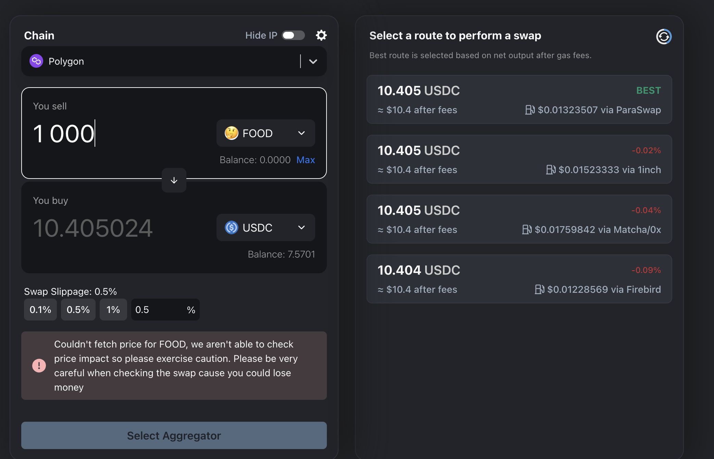

## Fooday 入金該怎麼操作？
如果想要在市集中購買 Fooca 相機，則需要在 App 內購 FUSD，或將 USDC 轉到 Fooday 錢包中。接下來 Fooday 會仔細教你如何內購，以及轉 USDC 到 Fooday App 中。

Fooca 相機在市集中以 FUSD 定價，想要獲取 FUSD 有兩種方法：

1. Fooday App 內購 FUSD
2. 從 Polygon 鏈將 USDC 轉入 Fooday 錢包，轉入後則會自動轉換為 FUSD（Rabby 錢包、交易所）

### 方法 1 ：Fooday App 內購 FUSD
如果你不熟悉區塊鏈及鏈上交易，使用 Fooday 內購 FUSD 是最快速的方式。內購方法相當簡單，先點擊下方選單最右邊，並找到「購買 FUSD」，並選擇想要購買的金額，FUSD 就會自動存入 Fooday 錢包囉，與其他手遊的課金方法相同。

### 方法 2：將 USDC 打入 Fooday 錢包
第二個方法則是從鏈上錢包打入 USDC 或 USDC.e 至 Fooday 錢包。接下來將以 [Rabby](<https://rabby.io/>) 錢包打入為例，當然使用其他錢包、使用 MAX、幣安等交易所也都可以。

**1. 目前 Fooday 僅支援 Polygon 鏈**  

* USDC 合約地址：[`0x3c499c542cEF5E3811e1192ce70d8cC03d5c3359`](<https://polygonscan.com/address/0x3c499c542cEF5E3811e1192ce70d8cC03d5c3359>)  
* USDC.e 合約地址：[`0x2791bca1f2de4661ed88a30c99a7a9449aa84174`](<https://polygonscan.com/address/0x2791bca1f2de4661ed88a30c99a7a9449aa84174>)

 

#### 步驟教學：
1. 進入 Fooday 後，一樣點擊下方選單最右側，並點選錢包下的「FUSD」，進入頁面後，點選「轉入」。（目前入金僅支援 Polygon 鏈，系統會自動代入。）

2. 接著按下最下方的「轉入」按鈕，會跳轉至你的 FUSD 轉入地址如圖。

3. 接著複製地址，並回到 Rabby 錢包。點選「SEND」後，選擇 Polygon 鏈及將剛剛在 Fooday 複製的錢包地址貼上。最後輸入想要入金的 USDC （或是 FOOD）數量後並送出。（FUSD：USDC = 1：1）

4. 接著 FUSD 就會出現在自己的 Fooday 錢包中囉！不過入金後需要等待一段時間才能使用，使用者可以點選「FUSD」查看狀況，當變成確認後就可以使用了！

5. 使用 FUSD 到市集購買相機，開始邊吃邊賺！

:::note
再次提醒：鏈一定要選擇 Polygon，目前 Fooday 僅支援 Polygon。
:::

以上是以 Rabby 錢包入金為例，如果想要從其他錢包入金也沒問題喔！

***

### 場外加碼：入金 FOOD 至 Fooday 錢包
除了 USDC，也可以將 FOOD 入金至 Fooday 錢包喔！

FOOD 為 Fooday 所發行的代幣，使用者可透過在 Fooday 中評論、建點等貢獻賺取 FOOD。而 FOOD 在 Fooay 中可用於 Mint 出新的相機、充電相機、升等相機等，且FOOD 本身具有流動性，可以在鏈上交易，也可以重新拿來入金至 Fooday 錢包。

如果想要馬上鑄造出新相機，或將相機快速升等，也可以選擇在 Polygon 上直接購入 FOOD，並轉入 Fooday 錢包中。入金的方式則與入金 FUSD 相同。

* FOOD 合約地址：`0x78b1aa5c9b37c52695c93448ad0c64560edb9c4d`
* 購買 FOOD：[https://reurl.cc/r6WaeZ](<https://reurl.cc/r6WaeZ>)

 

## Fooday 提領該如何操作

在 Fooday 中美食家只要透過貢獻就能賺取 FOOD，也能透過販賣 Fooca 相機賺取 FUSD。

接下來 Fooday 會仔細教你如何提領、換回 USDC，如果你還不知道 Fooday 該如何提領，繼續一起看下去！簡單步驟教美食家快速變現。

:::note
Fooday 提領目前僅支援 Polygon 鏈，且將 FOOD / FUSD 轉換成 USDC 時需支付 Gas Fee。（Gas Fee 詳細說明可跳到文章最下方查看。）
:::

***

### 提領簡單四步驟：
1. 進入 Fooday 錢包，點選 FOOD / FUSD，並點選「提領」
2. 在「提領至」中貼上你的 web3 錢包地址
輸入想提領的數量並點選提領
3. 接著到 LlamaSwap 上將 FOOD 換成 USDC
4. 美食家將 FOOD/FUSD 換成 USDC 後，就可以自行到 MAX 交易所換成台幣囉！

美食家將 FOOD/FUSD 換成 USDC 後，就可以自行到 MAX 交易所換成台幣囉！
***

### 詳細提領步驟
1. 點選下方選單的最右邊，在 Fooday 錢包中點選欲提領的幣種（ FOOD / FUSD），並點選「提領」。

2. 在「提領至」的欄位輸入你的錢包地址。
> 若你尚未擁有 web3 錢包，請一定要先註冊一個才能提領喔！  
Fooday 推薦 [Rabby](<https://rabby.io/>) 錢包，或是其他常見加密錢包如 metamask 也都可以。

圖下以 Rabby 錢包為例，註冊完後點選最上方地址，並點選右方箭頭，就可以看到完整錢包地址，也能從「提領至」欄位最右方，透過掃描 qrcode 匯入地址。

3. 填入欲提領的數量。  
**（ FOOD 最低提領數量為 1000，FUSD 最低提領數量為 2）**

4. 確認詳細提領資訊後按下「確認」後，請耐心等待提領要求確認。

5. 確認後請查看錢包餘額，提領的 FOOD / FUSD 應該已在錢包中。
> 請記得在錢包中新增 FOOD token，才能正確查看餘額。  

**FOOD 合約地址：`0x78b1aa5c9b37c52695c93448ad0c64560edb9c4d`**

6. 接著到 [LlamaSwap](https://medium.com/r/?url=https%3A%2F%2Fswap.defillama.com%2F%3Fchain%3Dpolygon%26from%3D0x78b1aa5c9b37c52695c93448ad0c64560edb9c4d%26to%3D0x3c499c542cef5e3811e1192ce70d8cc03d5c3359) 上將 FOOD / FUSD 換成 USDC。
輸入完想要兌換的數量後，記得從右邊選擇一種兌換路徑。

:::note
此動作需要支付 Gas Fee - 少量 matic，請查看最下方詳細說明
:::

7. 美食家將 FOOD 換成 USDC 、確認錢包內有收到後，接著就可以自行到 MAX 交易所換成台幣。(提領 FUSD 時，系統則會自動幫你轉換為 USDC，不需再 swap)  
* USDC 合約地址：[0x3c499c542cEF5E3811e1192ce70d8cC03d5c3359](<https://medium.com/r/?url=https%3A%2F%2Fpolygonscan.com%2Faddress%2F0x3c499c542cEF5E3811e1192ce70d8cC03d5c3359>)

> 若想要出金成台幣，請記得註冊 [MAX 交易所](<https://medium.com/r/?url=https%3A%2F%2Fmax.maicoin.com%2F>)。
> MAX 出金有許多教學文章，可參考 [MAX 新台幣提領教學](<https://medium.com/r/?url=https%3A%2F%2Fsupport.maicoin.com%2Fzh-TW%2Fsupport%2Fsolutions%2Farticles%2F32000021144-max-%25E6%2596%25B0%25E5%258F%25B0%25E5%25B9%25A3%25E6%258F%2590%25E9%25A0%2598%25E6%2595%2599%25E5%25AD%25B8>)。

 

## Fooday 提領注意事項
* 目前提領僅支援 Polygon 鏈，請一定要選對網路及貼上正確錢包地址。

* 目前每筆提領手續費：提領 FOOD 手續費為 100 FOOD；提領 FUSD 手續費為 1 FUSD。

* 目前 FOOD / FUSD 單日最高提領金額為 1000 美金。

* 請勿直接提領至眾籌獲 ICO 地址，我們不會處理未來代幣的發放。

 

## 鏈上 Gas Fee 說明
在鏈上的交易皆會收取 Gas Fee，且 Gas Fee 為該鏈的原生代幣。而 **Polygon 的原生代幣為 Matic**。

在提領 FOOD / FUSD 後，要把錢包中的 FOOD / FUSD 換成 USDC 時，需要支付 Polygon 鏈上的 Gas Fee，所以你需要先兌換一些 matic。

### 將 Matic 打入 web3 錢包
📌 若你尚未擁有 Matic：

請參考入金教學文章，與 MAX 交易所提領 USDC 到 Fooday 的方法相同，不過需將 Fooday 錢包的地址改為你的 web3 錢包 (Rabby)。

當錢包有了 Matic 後，就可以順利將 FOOD / FUSD 轉換為 USDC 囉！

>Polygon 鏈上 Gas Fee 價格算是非常親民，若不在巔峰期，每次交易通常都只收取約 0.01 美金，Fooday 建議基本上不需要兌換太多，5 Matic 就可以用很久了。