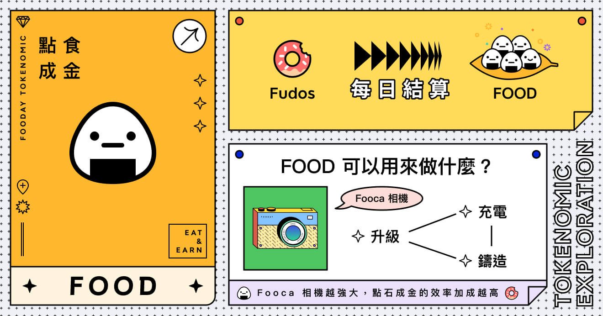
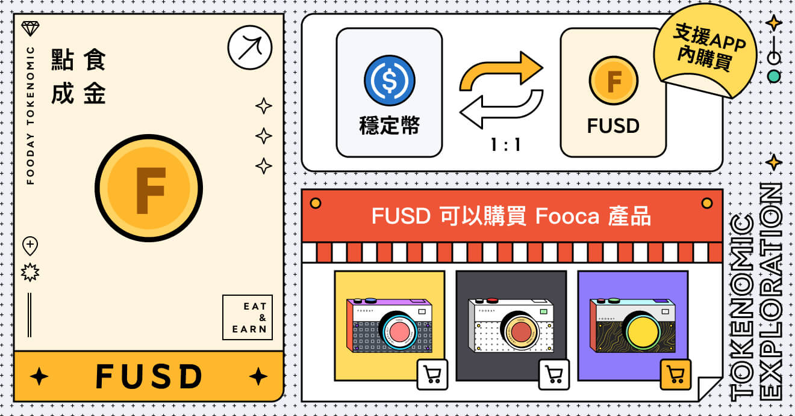

Fooday 不僅僅是一個美食社群，經濟代幣系統可說是其核心所在。目前 Fooday 有兩種重要代幣、一種經驗點數：Fudos、FOOD 和 FUSD。三者在 Fooday 中扮演不同角色，也有使用上的差異。

***

## Fudos

**透過貢獻賺取經驗值**

Fudos 是 Fooday 平台上的經驗值。擁有 Fooca 相機的美食家，可以通過完成任務、建立商家地點、分享美食體驗和檢舉錯誤資訊等方式，獲得一定數量的 Fudos。系統會自動結算，將獲得的 Fudos 自動轉換成 FOOD。結算規則及時間請參考 [美食家等級](/foodie-level) 介紹。 

簡而言之，通過互動和貢獻累積 Fudos，美食家的等級將提升。而美食家的等級將影響 Fudos 轉換成 FOOD 的比率，等級越高，能享受到更好的兌換率。

***

## FOOD

**美食平台代幣**

在 Fooday 中，FOOD 具有實際價值，為擁有多種用途的代幣。首先，美食家可以使用 FOOD 升級、充電，以及鑄造 Fooca 相機，提升在平台上的遊戲體驗。

此外，美食家能將賺取的 FOOD 提領到區塊鏈上，將其轉換為其他加密貨幣，這為用戶提供了更大的彈性，以及多種價值實現的可能性。

* 購買 FOOD：[https://reurl.cc/r6WaeZ](<https://reurl.cc/r6WaeZ>)
* FOOD 合約地址：`0x78b1aa5c9b37c52695c93448ad0c64560edb9c4d`
* 購買 FOOD：[https://reurl.cc/r6WaeZ](<https://reurl.cc/r6WaeZ>)

:::info
然而，需要注意的是，FOOD 的價格由市場決定的，所以會有漲跌波動的情況發生。
:::

還有一點需要注意的是，使用 FOOD 無法直接購買 Fooca 相機，需要使用特定的經濟貨幣 — — FUSD。

***

## FUSD

**可透過 app 內購的貨幣**

FUSD 是一種可以透過 Fooday App 直接內購的經濟貨幣。美食家可以使用 FUSD 購買包括 Fooca 相機、寶箱、配件等特殊商品，但無法進行充電和升級 Fooca 相機的操作。

同時，與 FOOD 相同，美食家也能自由將 FUSD 也能提領到區塊鏈上。值得一提的是，FUSD 出金後將換回穩定幣，這意味著它的價值不會受到波動的影響而減少。

此外，除了在 app 中內購，若你在區塊鏈上擁有 USDC/USDC.e，也能選擇將它們轉入 Fooday，並透過平台自動 1:1 轉換為 FUSD，方便讓使用者快速開始享受美食體驗。

***

我要怎麼從 Fooday 提領代幣? [入金與提領](/deposit-and-withdraw)
