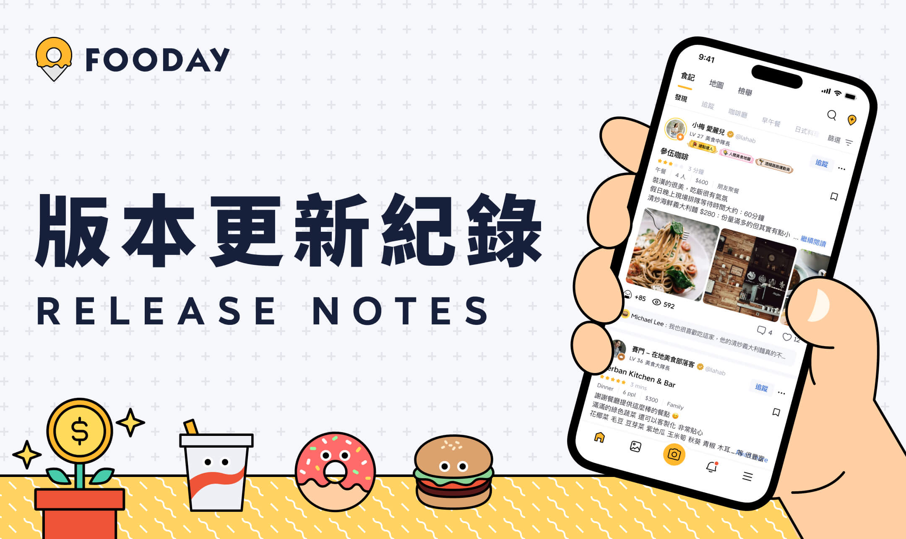
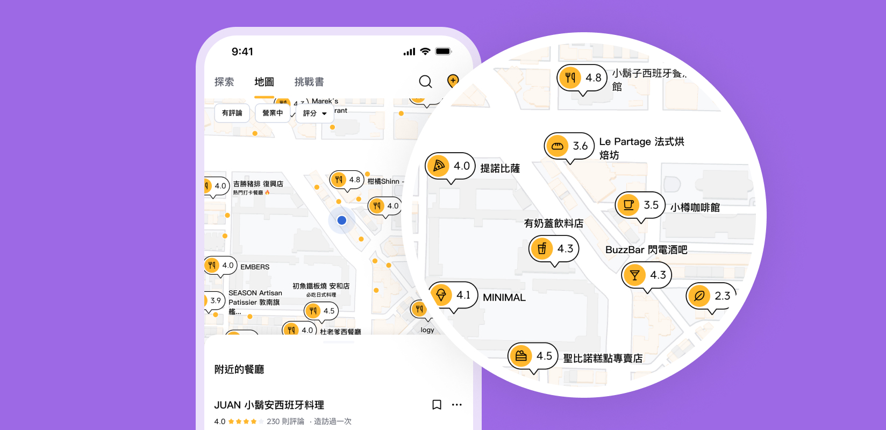
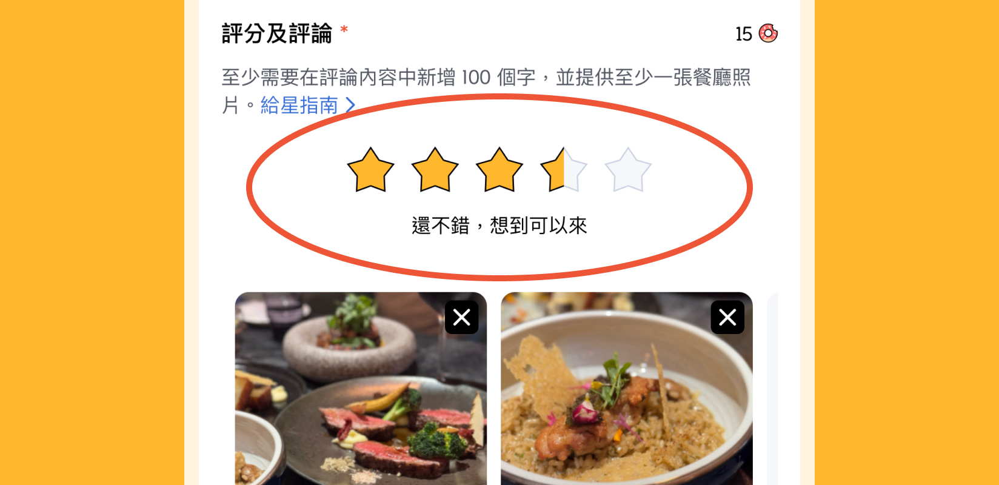
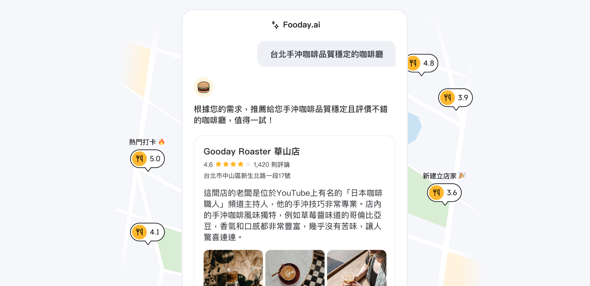
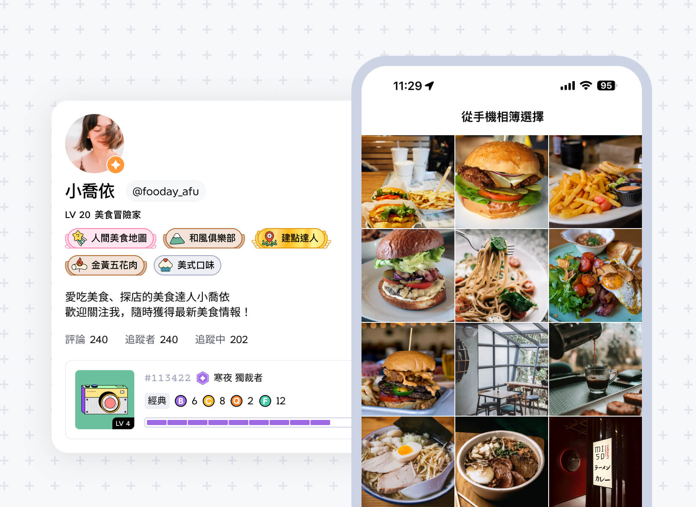
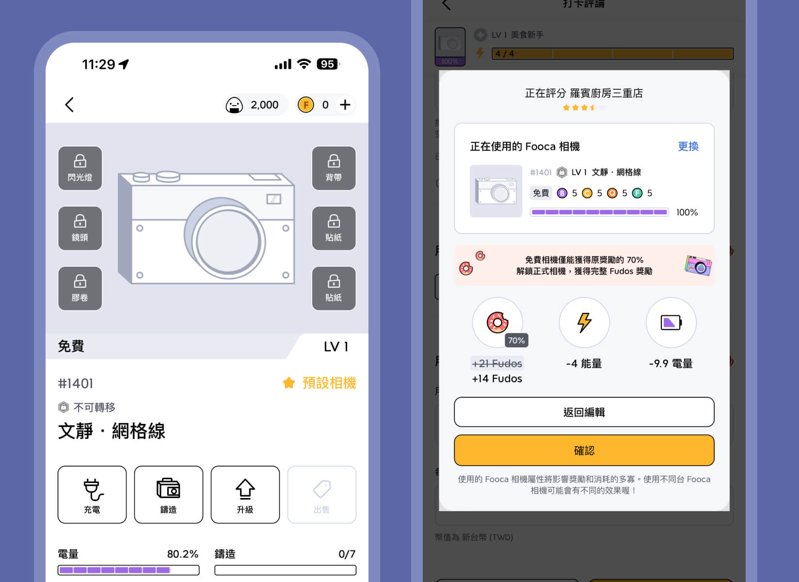
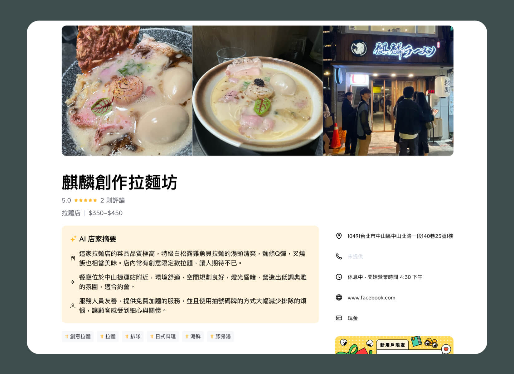
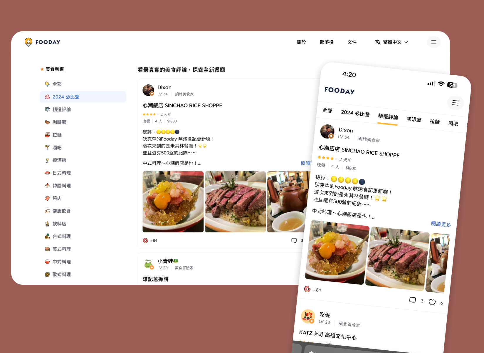

## App 版本紀錄

### V1.66.0（2024-10-11）

#### 🎉 新功能

- 速食相機主題活動上線：在活動期間內，鑄造出的相機盒子都將為「速食主題盒子」，且主題盒子的相機必定為速食主題相機。同時鑄造相機以及從市集購買並開盒者都將立刻回饋 Bonus FOOD，
- 新增速食徽章：速食相機都會有著速食徽章，之後會讓在特地餐廳類別評論時，獲得額外的加成賦能效果。

### V1.62.0（2024-09-04）

#### 🎉 新功能

- 新增分享 Fooday AI 回答功能：現在可以一鍵分享與 Fooday AI 的對話內容，包括詢問的問題及 Fooday AI 提供的回答、餐廳，分享給親朋好友更方便。
- 新增挑戰店家資訊的理由：新增如「無意義的更新」等新理由，讓使用者能更正確選擇並回報遇到的狀況。
---

### V1.60.0（2024-09-03）

#### 🎉 新功能

- 新增按讚通知：為了增加社群互動性，現在當有人對你的評論按讚，都會收到推播通知。

---

### V1.58.0 (2024-08-30)

#### 🎉 新功能

- 新手任務系統上線：現在在 App 內完成簡單社群任務，如按讚、追蹤其他美食家，就能獲得免費體驗相機。有了體驗相機後就能評論、建點，參與社群並提升自己的美食家等級。

---

### V1.55.5 (2024-08-25)

#### 🐛 Bug 及問題修正

- 修正無法從手機上傳照片的錯誤。

---

### V1.55.0 (2024-08-10)

#### 🎉 新功能

- 新增餐廳類別 icon：每種餐廳類別都有對應 icon 囉，現在在地圖上可以更方便查看。

---

### V1.54.0 (2024-08-05)

#### 🎉 新功能

- 新增半星：因應廣大要求，現在餐廳評分可以選擇以半星為單位，讓評分上做出更精準的差異。

---

### V1.52.0 (2024-07-15)

#### 🎉 新功能

- AI 店家摘要上線：現在點進餐廳後，可以看到結合所有評論產生出的店家摘要。包括餐點、服務、環境，讓使用者能快速透過摘要發現必點餐點以及餐廳的優缺點。

---

### V1.49.0 (2024-07-10)

#### 🎉 新功能

Fooday AI 正式上線：現在可以透過 AI 尋找餐廳，如「中山區餐酒館推薦」、「台北有雞白湯的拉麵」等，整合了 Fooday 中來自全球的真實餐廳評論，以及平台上最新的餐廳資訊。為美食愛好者提供相關知識和餐飲指南，幫助你做出更好的用餐選擇。

---

### V1.47.0 (2024-07-01)

#### 🎉 新功能

- 認證美食家功能：只要達成條件並通過審核，就可以獲得認證美食家（金勾勾）。有金勾勾的使用者可以自由從相簿內上傳 30 天內的照片，讓習慣使用自己設備的美食家更方便。

---

### V1.41.0 (2024-06-18)

#### 🎉 新功能

- 免費體驗相機：免費體驗相機正式上線，只要完成超簡單社群任務，就能獲得免費體驗相機。有體驗相機的使用者，可以完整參與 Fooday，包括建點、評論。可以讓有興趣的使用者試用後，再決定是否購入正式相機。

---

## Web 版本紀錄

### V1.21.0（2024-10-15）

#### 🎉 新功能

- 新增顯示裝置照片原比例：現在如果是從裝置上傳的照片，可以自由選擇是否裁切，也可以維持原比例上傳，選擇更多、更彈性！

---

### V1.20.0（2024-09-26）

#### 🎉 新功能

- 全新的下載卡片：現在網頁版全新的前往下載卡片更新囉，看起來更吸引人！

---

### V1.16.0（2024-09-17）

#### 🎉 新功能

- 新增顯示 half star：網頁版現在也能看到最精確的評分了。

---

### V1.11.0 (2024-09-03)

#### 🎉 新功能

- AI 美食話題上線：在 Fooday AI 中的熱門搜尋及回答，現在官網上也看得到了，去看看附近的美食家都在找什麼餐廳吧！

---

### V1.6.0 (2024-08-10)

#### 🎉 新功能

- AI 店家摘要：每個地點現在都會出現 AI 店家摘要，整合該地點所有的評論，給出服務、環境、餐點的精確摘要，讓使用者能更快速確認餐廳是否符合需求。

---

### V1.4.0 (2024-08-02)

#### 🎉 新功能

- 美食探索頁面：現在點進 Fooday 官網，能夠直接看到美食探索頁面，快速查看有興趣的餐飲類別，並查看 Fooday 美食家的超用心真實評論。

---
